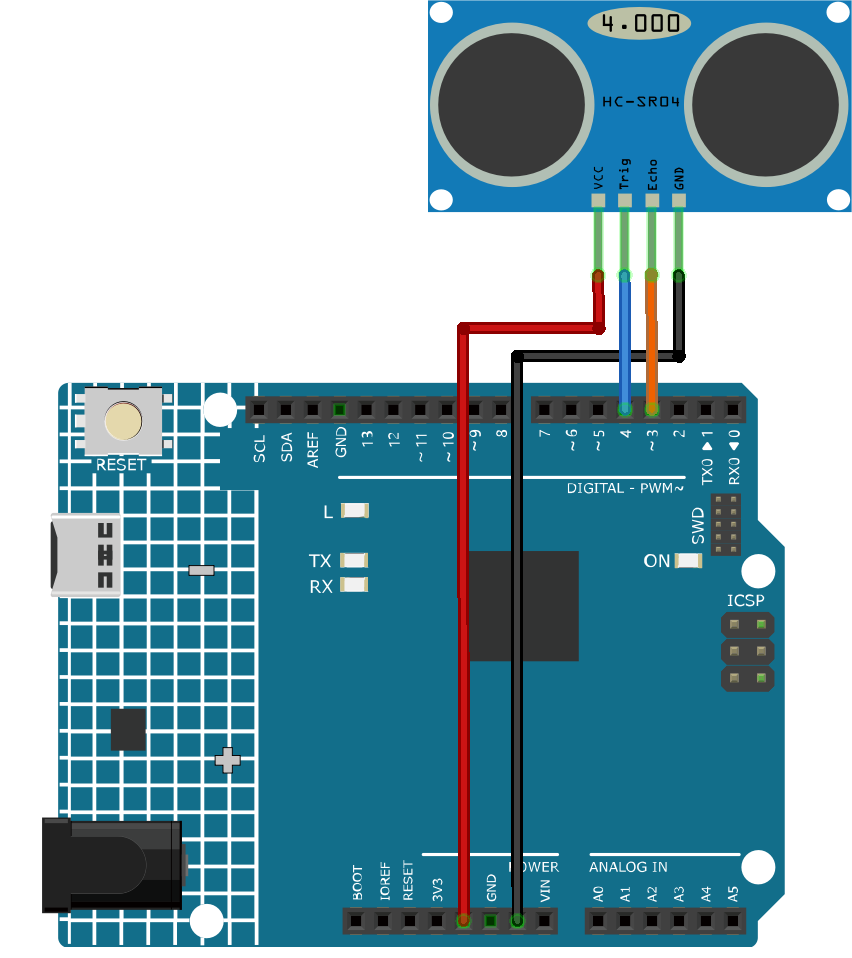

.. note::

    Hello, welcome to the SunFounder Raspberry Pi & Arduino & ESP32 Enthusiasts Community on Facebook! Dive deeper into Raspberry Pi, Arduino, and ESP32 with fellow enthusiasts.

    **Why Join?**

    - **Expert Support**: Solve post-sale issues and technical challenges with help from our community and team.
    - **Learn & Share**: Exchange tips and tutorials to enhance your skills.
    - **Exclusive Previews**: Get early access to new product announcements and sneak peeks.
    - **Special Discounts**: Enjoy exclusive discounts on our newest products.
    - **Festive Promotions and Giveaways**: Take part in giveaways and holiday promotions.

    👉 Ready to explore and create with us? Click [|link_sf_facebook|] and join today!

.. _cpn_ultrasonic:

Ultrasonic Sensor Module (HC-SR04)
=====================================

.. image:: img/01_ultrasonic.png
    :width: 400
    :align: center

Introduction
---------------------------
The Ultrasonic Module(HC-SR04) is a sensor that can measure distances between 2cm and 400cm using ultrasonic waves. It is commonly used in robotics and automation projects to detect objects and measure distances. The module consists of an ultrasonic transmitter and receiver, which work together to send and receive ultrasonic waves.

.. _cpn_ultrasonic_principle:

Principle
---------------------------
The module includes ultrasonic transmitters, receiver and control circuit. The basic principles are as follows:

#. Use an IO flip-flop to process a high level signal of at least 10us.

#. The module automatically sends eight 40khz and detects if there is a pulse signal return.

#. If the signal returns, passing the high level, the high output IO duration is the time from the transmission of the ultrasonic wave to the return of it. Here, test distance = (high time x sound speed (340 m / s) / 2.

The timing diagram is shown below. 

.. image:: img/01_ultrasonic_principle.png

You only need to supply a short 10us pulse for the trigger input to start the ranging, and then the module
will send out an 8 cycle burst of ultrasound at 40 kHz and raise its
echo. You can calculate the range through the time interval between
sending trigger signal and receiving echo signal.

.. note::
    It is recommended to use measurement cycle over 60ms in order to prevent signal collisions of
    trigger signal and the echo signal.

Formula: 
    - us / 58 = centimeters 
    - us / 148 = inch
    - distance = high level time \* speed of sound (340m/s) / 2; 

Usage
---------------------------

**Hardware components**

- Arduino Uno R4 or R3 board * 1
- Ultrasonic Sensor Module * 1
- Jumper Wires

**Circuit Assembly**

.. raw:: html
    
         

Code
^^^^^^^^^^^^^^^^^^^^

.. raw:: html
    
    <iframe src=https://create.arduino.cc/editor/sunfounder01/80624dbe-89ff-4c5b-9ca9-fb5053a0edbb/preview?embed style="height:510px;width:100%;margin:10px 0" frameborder=0></iframe>

.. raw:: html

   <video loop autoplay muted style = "max-width:100%">
      <source src="../_static/video/basic/01-component_ultrasonic_module.mp4"  type="video/mp4">
      Your browser does not support the video tag.
   </video>
       

Code explanation
^^^^^^^^^^^^^^^^^^^^

1. Pin declaration:

   Start by defining the pins for the ultrasonic sensor. ``echoPin`` and ``trigPin`` are declared as integers and their values are set to match the physical connection on the Arduino board.

   .. code-block:: arduino

      const int echoPin = 3;
      const int trigPin = 4;

2. ``setup()`` function:

   The ``setup()`` function initializes the serial communication, sets the pin modes, and prints a message to indicate the ultrasonic sensor is ready.

   .. code-block:: arduino

      void setup() {
        Serial.begin(9600);
        pinMode(echoPin, INPUT);
        pinMode(trigPin, OUTPUT);
        Serial.println("Ultrasonic sensor:");
      }

3. ``loop()`` function:

   The ``loop()`` function reads the distance from the sensor and prints it to the serial monitor, then delays for 400 milliseconds before repeating.

   .. code-block:: arduino

      void loop() {
        float distance = readDistance();
        Serial.print(distance);
        Serial.println(" cm");
        delay(400);
      }

4. ``readDistance()`` function :

   The ``readDistance()`` function triggers the ultrasonic sensor and calculates the distance based on the time it takes for the signal to bounce back.

   .. code-block:: arduino

      float readDistance() {
        digitalWrite(trigPin, LOW);   // Set trig pin to low to ensure a clean pulse
        delayMicroseconds(2);         // Delay for 2 microseconds
        digitalWrite(trigPin, HIGH);  // Send a 10 microsecond pulse by setting trig pin to high
        delayMicroseconds(10);
        digitalWrite(trigPin, LOW);  // Set trig pin back to low
        float distance = pulseIn(echoPin, HIGH) / 58.00;  // Formula: (340m/s * 1us) / 2
        return distance;
      }

Additional Ideas
^^^^^^^^^^^^^^^^

- Display the distance on an LCD screen instead of serial monitor
- Add LEDs that light up when object is within a threshold distance  

More Projects
---------------------------
* :ref:`fun_smart_trashcan`

