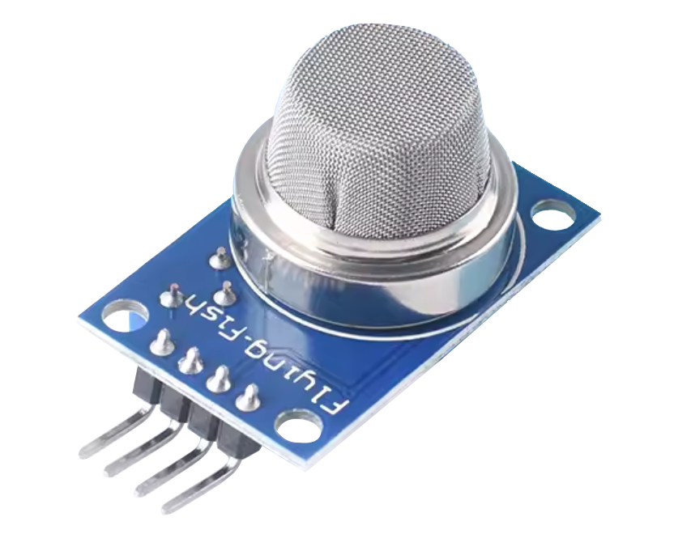
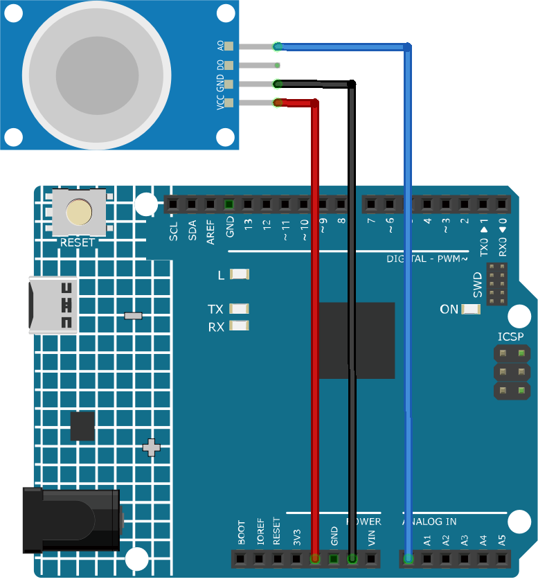

.. _cpn_gas:

ガス/煙センサーモジュール（MQ2）
=====================================

概要
---------------------------
MQ-2センサーは、アルコール、一酸化炭素、水素、イソブテン、液化石油ガス、メタン、プロパン、煙など、多種多様なガスを検出できる高機能なガスセンサーです。低コストで使いやすいため、初心者にも人気があります。

原理
---------------------------
MQ-2センサーは、異なるガスの存在下で抵抗値が変化するという原理で動作します。対象となるガスが加熱されたMOS（Metal Oxide Semiconductor）材料と接触すると、酸化または還元反応が起こり、MOS材料の抵抗値が変化します。特筆すべきは、MQ2ガスセンサーは多種のガスを検出できるものの、それらを識別する能力はありません。これは多くのガスセンサーに共通の特性です。

センサーには、センサーのデジタル出力（D0）の閾値を調整できる内蔵ポテンショメーターがあります。空気中のガス濃度が一定の閾値を超えると、センサーの抵抗値が変化します。この抵抗値の変化は、Arduinoボードで読み取れる電気信号に変換されます。

使い方
---------------------------

**使用する電子部品**

- Arduino Uno R4またはR3ボード * 1
- ガスセンサーモジュール（MQ2） * 1
- ジャンパーワイヤー

**回路組立て**

.. raw:: html
    
         

コード
^^^^^^^^^^^^^^^^^^^^
.. raw:: html

    <iframe src=https://create.arduino.cc/editor/sunfounder01/1de900bf-d3bf-411a-8f6b-23e53b704bf5/preview?embed style="height:510px;width:100%;margin:10px 0" frameborder=0></iframe>

.. raw:: html

   <video loop autoplay muted style = "max-width:100%">
      <source src="../_static/video/basic/02-component_gas.mp4"  type="video/mp4">
      お使いのブラウザはビデオタグをサポートしていません。
   </video>
       

コードの説明
^^^^^^^^^^^^^^^^^^^^^^^^^^^^^^^^^^^^^^^^

1. コードの最初の行は、ガスセンサーのピンに対する整数型の定数を宣言しています。アナログピンA0を使用して、ガスセンサーからの出力を読み取ります。

   .. code-block:: arduino
   
      const int sensorPin = A0;

2. ``setup()``関数では、シリアル通信を9600ボーレートで初期化します。この設定は、ガスセンサーの読み取り値をシリアルモニターに出力するために必要です。

   .. code-block:: arduino
   
      void setup() {
        Serial.begin(9600);  // Start serial communication at 9600 baud rate
      }

3. ``loop()``関数では、ガスセンサーからのアナログ値を連続して読み取り、それをシリアルモニターに出力します。``analogRead()``関数を使用してセンサーからのアナログ値を読み取ります。次の読み取りまで50ミリ秒間待ちます。この遅延は、シリアルモニターがデータを処理する猶予を与えます。

   .. code-block:: arduino
   
      void loop() {
        Serial.print("Analog output: ");
        Serial.println(analogRead(sensorPin));  // Read the analog value of the gas sensor and print it to the serial monitor
        delay(50);                             // Wait for 50 milliseconds
      }

.. note:: 

  MQ2は、使用前に通常予熱が必要な加熱駆動型のセンサーです。予熱期間中、センサーは通常高い値を示し、次第に減少して安定します。

追加アイデア
^^^^^^^^^^^^^^^^

- ガス濃度が特定の閾値を超えた際に作動する視覚または音声の警告システム（LEDやブザーを使用）を追加する。

その他のプロジェクト
---------------------------
* :ref:`fun_gas_leak_alarm`
