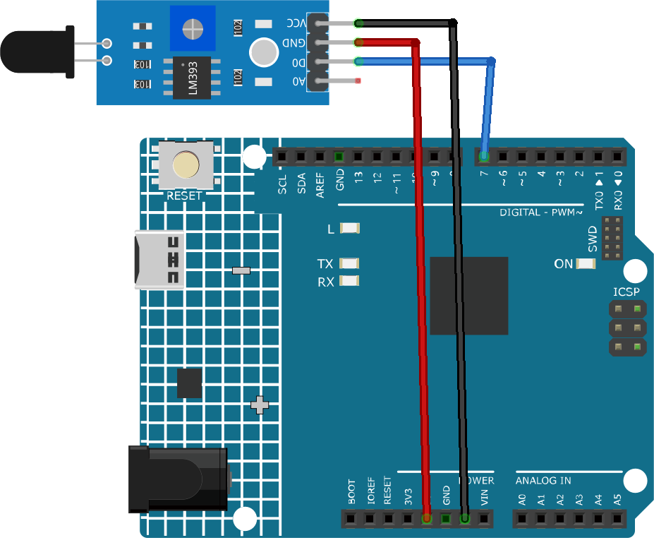

.. note::

    Hello, welcome to the SunFounder Raspberry Pi & Arduino & ESP32 Enthusiasts Community on Facebook! Dive deeper into Raspberry Pi, Arduino, and ESP32 with fellow enthusiasts.

    **Why Join?**

    - **Expert Support**: Solve post-sale issues and technical challenges with help from our community and team.
    - **Learn & Share**: Exchange tips and tutorials to enhance your skills.
    - **Exclusive Previews**: Get early access to new product announcements and sneak peeks.
    - **Special Discounts**: Enjoy exclusive discounts on our newest products.
    - **Festive Promotions and Giveaways**: Take part in giveaways and holiday promotions.

    👉 Ready to explore and create with us? Click [|link_sf_facebook|] and join today!

.. _cpn_flame:

Flame Sensor Module
==========================

.. image:: img/03_flame_module.jpg
    :width: 400
    :align: center

Introduction
---------------------------
The Flame sensor is a sensor that can detect the presence of fire or flames. It detects fires mainly by sensing infrared radiation emitted by fires or flames. It is widely used in fire detection systems in homes and industries.

.. note::
   **Notice**: Due to a production error, some of the flame sensors included in our kits may be the 3-pin version, which lacks the AO (Analog Output). This version is suitable for most projects and does not impact general usage. If you still require the 4-pin version, please contact our customer service at service@sunfounder.com. We will provide a free replacement to meet your needs.

Principle
---------------------------
The Flame sensor works on the principle of infrared (IR) detection. The sensor has an IR receiver that detects the IR radiation emitted by flames. When fire burns it emits a small amount of Infra-red light, this light will be received by the Photodiode (IR receiver) on the sensor module. Then we use an Op-Amp to check for a change in voltage across the IR Receiver, so that if a fire is detected the output pin (DO) will give 0V(LOW), and if the is no fire the output pin will be 5V(HIGH).

Usage
---------------------------

**Hardware components**

- Arduino Uno R4 or R3 board * 1
- Flame Sensor Module * 1
- Jumper Wires

**Circuit Assembly**

.. raw:: html
    
         

Code
^^^^^^^^^^^^^^^^^^^^

.. raw:: html

   <iframe src=https://create.arduino.cc/editor/sunfounder01/7529b311-3763-4b62-aa1c-a63e41871856/preview?embed style="height:510px;width:100%;margin:10px 0" frameborder=0></iframe>

.. raw:: html

   <video loop autoplay muted style = "max-width:100%">
      <source src="../_static/video/basic/03-component_flame.mp4"  type="video/mp4">
      Your browser does not support the video tag.
   </video>
       

Code explanation 
^^^^^^^^^^^^^^^^^^^^

1. The first line of code is a constant integer declaration for the flame sensor pin. We use the digital pin 7 to read the output from the flame sensor.

   .. code-block:: arduino
   
      const int sensorPin = 7;

2. The ``setup()`` function initializes the flame sensor pin as an input and the built-in LED pin as an output. It also starts the serial communication at a baud rate of 9600 for printing messages to the serial monitor.

   .. code-block:: arduino
   
      void setup() {
        pinMode(sensorPin, INPUT);     // Set the flame sensor pin as input
        pinMode(LED_BUILTIN, OUTPUT);  // Set the built-in LED pin as output
        Serial.begin(9600);            // Initialize the serial monitor at a baud rate of 9600
      }

3. The ``loop()`` function is where we continuously check the status of the flame sensor. If the sensor detects a flame, the built-in LED is turned on and a message is printed to the serial monitor. If no flame is detected, the LED is turned off and a different message is printed. The process repeats every 100 milliseconds.

   .. code-block:: arduino
   
      void loop() {
        // Check if the sensor is detecting a fire
        if (digitalRead(sensorPin) == 0) {
          digitalWrite(LED_BUILTIN, HIGH);  // Turn on the built-in LED
          Serial.println("** Fire detected!!! **");
        } else {
          digitalWrite(LED_BUILTIN, LOW);  // Turn off the built-in LED
          Serial.println("No Fire detected");
        }
        delay(100);
      }

Additional Ideas
^^^^^^^^^^^^^^^^

- Modify the code to trigger a buzzer or sound an alarm when fire is detected.

- Incorporate a smoke sensor in addition to the flame sensor to enhance fire detection capabilities.

- Plot the **analog output** instead of just digital HIGH/LOW. Use **AO** pin.

More Projects
---------------------------
* :ref:`iot_Flame`

