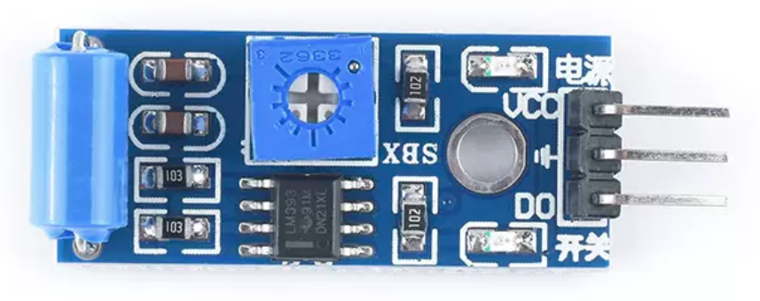
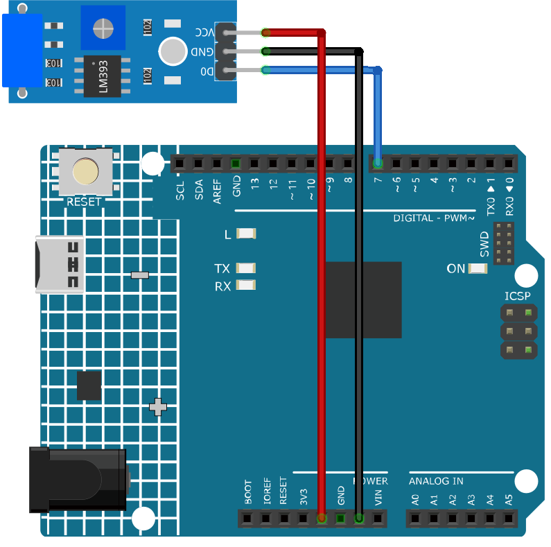

.. note::

    こんにちは、SunFounderのRaspberry Pi & Arduino & ESP32愛好家コミュニティへようこそ！Facebook上でRaspberry Pi、Arduino、ESP32についてもっと深く掘り下げ、他の愛好家と交流しましょう。

    **参加する理由は？**

    - **エキスパートサポート**：コミュニティやチームの助けを借りて、販売後の問題や技術的な課題を解決します。
    - **学び＆共有**：ヒントやチュートリアルを交換してスキルを向上させましょう。
    - **独占的なプレビュー**：新製品の発表や先行プレビューに早期アクセスしましょう。
    - **特別割引**：最新製品の独占割引をお楽しみください。
    - **祭りのプロモーションとギフト**：ギフトや祝日のプロモーションに参加しましょう。

    👉 私たちと一緒に探索し、創造する準備はできていますか？[|link_sf_facebook|]をクリックして今すぐ参加しましょう！

.. _cpn_vibration:

振動センサーモジュール（SW-420）
=====================================

概要
---------------------------
SW-420振動センサーは、表面の振動や衝撃を検出できるモジュールです。ドアのノック検出、機械の故障、自動車の衝突、警報システムなど、多様な用途で利用可能です。動作電圧は3.3Vから5Vです。モジュールには、電源状態用とセンサー出力用の2つのLEDと、振動の閾値を調整できるポテンショメーターが搭載されています。

原理
---------------------------
SW-420振動センサーモジュールは、SW-420振動スイッチとLM393電圧比較器で構成されています。SW-420振動スイッチは、筒の中にバネと棒が備えられている装置です。このスイッチが振動にさらされると、バネが棒に接触し、回路が閉じます。モジュール内の振動センサーは、これらの振動を検出し、電気信号に変換します。その後、LM393比較器チップは、ポテンショメーターで設定された基準電圧とこれらの信号を比較します。信号の振幅がこの基準電圧を超えた場合、比較器の出力は高（1）になり、それ以外の場合は低（0）になります。

使い方
---------------------------

**使用する電子部品**

- Arduino Uno R4またはR3ボード * 1
- 振動センサーモジュール（SW-420） * 1
- ジャンパーワイヤー

**回路組み立て**

.. raw:: html
    
         

コード
^^^^^^^^^^^^^^^^^^^^

.. raw:: html
    
    <iframe src=https://create.arduino.cc/editor/sunfounder01/690d9d6c-1049-48cd-99af-7bc6cd9c1ae4/preview?embed style="height:510px;width:100%;margin:10px 0" frameborder=0></iframe>

.. raw:: html

   <video loop autoplay muted style = "max-width:100%">
      <source src="../_static/video/basic/04-component_vibration.mp4"  type="video/mp4">
      Your browser does not support the video tag.
   </video>
       

コード解説
^^^^^^^^^^^^^^^^^^^^

1. 最初のコード行は、振動センサーピンの定数整数宣言です。振動センサーからの出力を読むためにデジタルピン7を使用します。

   .. code-block:: arduino
   
      const int sensorPin = 7;

2. ``setup()`` 関数では、振動センサーからの読み取りをシリアルモニターに表示するため、9600のボーレートでシリアル通信を初期化します。また、振動センサーピンを入力として設定します。

   .. code-block:: arduino
   
      void setup() {
        Serial.begin(9600);         // Start serial communication at 9600 baud rate
        pinMode(sensorPin, INPUT);  // Set the sensorPin as an input pin
      }

3. ``loop()`` 関数は、センサーが検出した振動を継続的にチェックする場所です。センサーが振動を検出すると、シリアルモニターに「Detected vibration...」と表示します。振動が検出されない場合は、「...」と表示します。このループは100ミリ秒ごとに繰り返されます。

   .. code-block:: arduino
   
      void loop() {
        if (digitalRead(sensorPin)) {               // Check if there is any vibration detected by the sensor
          Serial.println("Detected vibration...");  // Print "Detected vibration..." if vibration detected
        } 
        else {
          Serial.println("...");  // Print "..." otherwise
        }
        // Add a delay to avoid flooding the serial monitor
        delay(100);
      }

追加のアイデア
^^^^^^^^^^^^^^^^

- 振動が検出された際に点灯するLEDを接続可能
- 振動を感知した際に警報音またはブザーが鳴るように設定できます

その他のプロジェクト
---------------------------
* :ref:`iot_Intrusion_alert_system`
