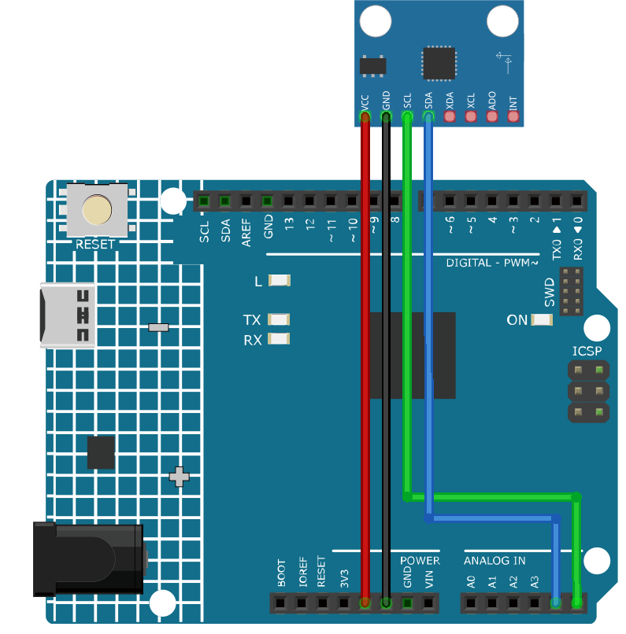

.. note::

    こんにちは、SunFounderのRaspberry Pi & Arduino & ESP32愛好家コミュニティへようこそ！Facebook上でRaspberry Pi、Arduino、ESP32についてもっと深く掘り下げ、他の愛好家と交流しましょう。

    **参加する理由は？**

    - **エキスパートサポート**：コミュニティやチームの助けを借りて、販売後の問題や技術的な課題を解決します。
    - **学び＆共有**：ヒントやチュートリアルを交換してスキルを向上させましょう。
    - **独占的なプレビュー**：新製品の発表や先行プレビューに早期アクセスしましょう。
    - **特別割引**：最新製品の独占割引をお楽しみください。
    - **祭りのプロモーションとギフト**：ギフトや祝日のプロモーションに参加しましょう。

    👉 私たちと一緒に探索し、創造する準備はできていますか？[|link_sf_facebook|]をクリックして今すぐ参加しましょう！

.. _cpn_mpu6050:

加速度センサー & ジャイロスコープモジュール（MPU6050）
===============================================================

.. image:: img/05_mpu6050_1.png
    :width: 300
    :align: center

概要
---------------------------
MPU-6050は、3軸のジャイロスコープと3軸の加速度センサーを組み合わせた6軸の動き検出デバイスです。動き、加速、回転の変化を検出することができます。ロボティクス、ゲームコントローラー、その他動き検出が必要な電子デバイスで一般的に使用されています。高い精度と低コストからDIYコミュニティで非常に人気があります。

原理
---------------------------
MPU-6050センサーモジュールは、3軸加速度センサーと3軸ジャイロスコープから構成されています。

この3つの座標系は次のように定義されています：

MPU6050をテーブルに平置きにし、ラベル面が上向きで、この面の左上隅にドットがある状態を確認します。その後、上方向がチップのz軸となります。左から右への方向がX軸と見なされます。それに対応して、後ろから前への方向がY軸と定義されています。

.. image:: img/05_mpu_2.png
    :width: 300
    :align: center

3軸加速度センサー
^^^^^^^^^^^^^^^^^^^^
加速度センサーは、圧電効果の原理に基づいて動作します。この効果は、機械的なストレスが加わると電荷を発生させる特定の材料の能力です。

例として、上の図のような立方体の箱があり、その中に小さいボールが入っていると想像してください。この箱の壁は圧電結晶で作られています。箱を傾けると、重力によってボールは傾斜方向に移動します。このとき、ボールが衝突した壁が微小な圧電電流を発生させます。立方体には、対の壁が3組あります。各対は3D空間でX、Y、Z軸に対応します。圧電壁から発生した電流に基づいて、傾斜の方向とその大きさを決定できます。

.. image:: img/05_mpu_3.png
    :width: 800
    :align: center

MPU6050を使用して、各座標軸上での加速度を検出することができます（静止状態では、Z軸の加速度は1G、X軸とY軸は0）。傾斜したり、無重力/過重状態になった場合、対応する読み取り値が変わります。

計測範囲はプログラムで選択でき、+/-2g、+/-4g、+/-8g、+/-16g（デフォルトは2g）があります。値の範囲は-32768から32767です。

加速度計の読み取りは、読み取り範囲から計測範囲にマッピングすることで加速度値に変換されます。

加速度 =（加速度計軸の生データ / 65536 * フルスケール加速度範囲）g

例えば、X軸の加速度計の生データが16384で、範囲が+/-2gの場合：

X軸に沿った加速度 =（16384 / 65536 * 4）g = 1g

3軸ジャイロスコープ
^^^^^^^^^^^^^^^^^^^^
ジャイロスコープは、コリオリ加速度の原理に基づいて動作します。フォークのような構造があり、それが絶えず前後に動いています。この構造は、圧電結晶で固定されています。この配置を傾けると、結晶は傾斜方向に力を受けます。これは、動いているフォークの慣性の結果です。したがって、結晶は圧電効果によって電流を発生させ、この電流が増幅されます。

.. image:: img/05_mpu_4.png
    :width: 800
    :align: center

ジャイロスコープにも4種類の計測範囲があります：+/- 250、+/- 500、+/- 1000、+/- 2000。計算方法と加速度は基本的に一致しています。

角速度に読み取りを変換する式は以下の通りです：

角速度 =（ジャイロスコープ軸の生データ / 65536 * フルスケールジャイロスコープ範囲）°/秒

例えば、加速度計のX軸の生データが16384で、範囲が+/- 250°/秒の場合：

X軸に沿った角速度 =（16384 / 65536 * 500）°/秒 = 125°/秒

使い方
---------------------------

**使用する電子部品**

- Arduino Uno R4 または R3 ボード * 1
- 加速度センサー & ジャイロスコープモジュール（MPU6050） * 1
- ジャンパーワイヤ

**回路の組み立て**

.. raw:: html
    
         

コード
^^^^^^^^^^^^^^^^^^^^

.. note:: 
      ライブラリをインストールするには、Arduinoのライブラリマネージャを使用し、 **"Adafruit MPU6050"** で検索してインストールしてください。  

.. raw:: html
    
    <iframe src=https://create.arduino.cc/editor/sunfounder01/e5160412-ce6c-4742-a0f3-0aa259bb9770/preview?embed style="height:510px;width:100%;margin:10px 0" frameborder=0></iframe>

.. raw:: html

   <video loop autoplay muted style = "max-width:100%">
      <source src="../_static/video/basic/05-component_mpu6050.mp4"  type="video/mp4">
      ご使用のブラウザはビデオタグをサポートしていません。
   </video>
       

コードの説明
^^^^^^^^^^^^^^^^^^^^

1. コードは必要なライブラリをインクルードし、MPU6050センサーのオブジェクトを作成することから始まります。このコードでは、Adafruit_MPU6050ライブラリ、Adafruit_Sensorライブラリ、およびWireライブラリを使用しています。 ``Adafruit_MPU6050`` ライブラリはMPU6050センサーとやり取りをし、加速度、回転、温度のデータを取得するために使用されます。 ``Adafruit_Sensor`` ライブラリはさまざまなタイプのセンサーの共通インターフェースを提供します。 ``Wire`` ライブラリはMPU6050センサーと通信するために必要なI2C通信のために使用されます。

   .. note:: 
       ライブラリをインストールするには、Arduinoのライブラリマネージャを使用し、 **"Adafruit MPU6050"** で検索してインストールしてください。

   .. code-block:: arduino
   
      #include <Adafruit_MPU6050.h>
      #include <Adafruit_Sensor.h>
      #include <Wire.h>
      Adafruit_MPU6050 mpu;

2. ``setup()`` 関数は、シリアル通信を初期化し、センサーが検出されるかどうかを確認します。センサーが見つからない場合、Arduinoは「Failed to find MPU6050 chip」というメッセージとともに無限ループに入ります。見つかった場合は、加速度計の範囲、ジャイロの範囲、フィルター帯域幅が設定され、安定のために遅延が追加されます。

   .. code-block:: arduino
   
      void setup(void) {
        // Initialize the serial communication
        Serial.begin(9600);
   
        // Check if the MPU6050 sensor is detected
        if (!mpu.begin()) {
          Serial.println("Failed to find MPU6050 chip");
          while (1) {
            delay(10);
          }
        }
        Serial.println("MPU6050 Found!");
   
        // set accelerometer range to +-8G
        mpu.setAccelerometerRange(MPU6050_RANGE_8_G);
   
        // set gyro range to +- 500 deg/s
        mpu.setGyroRange(MPU6050_RANGE_500_DEG);
   
        // set filter bandwidth to 21 Hz
        mpu.setFilterBandwidth(MPU6050_BAND_21_HZ);
   
        // Add a delay for stability
        delay(100);
      }

3. ``loop()`` 関数では、プログラムはセンサーの読み取りを保存するためのイベントを作成し、読み取りを取得します。次に、加速度、回転、温度の値がシリアルモニタに印刷されます。

   .. code-block:: arduino
   
      void loop() {
        // Get new sensor events with the readings
        sensors_event_t a, g, temp;
        mpu.getEvent(&a, &g, &temp);
   
        // Print out the acceleration, rotation, and temperature readings
        // ...
   
        // Add a delay to avoid flooding the serial monitor
        delay(1000);
      }

追加のアイディア
^^^^^^^^^^^^^^^^^^^^

- LCDやOLEDでセンサーデータをグラフィカルに可視化する