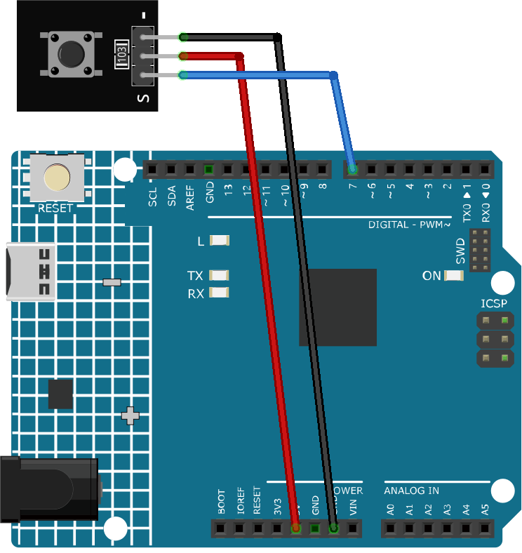

.. _cpn_button:

Button Module
==========================

.. image:: img/06_button.png
    :width: 350
    :align: center

.. _btn_intro:

Introduction
---------------------------
The button module is an electronic device that detects the state of a button.They are usually used as switches to connect or break circuits.Buttons are used in many scenarios, such as doorbells, desk lamps, remote controls, elevators, fire alarms, etc.

Principle
---------------------------
The button module works on the principle of a switch. A switch is an electrical component that can be used to open or close a circuit. 

The following is the internal structure of a button. The symbol on the right below is usually used to represent a button in circuits.

.. image:: img/06_button_2.png
    :width: 400
    :align: center

Since the pin 1 is connected to pin 2, and pin 3 to pin 4, when the button is pressed, the 4 pins are connected, thus closing the circuit.

.. image:: img/06_button_3.png
    :width: 700
    :align: center

Usage
---------------------------

**Hardware components**

- Arduino Uno R4 or R3 board * 1
- Button Module * 1
- Jumper Wires

**Circuit Assembly**

.. raw:: html
    
         

Code
^^^^^^^^^^^^^^^^^^^^

.. raw:: html
    
    <iframe src=https://create.arduino.cc/editor/sunfounder01/d6586fb8-fd37-46d2-ba1f-c94ef3582fe8/preview?embed style="height:510px;width:100%;margin:10px 0" frameborder=0></iframe>

.. raw:: html

   <video loop autoplay muted style = "max-width:100%">
      <source src="../_static/video/basic/06-component_button.mp4"  type="video/mp4">
      Your browser does not support the video tag.
   </video>
       

Code explanation
^^^^^^^^^^^^^^^^^^^^

1. **Setting Up**: In this part of the code, we first declare the ``sensorPin`` as a constant integer and assign it the pin number we will connect our button to on the Arduino board. The ``setup()`` function sets the mode of the ``sensorPin`` as ``INPUT``, meaning we'll be receiving data in through this pin from the button. The ``Serial.begin()`` function initiates serial communication at a baud rate of 9600.

   .. code-block:: arduino

      const int sensorPin = 7;

      void setup() {
        pinMode(sensorPin, INPUT);
        Serial.begin(9600);
      }

2. **The Loop**: The ``loop()`` function contains the main logic of the program. It continuously reads the button state and prints it to the serial monitor every 50 milliseconds. The ``digitalRead()`` function reads the state of the button, and the ``Serial.println()`` function prints this value to the serial monitor. The ``delay()`` function then pauses the execution for 50 milliseconds before the next reading. The button outputs a low level when pressed, and a high level when released. 

   .. code-block:: arduino
    
      void loop() {
        Serial.println(digitalRead(sensorPin));
        delay(50);
      }

Additional Ideas
^^^^^^^^^^^^^^^^^^^^

- Use the button with if statements to control different outcomes in a program.
- Make the button toggle an LED on and off instead of just printing to serial monitor. 

More Projects
---------------------------
* :ref:`fun_doorbell`