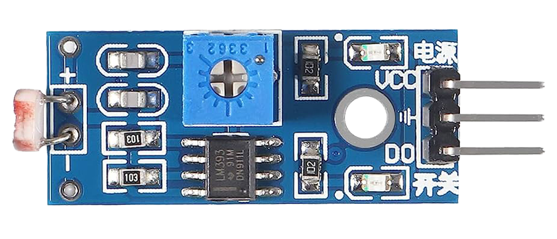
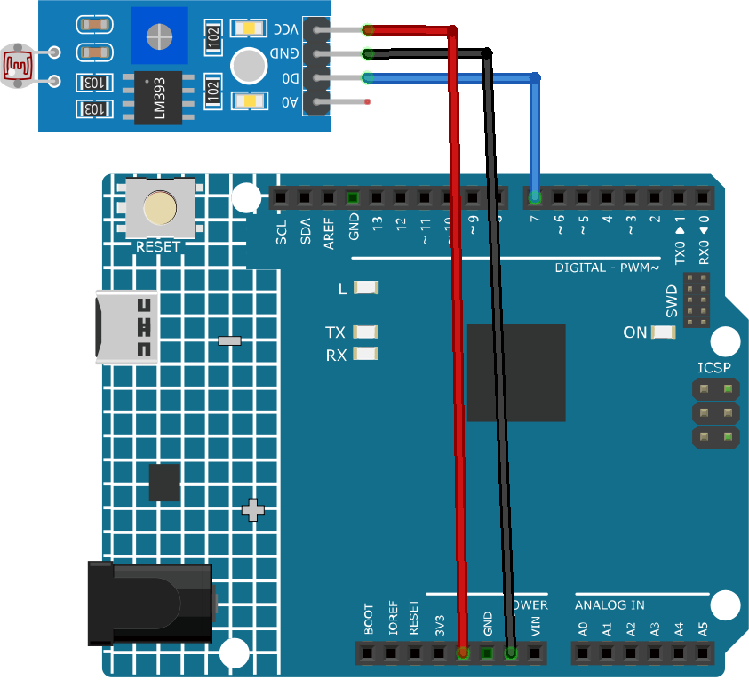

.. _cpn_photoresistor:

フォトレジスタモジュール
==========================

概要
---------------------------
フォトレジスタモジュールは、周囲の光の強度を検出するデバイスです。明るさの調整、昼夜の検出、照明スイッチの作動など、多様な用途に使用することができます。

フォトレジスタモジュールの重要な部品はフォトレジスタです。フォトレジスタは光によって抵抗値が変動する可変抵抗器です。つまり、光が当たると抵抗値が下がる、すなわち光導電性を有しています。

暗闇では数メガオーム（MΩ）に達することもあり、明るい状態では数百オームまで抵抗値が下がることがあります。フォトレジスタは、光感応検出回路や光起動・暗起動スイッチング回路において、抵抗半導体として応用されます。

以下は、フォトレジスタの電子記号です。

.. image:: img/07_photoresistor_symbol_2.png
    :width: 200
    :align: center

原理
---------------------------
フォトレジスタモジュールは、異なる光の強度に対して抵抗値を変更する原理に基づいて動作します。このセンサーには、センサーのデジタル出力（D0）の閾値を調整するための内蔵ポテンショメータがあります。光の強度が一定の閾値を超えると、センサーの抵抗値が変わります。この抵抗値の変化が電気信号に変換され、Arduinoボードで読み取ることができます。

使い方
---------------------------

**使用する電子部品**

- Arduino Uno R4またはR3ボード * 1
- フォトレジスタモジュール * 1
- ジャンパーワイヤー

**回路組立て**

.. raw:: html
    
         

コード
^^^^^^^^^^^^^^^^^^^^

.. raw:: html
    
    <iframe src=https://create.arduino.cc/editor/sunfounder01/72eab12e-5539-46a5-9205-3fede2a236fc/preview?embed style="height:510px;width:100%;margin:10px 0" frameborder=0></iframe>

.. raw:: html

   <video loop autoplay muted style = "max-width:100%">
      <source src="../_static/video/basic/07-component_photoresistor.mp4"  type="video/mp4">
      Your browser does not support the video tag.
   </video>
       

コードの説明
^^^^^^^^^^^^^^^^^^^^

#. このコード行では、Arduinoボード上でフォトレジスタセンサーが接続されているピン番号を定義しています。

   .. code-block:: arduino

      const int sensorPin = 7;

#. ``setup()`` 関数はArduinoで一度だけ実行される特別な関数です。このプロジェクトでは、sensorPinは値を読み取るためにINPUTとして設定されています。Serial.begin(9600) コマンドは、ボーレート9600でシリアル通信を開始します。

   .. code-block:: arduino

      void setup() {
        pinMode(sensorPin, INPUT);  
        Serial.begin(9600);         
      }

#. ``loop()`` 関数はプログラムが繰り返し実行される主要な関数です。この関数内で、digitalRead関数はフォトレジスタセンサーからデジタル値を読み取り、Serial.printlnを使用してシリアルモニターに表示します。 ``delay(50)`` コマンドは、次の読み取りを行う前にプログラムを50ミリ秒間待機させます。

   .. code-block:: arduino

      void loop() {
        Serial.println(digitalRead(sensorPin));  
        delay(50);
      }

追加のアイディア
^^^^^^^^^^^^^^^^^^^^

- センサーを使ってLEDやリレーをオン/オフする。
- デジタルのHIGH/LOWだけでなく、 **アナログ出力** をプロットする。 **AO** ピンを使用。

さらなるプロジェクト
---------------------------
* :ref:`fun_light_control_switch`
