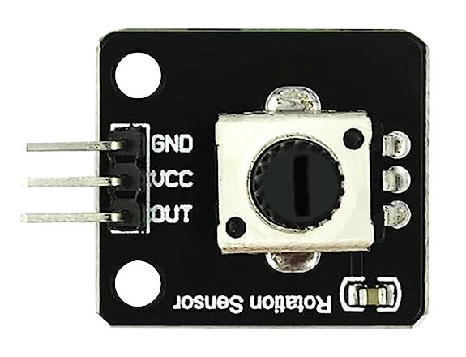
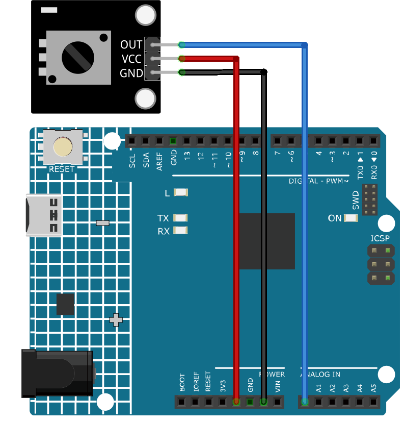

.. note::

    Hello, welcome to the SunFounder Raspberry Pi & Arduino & ESP32 Enthusiasts Community on Facebook! Dive deeper into Raspberry Pi, Arduino, and ESP32 with fellow enthusiasts.

    **Why Join?**

    - **Expert Support**: Solve post-sale issues and technical challenges with help from our community and team.
    - **Learn & Share**: Exchange tips and tutorials to enhance your skills.
    - **Exclusive Previews**: Get early access to new product announcements and sneak peeks.
    - **Special Discounts**: Enjoy exclusive discounts on our newest products.
    - **Festive Promotions and Giveaways**: Take part in giveaways and holiday promotions.

    👉 Ready to explore and create with us? Click [|link_sf_facebook|] and join today!

.. _cpn_potentiometer:

Potentiometer Module
==========================

Introduction
---------------------------
The potentiometer module is an electronic component that changes its resistance depending on the position of the twist knob.It can be used for various purposes, such as controlling the volume of a speaker, the brightness of a LED, or the speed of a motor.

Principle
---------------------------
Potentiometer is also a resistance component with 3 terminals and its resistance value can be adjusted according to some regular variation.

Potentiometers come in various shapes, sizes, and values, but they all have the following things in common:

- They have three terminals (or connection points).
- They have a knob, screw, or slider that can be moved to vary the resistance between the middle terminal and either one of the outer terminals.
- The resistance between the middle terminal and either one of the outer terminals varies from 0 Ω to the maximum resistance of the pot as the knob, screw, or slider is moved.

Here is the circuit symbol of potentiometer.

.. image:: img/08_potentiometer_symbol_2.png
    :width: 200
    :align: center

The functions of the potentiometer in the circuit are as follows:

#. Serving as a voltage divider

   Potentiometer is a continuously adjustable resistor. When you adjust the shaft or sliding handle of the potentiometer, the movable contact will slide on the resistor. At this point, a voltage can be output depending on the voltage applied onto the potentiometer and the angle the movable arm has rotated to or the travel it has made.

#. Serving as a rheostat

   When the potentiometer is used as a rheostat, connect the middle pin and one of the other 2 pins in the circuit. Thus you can get a smoothly and continuously changed resistance value within the travel of the moving contact.

#. Serving as a current controller

   When the potentiometer acts as a current controller, the sliding contact terminal must be connected as one of the output terminals.

Module Schematic Diagram
---------------------------

.. image:: img/08_potentiomete_module_schematic.png
    :width: 80%
    :align: center

.. raw:: html

    

Usage
---------------------------

**Hardware components**

- Arduino Uno R4 or R3 board * 1
- Potentiometer Module * 1
- Jumper Wires

**Circuit Assembly**

.. raw:: html
    
         

Code
^^^^^^^^^^^^^^^^^^^^

.. raw:: html
    
    <iframe src=https://create.arduino.cc/editor/sunfounder01/dd4ed045-ccca-48f2-a938-e90bb5257830/preview?embed style="height:510px;width:100%;margin:10px 0" frameborder=0></iframe>

.. raw:: html

   <video loop autoplay muted style = "max-width:100%">
      <source src="../_static/video/basic/08-component_potentiometer.mp4"  type="video/mp4">
      Your browser does not support the video tag.
   </video>
       

Code explanation
^^^^^^^^^^^^^^^^^^^^

#. This line of code defines the pin number to which the potentiometer is connected on the Arduino board.

   .. code-block:: arduino

      const int sensorPin = A0;

#. The ``setup()`` function is a special function in Arduino that is executed only once when the Arduino is powered on or reset. In this project, the ``Serial.begin(9600)`` command initiates serial communication at a baud rate of 9600.

   .. code-block:: arduino

      void setup() {
        Serial.begin(9600);  
      }

#. The ``loop()`` function is the main function where the program runs repeatedly. In this function, the ``analogRead()`` function reads the analog value from the potentiometer and prints it to the serial monitor using ``Serial.println()``. The ``delay(50)`` command makes the program wait for 50 milliseconds before taking the next reading.

   .. code-block:: arduino

      void loop() {
        Serial.println(analogRead(sensorPin));  
        delay(50);
      }

Additional Ideas
^^^^^^^^^^^^^^^^^^^^

- Control an LED's brightness: The potentiometer's analog value could be used to control the brightness of an LED connected to a PWM-enabled pin on the Arduino.
   
- Control a Servo Motor's Position: By mapping the analog value to the range of the servo's position (usually 0 to 180 degrees), the potentiometer could be used as a controller for the servo motor.

More Projects
---------------------------
* :ref:`fun_potentiometer_scale_value`