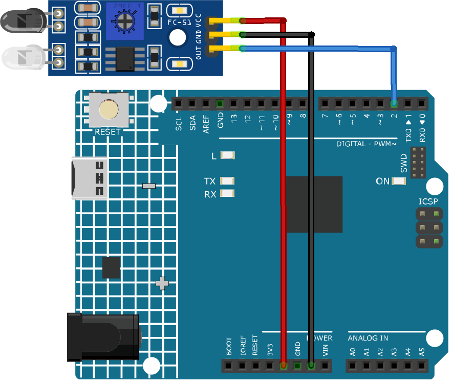

.. note::

    Hello, welcome to the SunFounder Raspberry Pi & Arduino & ESP32 Enthusiasts Community on Facebook! Dive deeper into Raspberry Pi, Arduino, and ESP32 with fellow enthusiasts.

    **Why Join?**

    - **Expert Support**: Solve post-sale issues and technical challenges with help from our community and team.
    - **Learn & Share**: Exchange tips and tutorials to enhance your skills.
    - **Exclusive Previews**: Get early access to new product announcements and sneak peeks.
    - **Special Discounts**: Enjoy exclusive discounts on our newest products.
    - **Festive Promotions and Giveaways**: Take part in giveaways and holiday promotions.

    👉 Ready to explore and create with us? Click [|link_sf_facebook|] and join today!

.. _cpn_ir_obstacle:

IR Obstacle Avoidance Sensor Module
=====================================

.. image:: img/09_IR_obstacle_module.png
    :width: 400
    :align: center

Introduction
---------------------------
An IR Obstacle Sensor works in accordance with the infrared reflection principle to detect obstacles. When there is no object, the infrared receiver receives no signals; when there is an object ahead which blocks and reflects the infrared light, the infrared receiver will receive signals.

Principle
---------------------------
An obstacle avoidance sensor mainly consists of an infrared transmitter, an infrared receiver and a potentiometer. According to the reflecting character of an object, if there is no obstacle, the emitted infrared ray will weaken with the distance it spreads and finally disappear. If there is an obstacle, when the infrared ray encounters it, the ray will be reflected back to the infrared receiver. Then the infrared receiver detects this signal and confirms an obstacle in front. The detection range can be adjusted by the built-in potentiometer.

.. image:: img/09_IR_obstacle_module_1.png
    :width: 600
    :align: center

Usage
---------------------------

**Hardware components**

- Arduino Uno R4 or R3 board * 1
- IR Obstacle Avoidance Sensor Module * 1
- Jumper Wires

**Circuit Assembly**

.. raw:: html
    
         

Code
^^^^^^^^^^^^^^^^^^^^

.. raw:: html
    
    <iframe src=https://create.arduino.cc/editor/sunfounder01/f0e8f3a8-c3a8-4ded-a8ec-67de5a4076f6/preview?embed style="height:510px;width:100%;margin:10px 0" frameborder=0></iframe>

.. raw:: html

   <video loop autoplay muted style = "max-width:100%">
      <source src="../_static/video/basic/09-component_ir_obstacle.mp4"  type="video/mp4">
      Your browser does not support the video tag.
   </video>
       

Code explanation
^^^^^^^^^^^^^^^^^^^^

1. Define pin number for sensor connection:

   .. code-block:: arduino

     const int sensorPin = 2;

   Connect the sensor's output pin to Arduino pin 2.

2. Setup serial communication and define sensor pin as input:

   .. code-block:: arduino

     void setup() {
       pinMode(sensorPin, INPUT);  
       Serial.begin(9600);
     }

   Initialize serial communication at 9600 baud rate to print to serial monitor.
   Set sensor pin as input to read input signal.

3. Read sensor value and print to serial monitor:

   .. code-block:: arduino

     void loop() {
       Serial.println(digitalRead(sensorPin));
       delay(50); 
     }
   
   Continuously read digital value from sensor pin using ``digitalRead()`` and print value to serial monitor using ``Serial.println()``.
   Add 50ms delay between prints for better viewing.

.. note:: 

   If the sensor is not working properly, adjust the IR transmitter and receiver to make them parallel. Additionally, you can adjust the detection range using the built-in potentiometer.

Additional Ideas
^^^^^^^^^^^^^^^^^^^^

- Add buzzer that beeps when obstacle is detected

More Projects
---------------------------
* :ref:`fun_soap_dispenser`

