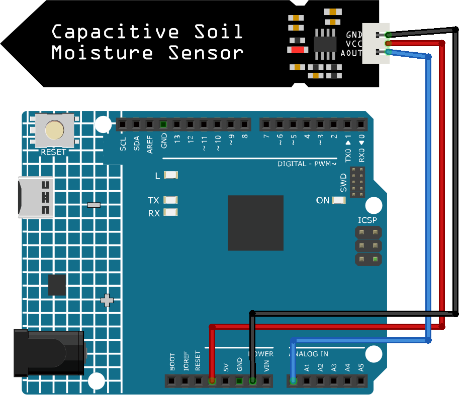

.. note::

    Hallo und willkommen in der SunFounder Raspberry Pi & Arduino & ESP32 Enthusiasten-Gemeinschaft auf Facebook! Tauchen Sie tiefer ein in die Welt von Raspberry Pi, Arduino und ESP32 mit anderen Enthusiasten.

    **Warum beitreten?**

    - **Expertenunterstützung**: Lösen Sie Nachverkaufsprobleme und technische Herausforderungen mit Hilfe unserer Gemeinschaft und unseres Teams.
    - **Lernen & Teilen**: Tauschen Sie Tipps und Anleitungen aus, um Ihre Fähigkeiten zu verbessern.
    - **Exklusive Vorschauen**: Erhalten Sie frühzeitigen Zugang zu neuen Produktankündigungen und exklusiven Einblicken.
    - **Spezialrabatte**: Genießen Sie exklusive Rabatte auf unsere neuesten Produkte.
    - **Festliche Aktionen und Gewinnspiele**: Nehmen Sie an Gewinnspielen und Feiertagsaktionen teil.

    👉 Sind Sie bereit, mit uns zu erkunden und zu erschaffen? Klicken Sie auf [|link_sf_facebook|] und treten Sie heute bei!

.. _cpn_soil:

Kapazitives Bodenfeuchtigkeitsmodul
===================================

.. image:: img/10_soil_mositure_module.png
    :width: 600
    :align: center

Einführung
----------

Das Bodenfeuchtigkeitsmodul ist ein Sensor zur Messung des Feuchtigkeitsgehalts von Erde. Es findet insbesondere in der Landwirtschaft Anwendung, um den Feuchtigkeitszustand des Bodens zu überwachen und Landwirten eine bessere Bewässerungsplanung zu ermöglichen.

Funktionsprinzip
----------------

Im Gegensatz zu den meisten resistiven Sensoren, die derzeit auf dem Markt erhältlich sind, basiert dieses kapazitive Bodenfeuchtigkeitsmodul auf dem Prinzip der kapazitiven Induktion. Dadurch wird das Problem der Korrosionsanfälligkeit, das bei resistiven Sensoren auftritt, effektiv umgangen, was die Lebensdauer des Sensors erheblich verlängert.

Der Sensor besteht aus korrosionsbeständigen Materialien und bietet eine ausgezeichnete Langlebigkeit. Einfach in die Erde neben den Pflanzen einstecken und die Bodenfeuchtigkeit in Echtzeit überwachen. Das Modul enthält einen integrierten Spannungsregler und arbeitet in einem Spannungsbereich von 3,3 bis 5,5 V, wodurch es für Mikrocontroller mit 3,3 V und 5 V Versorgungsspannung ideal ist.

Die Hardware-Schaltung des kapazitiven Bodenfeuchtigkeitssensors ist unten dargestellt.

.. image:: img/10_solid_schematic.png
    :width: 500
    :align: center

Der Sensor verfügt über einen festfrequenten Oszillator, der mit einem 555-Timer-IC realisiert ist. Das generierte Rechtecksignal wird dem Sensor zugeführt, der als Kondensator wirkt. Das Signal durchläuft eine Reaktanz, die in Kombination mit einem rein ohmschen Widerstand (10k Widerstand am Pin 3) einen Spannungsteiler bildet.

Je höher die Bodenfeuchtigkeit, desto größer ist die Kapazität des Sensors. Dadurch verringert sich die Reaktanz des Rechtecksignals, was die Spannung auf der Signalleitung reduziert und den Analogeingangswert am Mikrocontroller entsprechend verkleinert.

Anwendungsbeispiele
--------------------

**Benötigte Hardware-Komponenten**

- Arduino Uno R4 oder R3 Board * 1
- Bodenfeuchtigkeitsmodul * 1
- Jumperkabel

**Schaltungsaufbau**

.. raw:: html
    
         

Programmcode 
^^^^^^^^^^^^^^^^

.. raw:: html
    
    <iframe src=https://create.arduino.cc/editor/sunfounder01/47eddacd-6e47-422b-968f-bdd37dc77015/preview?embed style="height:510px;width:100%;margin:10px 0" frameborder=0></iframe>

.. raw:: html

   <video loop autoplay muted style = "max-width:100%">
      <source src="../_static/video/basic/10-component_soil.mp4"  type="video/mp4">
      Ihr Browser unterstützt das Video-Tag nicht.
   </video>
       

Codeerklärung
^^^^^^^^^^^^^

1. Definition des Sensorpins:

.. code-block:: arduino

    const int sensorPin = A0;

In diesem Codeabschnitt wird eine Konstante mit dem Namen `sensorPin` definiert und dem Wert A0 zugewiesen, der dem analogen Eingangspin auf dem Arduino-Board entspricht, an den der Bodenfeuchtigkeitssensor angeschlossen ist.

2. Initialisierung der seriellen Kommunikation:

.. code-block:: arduino

    void setup() {
      Serial.begin(9600);
    }

Die Funktion ``setup()`` wird einmal aufgerufen, wenn der Arduino eingeschaltet oder zurückgesetzt wird. Hier initialisieren wir die serielle Kommunikation mit einer Baudrate von 9600.

3. Daten lesen und auf dem seriellen Monitor ausgeben:

.. code-block:: arduino

    void loop() {
      Serial.println(analogRead(sensorPin));
      delay(500);
    }

In der `loop()`-Funktion wird die Hauptlogik des Programms ausgeführt. Diese Schleife läuft ununterbrochen, sobald das Programm gestartet ist. Wir verwenden die Funktion ``analogRead()``, um die Daten vom Feuchtigkeitssensor zu lesen und sie auf dem seriellen Monitor auszugeben. Anschließend wird das Programm für 500 Millisekunden pausiert, bevor der nächste Wert erfasst wird.

.. note:: 
    
    Je kleiner der Wert, desto höher ist der Feuchtigkeitsgehalt im Boden.

Weitere Ideen
^^^^^^^^^^^^^

- Integration eines Buzzers oder einer LED, die aktiviert wird, wenn der Feuchtigkeitswert unter einen bestimmten Schwellenwert fällt. So erhalten Sie einen physischen Hinweis, wann es Zeit ist, Ihre Pflanzen zu gießen.
- Automatisierung des Bewässerungsprozesses durch Anschluss einer Wasserpumpe. Fällt die Bodenfeuchtigkeit unter einen bestimmten Wert, kann der Arduino die Pumpe aktivieren, um die Pflanzen zu bewässern.

Weitere Projekte
----------------
* :ref:`iot_Plant_monitor`
* :ref:`iot_Auto_watering_system`
