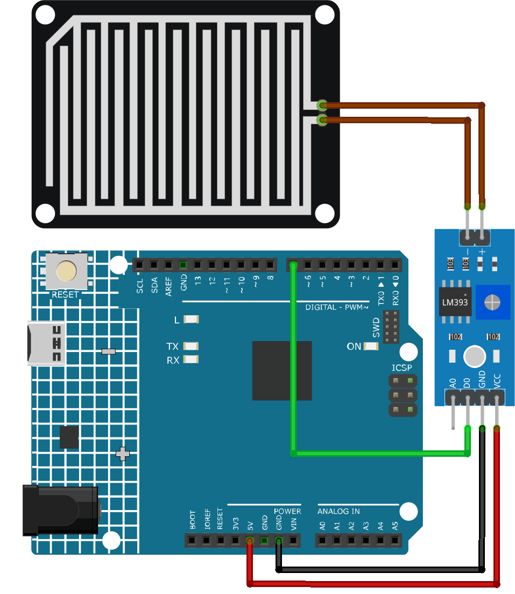

.. _cpn_raindrop:

Regentropfen-Erkennungsmodul
==========================

.. image:: img/11_raindrop_detection_module.jpg
    :width: 300
    :align: center

Einleitung
---------------------------

Ein Regentropfensensor oder auch Regenfall-Erkennungssensor wird genutzt, um festzustellen, ob es regnet und wie stark der Niederschlag ist. Er findet breite Anwendung in automatischen Scheibenwischersystemen, intelligenten Beleuchtungssystemen und Schiebedachsystemen von Automobilen.

Funktionsprinzip
---------------------------

Der Regentropfensensor besteht im Grunde aus einer Platte, die mit Nickel in Linienform beschichtet ist. Er arbeitet auf dem Prinzip des elektrischen Widerstands. Wenn die Platte trocken ist, ist der Widerstand hoch und dementsprechend ist auch die Spannung nach der Formel V=IR hoch. Bei Kontakt mit Regentropfen sinkt der Widerstand, da Wasser ein elektrischer Leiter ist und die Nickel-Linien parallel schließt, was den Widerstand und den Spannungsabfall reduziert. Je stärker der Regenfall, desto geringer ist der Widerstand.

Anwendungsbeispiele
---------------------------

**Benötigte Hardware-Komponenten**

- Arduino Uno R4 oder R3 Platine * 1
- Regentropfen-Erkennungsmodul * 1
- Verbindungskabel

**Schaltungsaufbau**

.. raw:: html
    
         

Code
^^^^^^^^^^^^^^^^^^^^

.. raw:: html
    
    <iframe src=https://create.arduino.cc/editor/sunfounder01/5dbd8745-a9a9-4b19-b245-02c073d89ce8/preview?embed style="height:510px;width:100%;margin:10px 0" frameborder=0></iframe>

.. raw:: html

   <video loop autoplay muted style = "max-width:100%">
      <source src="../_static/video/basic/11-component_raindrop.mp4"  type="video/mp4">
      Ihr Browser unterstützt das Video-Tag nicht.
   </video>
       

Code-Erklärung
^^^^^^^^^^^^^^^^^^^^

1. Sensorpin definieren
Hier wird eine Konstante des Typs Integer namens ``sensorPin`` definiert und dem Wert 7 zugewiesen. Dies entspricht dem digitalen Pin auf dem Arduino-Board, an den der Regentropfen-Erkennungssensor angeschlossen ist.

.. code-block:: arduino

    const int sensorPin = 7;

2. Pin-Modus einstellen und serielle Kommunikation initiieren
In der ``setup()``-Funktion werden zwei wesentliche Schritte durchgeführt. Erstens wird mit ``pinMode()`` der ``sensorPin`` als Eingang konfiguriert, damit digitale Werte vom Regentropfensensor gelesen werden können. Zweitens wird die serielle Kommunikation mit einer Baudrate von 9600 initialisiert.

.. code-block:: arduino

    void setup() {
      pinMode(sensorPin, INPUT);
      Serial.begin(9600);
    }

3. Den digitalen Wert lesen und an das serielle Monitor senden.
Die ``loop()``-Funktion liest den digitalen Wert vom Regentropfensensor mit ``digitalRead()`` aus. Dieser Wert (entweder HIGH oder LOW) wird an das serielle Monitor ausgegeben. Das Programm wartet dann 50 Millisekunden, bevor die nächste Messung erfolgt.

.. code-block:: arduino

    void loop() {
      Serial.println(digitalRead(sensorPin));
      delay(50);
    }

Weitere Ideen
^^^^^^^^^^^^^^^^^^^^^^^^^^^^^^^^^^^^^^^^

- Fügen Sie eine LED-Anzeige hinzu, die aufleuchtet, wenn Regen erkannt wird.
- Verbinden Sie einen Summer mit dem Arduino, um einen Alarmton auszulösen, wenn Regen erkannt wird. Dies könnte als Frühwarnsystem für Veranstaltungen wie Picknicks oder Outdoor-Aktivitäten dienen.

