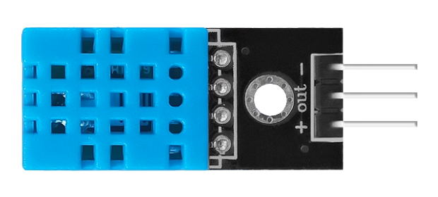
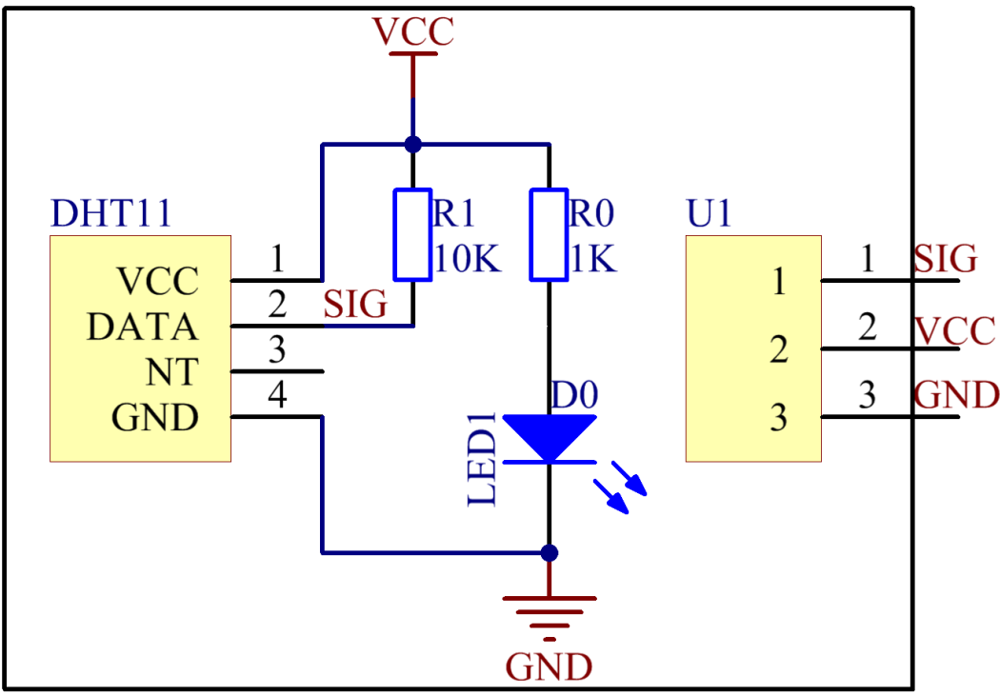
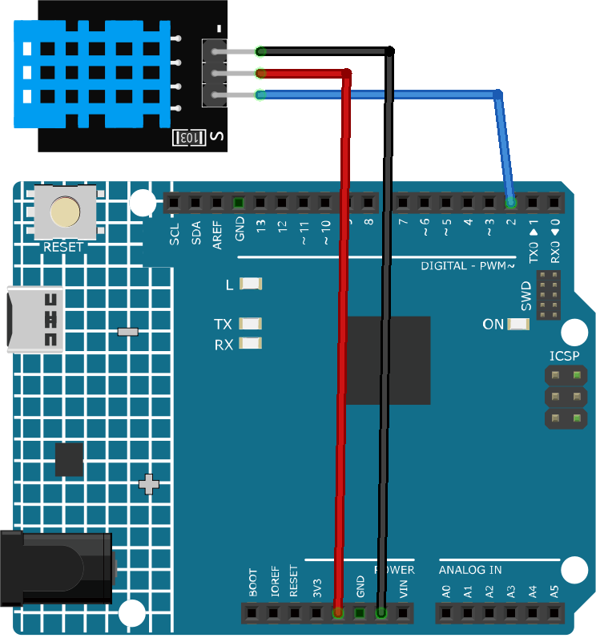

.. _cpn_dht11:

Temperature and Humidity Sensor Moudle (DHT11)
================================================

Introduction
---------------------------
The digital temperature and humidity sensor DHT11 is a composite sensor that contains a calibrated digital signal output of temperature and humidity. The technology of a dedicated digital modules collection and the temperature and humidity sensing technology are applied to ensure that the product has high reliability and excellent long-term stability.

The sensor includes a resistive sense of wet component and an NTC temperature measurement device, and is connected with a high-performance 8-bit microcontroller.

Principle
---------------------------
Only three pins are available for use: VCC, GND, and DATA. The communication process begins with the DATA line sending start signals to DHT11, and DHT11 receives the signals and returns an answer signal. Then the host receives the answer signal and begins to receive 40-bit humidity and temperature data (8-bit humidity integer + 8-bit humidity decimal + 8-bit temperature integer + 8-bit temperature decimal + 8-bit checksum).

.. image:: img/12_dht11_module_2.png
    :width: 300
    :align: center

For more information, please refer to the datasheet of DHT11.

The schematic diagram

.. raw:: html
    
         

Usage
---------------------------

**Hardware components**

- Arduino Uno R4 or R3 board * 1
- Temperature and Humidity Sensor Moudle(DHT11) * 1
- Jumper Wires

**Circuit Assembly**

.. raw:: html
    
         

Code
^^^^^^^^^^^^^^^^^^^^

.. raw:: html
    
    <iframe src=https://create.arduino.cc/editor/sunfounder01/34796700-4b94-4796-815a-314a25f60638/preview?embed style="height:510px;width:100%;margin:10px 0" frameborder=0></iframe>

.. raw:: html

   <video loop autoplay muted style = "max-width:100%">
      <source src="../_static/video/basic/12-component_dht11.mp4"  type="video/mp4">
      Your browser does not support the video tag.
   </video>
       

Code explanation
^^^^^^^^^^^^^^^^^^^^

#. Inclusion of necessary libraries and definition of constants.
   This part of the code includes the DHT sensor library and defines the pin number and sensor type used in this project.

   .. note:: 
      To install, use the Arduino Library Manager and search for **"DHT sensor library"** and install the library. 

   .. code-block:: arduino
    
      #include <DHT.h>
      #define DHTPIN 2       // Define the pin used to connect the sensor
      #define DHTTYPE DHT11  // Define the sensor type

#. Creation of DHT object.
   Here we create a DHT object using the defined pin number and sensor type.

   .. code-block:: arduino

      DHT dht(DHTPIN, DHTTYPE);  // Create a DHT object

#. This function is executed once when the Arduino starts. We initialize the serial communication and the DHT sensor in this function.

   .. code-block:: arduino

      void setup() {
        Serial.begin(9600);
        Serial.println(F("DHT11 test!"));
        dht.begin();  // Initialize the DHT sensor
      }

#. Main loop.
   The ``loop()`` function runs continuously after the setup function. Here, we read the humidity and temperature values, calculate the heat index, and print these values to the serial monitor.  If the sensor read fails (returns NaN), it prints an error message.

   .. note::
    
      The |link_heat_index| is a way to measure how hot it feels outside by combining the air temperature and the humidity. It is also called the "felt air temperature" or "apparent temperature".

   .. code-block:: arduino

      void loop() {
        delay(2000);
        float h = dht.readHumidity();
        float t = dht.readTemperature();
        float f = dht.readTemperature(true);
        if (isnan(h) || isnan(t) || isnan(f)) {
          Serial.println(F("Failed to read from DHT sensor!"));
          return;
        }
        float hif = dht.computeHeatIndex(f, h);
        float hic = dht.computeHeatIndex(t, h, false);
        Serial.print(F("Humidity: "));
        Serial.print(h);
        Serial.print(F("%  Temperature: "));
        Serial.print(t);
        Serial.print(F("°C "));
        Serial.print(f);
        Serial.print(F("°F  Heat index: "));
        Serial.print(hic);
        Serial.print(F("°C "));
        Serial.print(hif);
        Serial.println(F("°F"));
      }

    
Additional Ideas
^^^^^^^^^^^^^^^^^^^^

- Display readings on an LCD or OLED display

More Projects
---------------------------
* :ref:`iot_Plant_monitor`
* :ref:`iot_Bluetooth_environmental_monitor`

