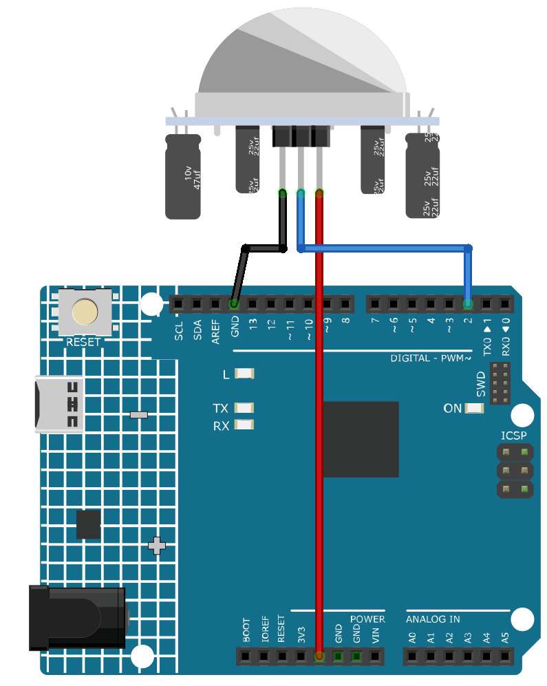

.. _cpn_pir_motion:

PIR Motion Module (HC-SR501)
==========================

.. image:: img/13_pir_module.png
    :width: 300
    :align: center

Introduction
---------------------------
The Passive Infrared(PIR) Motion Sensor is a sensor that detects motion. It is commonly used in security systems and automatic lighting systems. The sensor has two slots that detect infrared radiation. When an object, such as a person, passes in front of the sensor, it detects a change in the amount of infrared radiation and triggers an output signal.

Principle
---------------------------
The PIR sensor is split into two slots that are connected to a differential amplifier. Whenever a stationary object is in front of the sensor, the two slots receive the same amount of radiation and the output is zero. Whenever a moving object is in front of the sensor, one of the slots receives more radiation than the other , which makes the output fluctuate high or low. This change in output voltage is a result of detection of motion.

.. image:: img/13_pir_working_principle.jpg
    :width: 500
    :align: center

After the sensing module is wired, there is a one-minute initialization. During the initialization, module will output for 0~3 times at intervals. Then the module will be in the standby mode. Please keep the interference of light source and other sources away from the surface of the module so as to avoid the misoperation caused by the interfering signal. Even you’d better use the module without too much wind, because the wind can also interfere with the sensor.

.. image:: img/13_pir_module_back.png
    :width: 350
    :align: center

.. raw:: html
    
       

Distance Adjustment
^^^^^^^^^^^^^^^^^^^^
Turning the knob of the distance adjustment potentiometer clockwise, the range of sensing distance increases, and the maximum sensing distance range is about 0-7 meters. If turn it anticlockwise, the range of sensing distance is reduced, and the minimum sensing distance range is about 0-3 meters.

Delay adjustment
^^^^^^^^^^^^^^^^^^^^
Rotate the knob of the delay adjustment potentiometer clockwise, you can also see the sensing delay increasing. The maximum of the sensing delay can reach up to 300s. On the contrary, if rotate it anticlockwise, you can shorten the delay with a minimum of 5s.

Two Trigger Modes
^^^^^^^^^^^^^^^^^^^^
Choosing different modes by using the jumper cap.

* H: Repeatable trigger mode, after sensing the human body, the module outputs high level. During the subsequent delay period, if somebody enters the sensing range,the output will keep being the high level.
* L: Non-repeatable trigger mode, outputs high level when it senses the human body. After the delay, the output will change from high level into low level automatically.

Usage
---------------------------

**Hardware components**

- Arduino Uno R4 or R3 board * 1
- PIR Motion Module * 1
- Jumper Wires

**Circuit Assembly**

.. note::
    The pin markings are hidden by the Fresnel lens. You can open it to view.

.. raw:: html
    
         

Code
^^^^^^^^^^^^^^^^^^^^

.. raw:: html
    
    <iframe src=https://create.arduino.cc/editor/sunfounder01/4a9b7041-dac5-4d8a-8941-fa0d2d6313d8/preview?embed style="height:510px;width:100%;margin:10px 0" frameborder=0></iframe>

.. raw:: html

   <video loop autoplay muted style = "max-width:100%">
      <source src="../_static/video/basic/13-component_pir_motion.mp4"  type="video/mp4">
      Your browser does not support the video tag.
   </video>
       

Code explanation
^^^^^^^^^^^^^^^^^^^^

1. Setting up the PIR Sensor Pin. The pin for the PIR sensor is defined as pin 2. 

   .. code-block:: arduino

      const int pirPin = 2;
      int state = 0;

2. Initializing the PIR Sensor. In the ``setup()`` function, the PIR sensor pin is set as an input. This allows the Arduino to read the state of the PIR sensor.

   .. code-block:: arduino

      void setup() {
        pinMode(pirPin, INPUT);
        Serial.begin(9600);
      }

3. Reading from the PIR Sensor and Displaying the Results. In the ``loop()`` function, the state of the PIR sensor is continuously read. 

   .. code-block:: arduino

      void loop() {
        state = digitalRead(pirPin);
        if (state == HIGH) {
          Serial.println("Somebody here!");
        } else {
          Serial.println("Monitoring...");
          delay(100);
        }
      }

   If the state is ``HIGH``, meaning motion is detected, a message "Somebody here!" is printed to the serial monitor. Otherwise, "Monitoring..." is printed.

Additional Ideas
^^^^^^^^^^^^^^^^^^^^

- You can add an LED that turns on or blinks when motion is detected. This provides visual feedback in addition to the serial monitor message.
- Integrate a buzzer to sound an alert when motion is detected.

More Projects
---------------------------
* :ref:`fun_motion_triggered_relay`
* :ref:`iot_Intrusion_alert_system`
