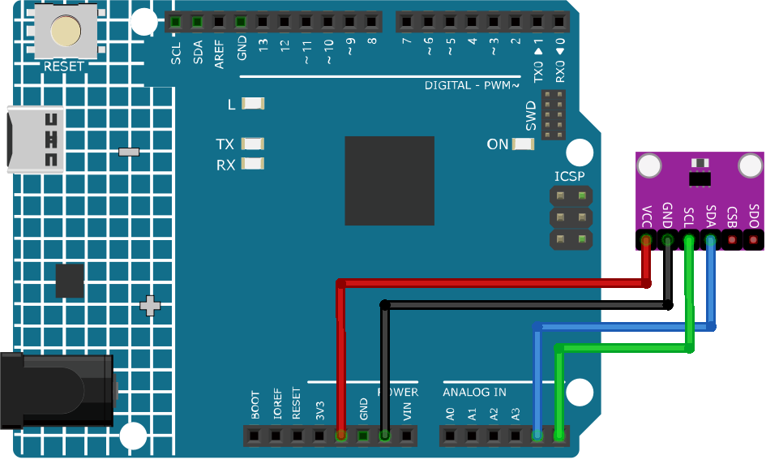

.. _cpn_bmp280:

温度、湿度、気圧センサー（BMP280）
===============================================================

.. image:: img/14_gy_bme280_3.3_module.png
    :width: 300
    :align: center

はじめに
---------------------------
GY-BMP280-3.3高精度気圧センサーモジュールは、大気圧と温度を高精度で測定できるデバイスです。このモジュールにより、気象状況のモニタリングや高度、気圧データを使用したプロジェクトが実現可能です。

原理
---------------------------
GY-BMP280-3.3高精度気圧センサーモジュールは、Bosch製のBMP280センサーを使用して圧力と温度の両方を測定します。このBMP280センサーには、密封された金属チャンバー内に圧電抵抗式圧力センサーとサーミスタが搭載されています。圧電抵抗式センサーは、チャンバーに加えられた圧力に応じて抵抗値を変更し、サーミスタはチャンバー内の温度に応じて抵抗値を変更します。このモジュールには、これらの抵抗値をデジタル信号に変換し、ArduinoにI2CまたはSPIインターフェースで送信する集積回路が組み込まれています。

使い方
---------------------------

**使用する電子部品**

- Arduino Uno R4またはR3ボード * 1
- 温度、湿度、気圧センサー（GY-BMP280-3.3） * 1
- ジャンパーワイヤー

**回路組み立て**

.. raw:: html
    
         

コード
^^^^^^^^^^^^^^^^^^^^

.. note:: 
   ライブラリをインストールするには、Arduino Library Managerで**"Adafruit BMP280"**と検索してインストールしてください。

.. raw:: html
    
    <iframe src=https://create.arduino.cc/editor/sunfounder01/e1f581e4-76c8-48a0-b1cc-d15604267183/preview?embed style="height:510px;width:100%;margin:10px 0" frameborder=0></iframe>

.. raw:: html

   <video loop autoplay muted style = "max-width:100%">
      <source src="../_static/video/basic/14-component_bmp280.mp4"  type="video/mp4">
      ご利用のブラウザはビデオタグに対応していません。
   </video>
       

コード説明
^^^^^^^^^^^^^^^^^^^^

1. ライブラリのインクルードと初期化。必要なライブラリがインクルードされ、BMP280センサーはI2Cインターフェースを使用して通信のために初期化されます。

   .. note:: 
      ライブラリをインストールするには、Arduino Library Managerで **"Adafruit BMP280"** と検索してインストールしてください。

   - Adafruit BMP280ライブラリ：このライブラリは、BMP280センサーから温度、圧力、高度を簡単に読み取るためのインターフェースを提供します。
   - Wire.h：I2C通信に使用されます。

   .. raw:: html
    
     

   .. code-block:: arduino
    
      #include <Wire.h>
      #include <Adafruit_BMP280.h>
      #define BMP280_ADDRESS 0x76
      Adafruit_BMP280 bmp;  // use I2C interface

2. ``setup()`` 関数では、シリアル通信を初期化し、BMP280センサーの存在を確認し、デフォルトの設定でセンサーを設定します。

   .. code-block:: arduino

      void setup() {
        Serial.begin(9600);
        while (!Serial) delay(100);
        Serial.println(F("BMP280 test"));
        unsigned status;
        status = bmp.begin(BMP280_ADDRESS);
        // ... (rest of the setup code)

3. ``loop()`` 関数では、BMP280センサーから温度、圧力、高度のデータを読み取り、シリアルモニターに表示します。

   .. code-block:: arduino

      void loop() {
        // ... (read and print temperature, pressure, and altitude data)
        delay(2000);  // 2-second delay between readings.
      }

追加アイデア
^^^^^^^^^^^^^^^^^^^^

- シリアルモニターに加えて、または代わりにLCDディスプレイモジュールを使用して読み取り値を表示します。
- 温度と圧力の閾値を設定し、これらが超過された場合にブザーまたはLEDで警告します。

その他のプロジェクト
---------------------------
* :ref:`iot_Weather_monitor`
