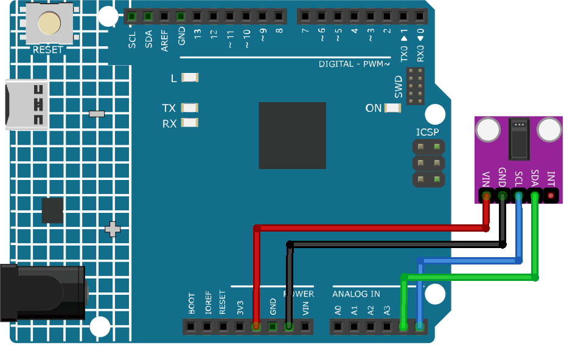

.. _cpn_max30102:

Pulse Oximeter and Heart Rate Sensor (MAX30102)
===============================================================

.. image:: img/15_gy_max30102_module.png
    :width: 300
    :align: center

Introduction
---------------------------
MAX30102 is a sensor that combines a pulse oximeter and a heart rate monitor. It's an optical sensor that measures the absorbance of pulsating blood through a photodetector after emitting two wavelengths of light from two LEDs - a red and an infrared one. This particular LED colour combination is designed to allow data to be read with the tip of one's finger.

Principle
---------------------------
The MAX30102 works by shining both lights onto the finger or earlobe (or essentially anywhere where the skin isn’t too thick, so both lights can easily penetrate the tissue) and measuring the amount of reflected light using a photodetector. This method of pulse detection through light is called Photoplethysmogram.

The working of MAX30102 can be divided into two parts: Heart Rate Measurement and Pulse Oximetry (measuring the oxygen level of the blood).

Heart Rate Measurement
^^^^^^^^^^^^^^^^^^^^^^^^^^
The oxygenated hemoglobin (HbO2) in the arterial blood has the characteristic of absorbing IR light. The redder the blood (the higher the hemoglobin), the more IR light is absorbed. As the blood is pumped through the finger with each heartbeat, the amount of reflected light changes, creating a changing waveform at the output of the photodetector. As you continue to shine light and take photodetector readings, you quickly start to get a heart-beat (HR) pulse reading.

Pulse Oximetry
^^^^^^^^^^^^^^^^^^^^
Pulse oximetry is based on the principle that the amount of RED and IR light absorbed varies depending on the amount of oxygen in your blood. 

Usage
---------------------------

**Hardware components**

- Arduino Uno R4 or R3 board * 1
- Pulse Oximeter and Heart Rate Sensor(MAX30102) * 1
- Jumper Wires

**Circuit Assembly**

.. raw:: html
    
         

Code
^^^^^^^^^^^^^^^^^^^^

.. warning::
    This sketch detects heart-rate optically. This method is tricky and prone to give false readings. So please **DO NOT** use it for actual medical diagnosis.

.. raw:: html
    
    <iframe src=https://create.arduino.cc/editor/sunfounder01/8fd9aa35-11df-477e-87ea-879172104d03/preview?embed style="height:510px;width:100%;margin:10px 0" frameborder=0></iframe>

.. raw:: html

   <video loop autoplay muted style = "max-width:100%">
      <source src="../_static/video/basic/15-component_max30102.mp4"  type="video/mp4">
      Your browser does not support the video tag.
   </video>
       

Code explanation
^^^^^^^^^^^^^^^^^^^^

1. **Including Libraries & Initializing Global Variables**:

   The essential libraries are imported, the sensor object is instantiated, and global variables for data management are set.

   .. note:: 
      To install library, use the Arduino Library Manager and search for **"SparkFun MAX3010x"** and install the library. 
   
   .. code-block:: arduino
    
      #include <Wire.h>
      #include "MAX30105.h"
      #include "heartRate.h"
      MAX30105 particleSensor;
      // ... (other global variables)

2. **Setup Function & Sensor Initialization**:

   The Serial communication is initialized at a baud rate of 9600. The sensor's connection is checked, and if successful, an initialization sequence is run. An error message is displayed if the sensor isn't detected.
   
   .. code-block:: arduino

      void setup() {
        Serial.begin(9600);
        if (!particleSensor.begin(Wire, I2C_SPEED_FAST)) {
          Serial.println("MAX30102 not found.");
          while (1) ;  // Infinite loop if sensor not detected.
        }
        // ... (further setup)

3. **Reading IR Value & Checking for Heartbeat**:

   The IR value, which is indicative of the blood flow, is fetched from the sensor. The `checkForBeat()` function assesses if a heartbeat is detected based on this value.

   .. code-block:: arduino

      long irValue = particleSensor.getIR();
      if (checkForBeat(irValue) == true) {
          // ... (heartbeat detected actions)
      }

4. **Calculating Beats Per Minute (BPM)**:

   Upon detecting a heartbeat, the BPM is calculated based on the time difference since the last detected heartbeat. The code also ensures the BPM falls within a realistic range before updating the average.

   .. code-block:: arduino

      long delta = millis() - lastBeat;
      beatsPerMinute = 60 / (delta / 1000.0);
      if (beatsPerMinute < 255 && beatsPerMinute > 20) {
          // ... (store and average BPM)
      }
      

5. **Printing Values to the Serial Monitor**:

   The IR value, current BPM, and average BPM are printed to the Serial Monitor. Additionally, the code checks if the IR value is too low, suggesting the absence of a finger.

   .. code-block:: arduino

      //Print the IR value, current BPM value, and average BPM value to the serial monitor
      Serial.print("IR=");
      Serial.print(irValue);
      Serial.print(", BPM=");
      Serial.print(beatsPerMinute);
      Serial.print(", Avg BPM=");
      Serial.print(beatAvg);

      if (irValue < 50000)
        Serial.print(" No finger?");

Additional Ideas
^^^^^^^^^^^^^^^^^^^^

- Add LEDs to flash with each detected beat  
- Use a small OLED or LCD screen to display real-time BPM values and other relevant data.

More Projects
---------------------------
* :ref:`fun_heartrate_monitor`