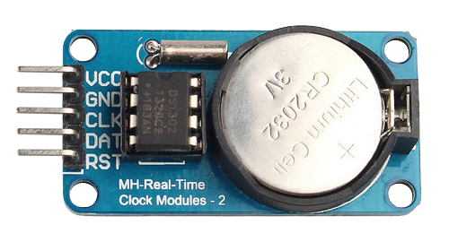
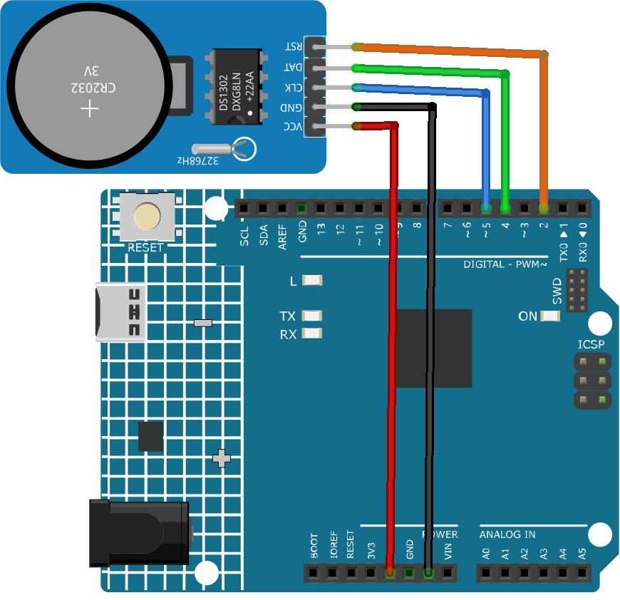

.. _cpn_rtc_ds1302:

Real Time Clock Module (DS1302)
=====================================

Introduction
---------------------------
A DS1302 real-time clock module is a device that can keep track of the date and time. It can help you create projects that need accurate timing and scheduling. It can also be used to create a digital clock with Arduino.

Principle
---------------------------
DS1302 is a trickle charging clock chip, launched by DALLAS in America. With a built-in real-time clock/calendar and a 31-byte static RAM, it can communicate with MCU through simple serial ports. The real-time clock/calendar circuit provides information about second, minute, hour, day, week, month, and year. DS1302 can automatically adjust the number of days per month and days in leap year. You can determine to use a 24-hour or 12-hour system by AM/PM selection. It can simply communicate with MCU in synchronous serial way and only needs to use three port cables: Reset (RST) cable, I/O data (SDA) cable and serial clock (SCL) cable.

Usage
---------------------------

**Hardware components**

- Arduino Uno R4 or R3 board * 1
- Real Time Clock Module(DS1302) * 1
- Jumper Wires

**Circuit Assembly**

.. raw:: html
    
         

Code
^^^^^^^^^^^^^^^^^^^^

.. note:: 
   To install the library, use the Arduino Library Manager and search for **"Rtc by Makuna"** and install it. 

.. raw:: html
    
    <iframe src=https://create.arduino.cc/editor/sunfounder01/f923ec19-a2f0-4d74-b68b-826da12a17f3/preview?embed style="height:510px;width:100%;margin:10px 0" frameborder=0></iframe>

.. raw:: html

   <video loop autoplay muted style = "max-width:100%">
      <source src="../_static/video/basic/16-component_rtc_ds1302.mp4"  type="video/mp4">
      Your browser does not support the video tag.
   </video>
       

Code explanation
^^^^^^^^^^^^^^^^^^^^

#. Initialization and library inclusion

   .. note:: 
      To install the library, use the Arduino Library Manager and search for **"Rtc by Makuna"** and install it. 

   Here, necessary libraries are included for the DS1302 RTC module.

   .. code-block:: arduino

      #include <ThreeWire.h>
      #include <RtcDS1302.h>

#. Define pins and create RTC instance

   Pins for communication are defined and an instance of the RTC is created.

   .. code-block:: arduino

      const int IO = 4;    // DAT
      const int SCLK = 5;  // CLK
      const int CE = 2;    // RST

      ThreeWire myWire(4, 5, 2);  // IO, SCLK, CE
      RtcDS1302<ThreeWire> Rtc(myWire);

#. ``setup()`` function

   This function initializes the serial communication and sets up the RTC module. Various checks are made to ensure the RTC is running correctly.

   .. code-block:: arduino

      void setup() {
        Serial.begin(9600);
      
        Serial.print("compiled: ");
        Serial.print(__DATE__);
        Serial.println(__TIME__);
      
        Rtc.Begin();
      
        RtcDateTime compiled = RtcDateTime(__DATE__, __TIME__);
        printDateTime(compiled);
        Serial.println();
      
        if (!Rtc.IsDateTimeValid()) {
          // Common Causes:
          //    1) first time you ran and the device wasn't running yet
          //    2) the battery on the device is low or even missing
      
          Serial.println("RTC lost confidence in the DateTime!");
          Rtc.SetDateTime(compiled);
        }
      
        if (Rtc.GetIsWriteProtected()) {
          Serial.println("RTC was write protected, enabling writing now");
          Rtc.SetIsWriteProtected(false);
        }
      
        if (!Rtc.GetIsRunning()) {
          Serial.println("RTC was not actively running, starting now");
          Rtc.SetIsRunning(true);
        }
      
        RtcDateTime now = Rtc.GetDateTime();
        if (now < compiled) {
          Serial.println("RTC is older than compile time!  (Updating DateTime)");
          Rtc.SetDateTime(compiled);
        } else if (now > compiled) {
          Serial.println("RTC is newer than compile time. (this is expected)");
        } else if (now == compiled) {
          Serial.println("RTC is the same as compile time! (not expected but all is fine)");
        }
      }

#. ``loop()`` function

   This function periodically fetches the current date and time from the RTC and prints it on the serial monitor. It also checks if the RTC is still maintaining a valid date and time.

   .. code-block:: arduino

      void loop() {
        RtcDateTime now = Rtc.GetDateTime();
      
        printDateTime(now);
        Serial.println();
      
        if (!now.IsValid()) {
          // Common Causes:
          //    1) the battery on the device is low or even missing and the power line was disconnected
          Serial.println("RTC lost confidence in the DateTime!");
        }
      
        delay(5000);  // five seconds
      }

#. Date and time printing function

   A helper function that takes a ``RtcDateTime`` object and prints the formatted date and time to the serial monitor.

   .. code-block:: arduino

      void printDateTime(const RtcDateTime& dt) {
        char datestring[20];
      
        snprintf_P(datestring,
                   countof(datestring),
                   PSTR("%02u/%02u/%04u %02u:%02u:%02u"),
                   dt.Month(),
                   dt.Day(),
                   dt.Year(),
                   dt.Hour(),
                   dt.Minute(),
                   dt.Second());
        Serial.print(datestring);
      }

Additional Ideas
^^^^^^^^^^^^^^^^^^^^

- Display time on LCD or serial monitor
- Schedule events/alarms at certain times

