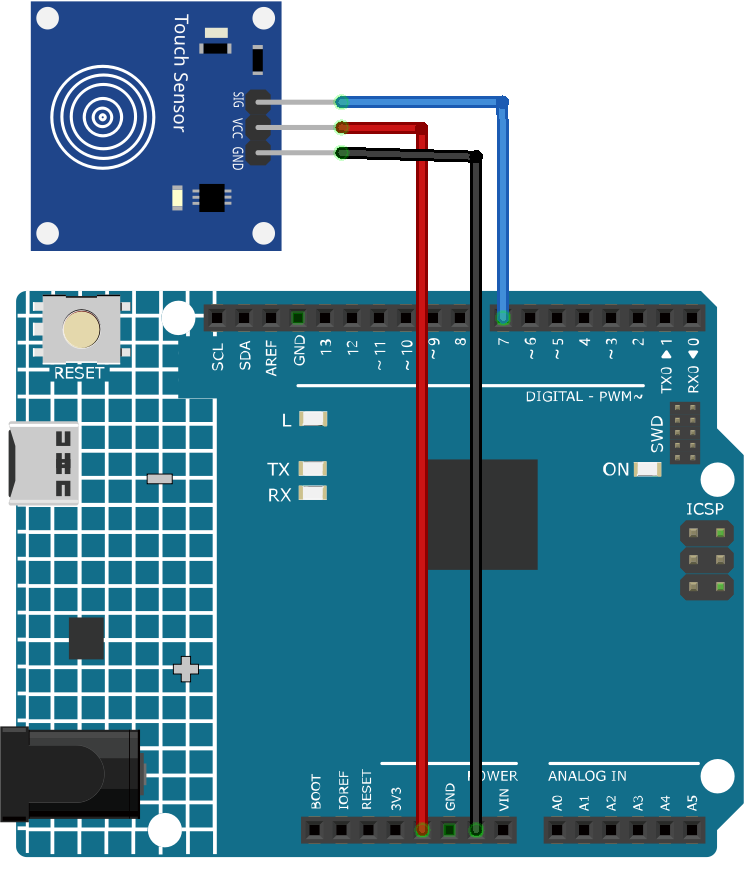

.. _cpn_touch:

Touch Sensor Module
==========================

.. image:: img/17_touch_sensor_moudle.png
    :width: 200
    :align: center

Introduction
---------------------------
The Touch switch sensor (also called touch button or touch switch) is widely used to control devices (e.g. touchable lamp). It has the same functionality as a button. It is used instead of the button on many new devices because it makes the product look neat.

Principle
---------------------------
This module is a capacitive touch switch module based on a touch sensor IC (TTP223B). In the normal state, the module outputs a low level with low power consumption; when a finger touches the corresponding position, the module outputs a high level and becomes low level again after the finger is released.

Here is how the capacitive touch switch works:

A capacitive touch switch has different layers—top insulating face plate followed by touch plate, another insulating layer and then ground plate.

.. image:: img/17_touch_sensor_moudle_principle.jpeg
    :width: 400
    :align: center

In practice, a capacitive sensor can be made on a double-sided PCB by regarding one side as the touch sensor and the opposite side as ground plate of the capacitor. When power is applied across these plates, the two plates get charged. In equilibrium state, the plates have the same voltage as the power source.

The touch detector circuit has an oscillator whose frequency is dependent on capacitance of the touchpad. When a finger is moved close to the touchpad, additional capacitance causes frequency of this internal oscillator to change. The detector circuit tracks oscillator frequency at timed intervals, and when the shift crosses the threshold change, the circuit triggers a key-press event.

Usage
---------------------------

**Hardware components**

- Arduino Uno R4 or R3 board * 1
- Touch Sensor Module * 1
- Jumper Wires

**Circuit Assembly**

.. raw:: html
    
         

Code
^^^^^^^^^^^^^^^^^^^^

.. raw:: html
    
    <iframe src=https://create.arduino.cc/editor/sunfounder01/3a0a411f-7bdc-43f0-82e9-5978e4167dd7/preview?embed style="height:510px;width:100%;margin:10px 0" frameborder=0></iframe>

.. raw:: html

   <video loop autoplay muted style = "max-width:100%">
      <source src="../_static/video/basic/17-component_touch.mp4"  type="video/mp4">
      Your browser does not support the video tag.
   </video>
       

Code explanation
^^^^^^^^^^^^^^^^^^^^

#. Setting up the necessary variables. We start by defining the pin number where the touch sensor is connected.

   .. code-block:: arduino

      const int sensorPin = 7;

#. Initialization in the ``setup()`` function. Here, we specify that the sensor pin will be used for input, the built-in LED will be used for output, and we start the serial communication to allow messages to be sent to the serial monitor.

   .. code-block:: arduino

      void setup() {
        pinMode(sensorPin, INPUT);
        pinMode(LED_BUILTIN, OUTPUT);
        Serial.begin(9600);
      }

#. Continuously, the Arduino checks if the touch sensor is activated. If touched, it turns on the LED and sends a "Touch detected!" message. If not touched, it turns off the LED and sends a "No touch detected..." message. A delay is introduced to prevent the sensor from being read too quickly.

   .. code-block:: arduino

      void loop() {
        if (digitalRead(sensorPin) == 1) {
          digitalWrite(LED_BUILTIN, HIGH);
          Serial.println("Touch detected!");
        } else {
          digitalWrite(LED_BUILTIN, LOW);
          Serial.println("No touch detected...");
        }
        delay(100);
      }

Additional Ideas
^^^^^^^^^^^^^^^^^^^^

- Use different LED colors to indicate touch
- The touch sensor could be used to control more complex elements, like a motor or a relay. 

More Projects
---------------------------
* :ref:`fun_touch_toggle_light`
