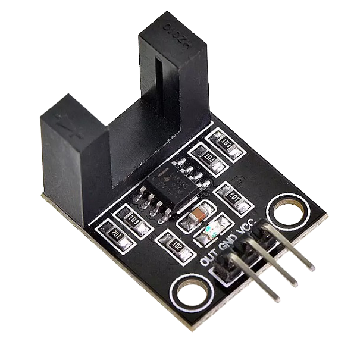
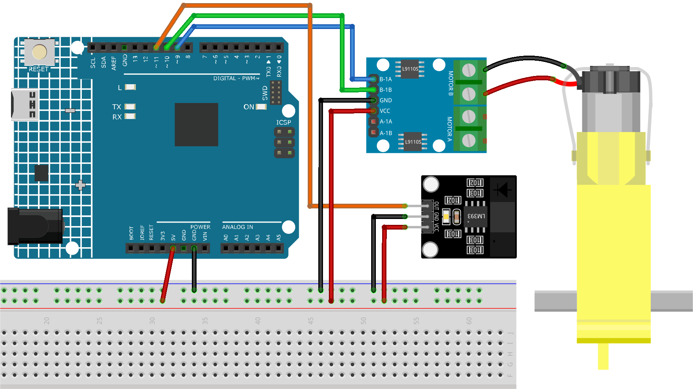

.. _cpn_speed:

Infrarot-Geschwindigkeitssensor-Modul (LM393)
===========================================

Einführung
---------------------------
Das LM393-Modul ist ein Infrarot-Zähler, der sowohl einen Infrarot-Sender als auch einen Empfänger enthält. Sobald ein Hindernis zwischen diesen Sensoren platziert wird, sendet das Modul ein Signal an den Mikrocontroller. Dieses Modul eignet sich in Kombination mit einem Mikrocontroller für Anwendungen wie Motordrehzahlerkennung, Impulszählung, Positionsbeschränkung und Ähnliches.

Funktionsprinzip
---------------------------
Das LM393-Modul enthält eine H2010-Fotodiode, die aus einem Fototransistor und einer Infrarot-Lichtquelle besteht und in einem 10 cm breiten schwarzen Kunststoffgehäuse verpackt ist.

.. image:: img/18_LM393_module_2.png
    :width: 200
    :align: center

Im Betrieb emittiert die Infrarot-Lichtquelle kontinuierlich Infrarot-Licht (unsichtbares Licht), und die lichtempfindliche Triode wird leitfähig, wenn sie dieses Licht empfängt.

.. image:: img/18_LM393_module_3.png
    :width: 900
    :align: center

Anwendungsbeispiele
---------------------------

**Hardware-Komponenten**

- Arduino Uno R4 oder R3 Board * 1
- Infrarot-Geschwindigkeitssensor-Modul * 1
- Verbindungskabel

**Schaltungsaufbau**

.. raw:: html
    
         

Programmcode
^^^^^^^^^^^^^^^^^^^^

.. raw:: html
    
    <iframe src=https://create.arduino.cc/editor/sunfounder01/abcd3502-1ea8-49e5-8254-5652448f06b1/preview?embed style="height:510px;width:100%;margin:10px 0" frameborder=0></iframe>

.. raw:: html

   <video loop autoplay muted style = "max-width:100%">
      <source src="../_static/video/basic/18-component_speed.mp4"  type="video/mp4">
      Your browser does not support the video tag.
   </video>
       

Code-Erklärung
^^^^^^^^^^^^^^^^^^^^

#. Einrichtung der Pins und Initialisierung der Variablen. Hier definieren wir die Pins für den Motor und den Geschwindigkeitssensor. Darüber hinaus initialisieren wir die Variablen, die zur Messung und Berechnung der Motordrehzahl verwendet werden.

   .. code-block:: arduino

      // Define the sensor and motor pins
      const int sensorPin = 11;
      const int motorB_1A = 9;
      const int motorB_2A = 10;
      
      // Define variables for measuring speed
      unsigned long start_time = 0;
      unsigned long end_time = 0;
      int steps = 0;
      float steps_old = 0;
      float temp = 0;
      float rps = 0;

#. Initialisierung in der ``setup()``-Funktion. In diesem Abschnitt wird die serielle Kommunikation eingerichtet, die Modi der Pins konfiguriert und die Anfangsgeschwindigkeit des Motors festgelegt.

   .. code-block:: arduino

      void setup() {
        Serial.begin(9600);
        pinMode(sensorPin, INPUT);
        pinMode(motorB_1A, OUTPUT);
        pinMode(motorB_2A, OUTPUT);
        analogWrite(motorB_1A, 160);
        analogWrite(motorB_2A, 0);
      }

#. Messung der Motorgeschwindigkeit in der ``loop()``-Funktion. In diesem Abschnitt werden die Schritte des Motors für eine Dauer von einer Sekunde gemessen. Anhand dieser Schritte wird die Umdrehungszahl pro Sekunde (rps) berechnet und an den seriellen Monitor gesendet.

   ``millis()`` gibt die Anzahl der Millisekunden zurück, die seit dem Start des aktuellen Programms auf dem Arduino-Board vergangen sind.

   .. code-block:: arduino

      void loop() {
        start_time = millis();
        end_time = start_time + 1000;
        while (millis() < end_time) {
          if (digitalRead(sensorPin)) {
            steps = steps + 1;
            while (digitalRead(sensorPin))
              ;
          }
        }
        temp = steps - steps_old;
        steps_old = steps;
        rps = (temp / 20);
        Serial.print("rps:");
        Serial.println(rps);
      }

Zusätzliche Ideen
^^^^^^^^^^^^^^^^^^^^

- Anzeige der rps auf einem LCD-Bildschirm für eine benutzerfreundlichere Bedienoberfläche.

