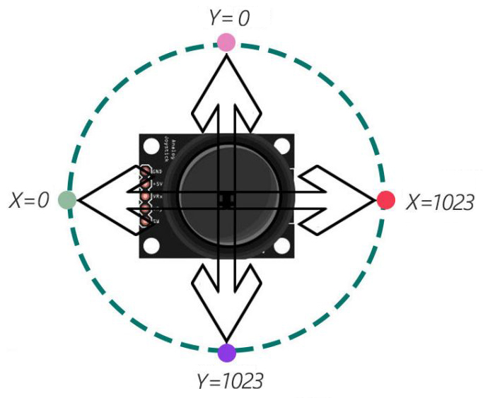
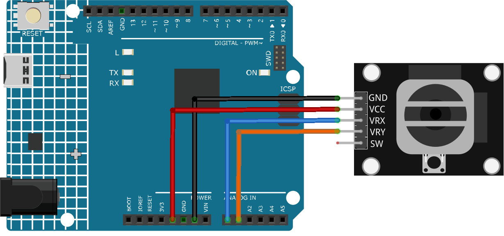

.. note::

    Hello, welcome to the SunFounder Raspberry Pi & Arduino & ESP32 Enthusiasts Community on Facebook! Dive deeper into Raspberry Pi, Arduino, and ESP32 with fellow enthusiasts.

    **Why Join?**

    - **Expert Support**: Solve post-sale issues and technical challenges with help from our community and team.
    - **Learn & Share**: Exchange tips and tutorials to enhance your skills.
    - **Exclusive Previews**: Get early access to new product announcements and sneak peeks.
    - **Special Discounts**: Enjoy exclusive discounts on our newest products.
    - **Festive Promotions and Giveaways**: Take part in giveaways and holiday promotions.

    👉 Ready to explore and create with us? Click [|link_sf_facebook|] and join today!

.. _cpn_joystick:

Joystick Module
==========================

.. image:: img/19_joystick.png
    :width: 400
    :align: center

Introduction
---------------------------
A joystick module is a device that can measure the movement of a knob in two directions: horizontal (X-axis) and vertical (Y-axis). A joystick module can be used to control various things such as games, robots, cameras, etc.

Principle
---------------------------
Joystick operates based on the resistance change of two potentiometers (usually 10-kilo ohms). By changing resistance in x and y directions, Arduino receives varying voltages which are interpreted to x and y coordinates. The processor needs an ADC unit to change the joystick’s analog values into digital values and perform necessary processing.

Arduino boards have six 10-bits ADC channels. It means the Arduino’s reference voltage (5 volts) is divided to 1024 segments. When joystick moves along the x-axis, the ADC value rises from 0 to 1023, with the value 512 in the middle. The image below displays the ADC approximate value based on the joystick position.

Usage
---------------------------

**Hardware components**

- Arduino Uno R4 or R3 board * 1
- Joystick Module * 1
- Jumper Wires

**Circuit Assembly**

.. raw:: html
    
         

Code
^^^^^^^^^^^^^^^^^^^^

.. raw:: html
    
    <iframe src=https://create.arduino.cc/editor/sunfounder01/3233bdfb-21b1-4358-a8cb-a0b2badeb173/preview?embed style="height:510px;width:100%;margin:10px 0" frameborder=0></iframe>

.. raw:: html

   <video loop autoplay muted style = "max-width:100%">
      <source src="../_static/video/basic/19-component_joystick.mp4"  type="video/mp4">
      Your browser does not support the video tag.
   </video>
       

Code explanation
^^^^^^^^^^^^^^^^^^^^

#. Setting up the joystick pins. Here, we define which analog pins the X and Y axes of the joystick are connected to.

   .. code-block:: arduino

      const int xPin = A0;
      const int yPin = A1;

#. Initialization in the ``setup()`` function. This section sets up the serial communication, allowing us to send and receive messages from the Arduino through the serial monitor.

   .. code-block:: arduino

      void setup() {
        Serial.begin(9600);
      }

#. Reading the joystick values in the ``loop()`` function. Continuously, the Arduino reads the X and Y values from the joystick and prints them to the serial monitor. There's a short delay after each print to make the readings more readable and to avoid overwhelming the serial monitor.

   .. code-block:: arduino
       
      void loop() {
        Serial.print("X: ");
        Serial.print(analogRead(xPin));
        Serial.print(" | Y: ");
        Serial.println(analogRead(yPin));
        delay(50);
      }

Additional Ideas
^^^^^^^^^^^^^^^^^^^^

- Use the joystick values to control a servo motor, making it move in response to joystick movements.

