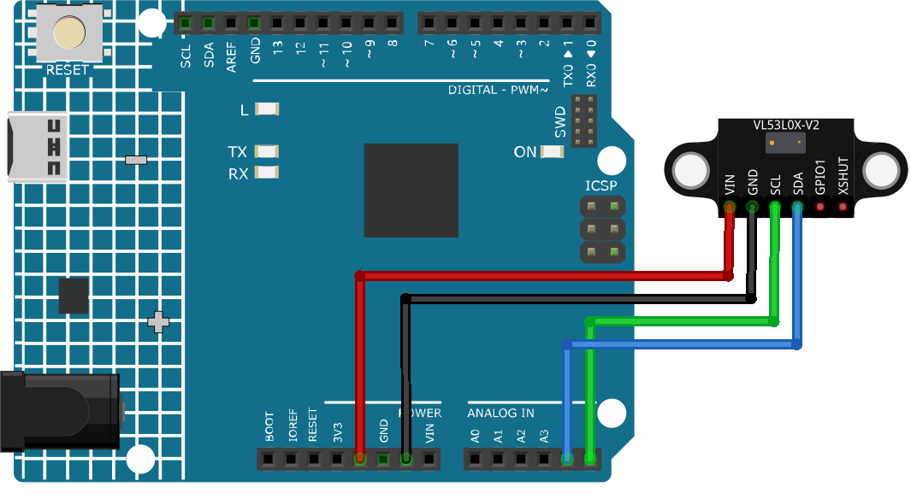

.. _cpn_VL53L0X:

Time of Flight Micro-LIDAR Distance Sensor (VL53L0X)
===============================================================

.. image:: img/20_VL53L0X_module.png
    :width: 350
    :align: center

Introduction
---------------------------

The VL53L0X module is a Time of Flight (ToF) ranging sensor that can accurately measure distances up to 2 meters using laser technology. It is a multi-sensor module with an integrated laser emitter, detector, and microcontroller. The module has all required components such as pull-up resistors and capacitors. It can handle about 50 - 1200 mm of range distance.

Principle
---------------------------
The VL53L0X module works on the principle of Time of Flight (ToF). It sends out a laser pulse and measures the time it takes for the pulse to bounce back. The time it takes for the pulse to return is proportional to the distance between the sensor and the object. The module uses a single photon avalanche diode (SPAD) array to detect the reflected light from the object. The SPAD array is capable of detecting even a single photon of light. The module also has an integrated microcontroller that processes the data from the SPAD array and calculates the distance between the sensor and the object.

Usage
---------------------------

**Hardware components**

- Arduino Uno R4 or R3 board * 1
- Time of Flight Micro-LIDAR Distance Sensor * 1
- Jumper Wires

**Circuit Assembly**

.. raw:: html
    
         

Code
^^^^^^^^^^^^^^^^^^^^

.. raw:: html
    
    <iframe src=https://create.arduino.cc/editor/sunfounder01/d1f540b1-8a29-40cd-ba12-84c34f0ab4a3/preview?embed style="height:510px;width:100%;margin:10px 0" frameborder=0></iframe>

.. raw:: html

   <video loop autoplay muted style = "max-width:100%">
      <source src="../_static/video/basic/20-component_VL53L0X.mp4"  type="video/mp4">
      Your browser does not support the video tag.
   </video>
       

Code explanation
^^^^^^^^^^^^^^^^^^^^

#. Including the necessary library and initializing the sensor object. We start by including the library for the VL53L0X sensor and creating an instance of the Adafruit_VL53L0X class.

   .. note:: 
      To install library, use the Arduino Library Manager and search for **"Adafruit_VL53L0X"** and install the library.  

   .. code-block:: arduino

      #include <Adafruit_VL53L0X.h>
      Adafruit_VL53L0X lox = Adafruit_VL53L0X();

#. Initialization in the ``setup()`` function. Here, we set up serial communication and initialize the distance sensor. If the sensor can't be initialized, the program halts.

   .. code-block:: arduino

      void setup() {
        Serial.begin(115200);
        while (!Serial) {
          delay(1);
        }
        Serial.println("Adafruit VL53L0X test");
        if (!lox.begin()) {
          Serial.println(F("Failed to boot VL53L0X"));
          while (1)
            ;
        }
        Serial.println(F("VL53L0X API Simple Ranging example\n\n"));
      }

#. Capturing and displaying the measurements in the ``loop()`` function. Continuously, the Arduino captures a distance measurement using the ``rangingTest()`` method. If the measurement is valid, it's printed to the serial monitor.

   .. code-block:: arduino
       
      void loop() {
        VL53L0X_RangingMeasurementData_t measure;
        Serial.print("Reading a measurement... ");
        lox.rangingTest(&measure, false);
        if (measure.RangeStatus != 4) {
          Serial.print("Distance (mm): ");
          Serial.println(measure.RangeMilliMeter);
        } else {
          Serial.println(" out of range ");
        }
        delay(100);
      }

Additional Ideas
^^^^^^^^^^^^^^^^^^^^

- Integrate the sensor with a display (like an OLED) to show the distance measurements.
- Use the distance data to trigger other components, such as LEDs or buzzers, when an object comes within a specific range.

