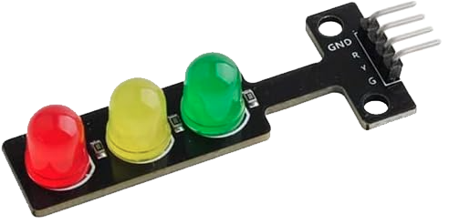
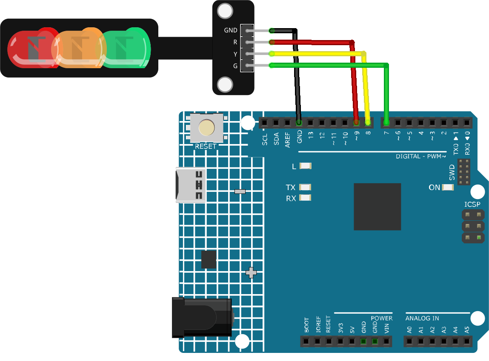

.. _cpn_traffic:

Traffic Light Module
==========================

Introduction
---------------------------
The traffic light module is a small device that can display red, yellow and green lights, just like a real traffic light. It can be used to make a traffic light system model or to learn how to control LEDs with Arduino. It is featured with its small size, simple wiring, targeted, and custom installation. It can be connected PWM pin to control the brightness of the LED.

Principle
---------------------------
The traffic light module can be controlled in two primary ways. The more straightforward method involves using digital inputs from the Arduino, where a HIGH or LOW signal directly turns the corresponding LED on or off. Alternatively, PWM (pulse-width modulation) can be used, especially when varying the brightness of the LED is desired. PWM is a technique where the duty cycle of a digital signal is changed to modulate the brightness of the LED. A duty cycle represents the percentage of time that a signal remains on during a specific period. For instance, a 50% duty cycle implies the signal is active for half the duration and inactive for the remainder. Adjusting the duty cycle allows for the LED's brightness modulation.

Usage
---------------------------

**Hardware components**

- Arduino Uno R4 or R3 board * 1
- Traffic Light Module * 1
- Jumper Wires

**Circuit Assembly**

.. raw:: html
    
         

Code
^^^^^^^^^^^^^^^^^^^^

.. raw:: html
    
    <iframe src=https://create.arduino.cc/editor/sunfounder01/fb0a9599-5e59-458c-893b-97551f62aea8/preview?embed style="height:510px;width:100%;margin:10px 0" frameborder=0></iframe>

.. raw:: html

   <video loop autoplay muted style = "max-width:100%">
      <source src="../_static/video/basic/23-component_traffic.mp4"  type="video/mp4">
      Your browser does not support the video tag.
   </video>
       

Code explanation
^^^^^^^^^^^^^^^^^^^^

1. Before any operations, we define constants for the pins where LEDs are connected. This makes our code easier to read and modify.

  .. code-block:: arduino

     const int rledPin = 9;  //red
     const int yledPin = 8;  //yellow
     const int gledPin = 7;  //green

2. Here, we specify the pin modes for our LED pins. They are all set to ``OUTPUT`` because we intend to send voltage to them.

  .. code-block:: arduino

     void setup() {
       pinMode(rledPin, OUTPUT);
       pinMode(yledPin, OUTPUT);
       pinMode(gledPin, OUTPUT);
     }

3. This is where our traffic light cycle logic is implemented. The sequence of operations is:

    * Turn the green LED on for 5 seconds.
    * Blink the yellow LED three times (each blink lasts for 0.5 seconds).
    * Turn the red LED on for 5 seconds.
    
  .. code-block:: arduino

     void loop() {
       digitalWrite(gledPin, HIGH);
       delay(5000);
       digitalWrite(gledPin, LOW);
       
       digitalWrite(yledPin, HIGH);
       delay(500);
       digitalWrite(yledPin, LOW);
       delay(500);
       digitalWrite(yledPin, HIGH);
       delay(500);
       digitalWrite(yledPin, LOW);
       delay(500);
       digitalWrite(yledPin, HIGH);
       delay(500);
       digitalWrite(yledPin, LOW);
       delay(500);
       
       digitalWrite(rledPin, HIGH);
       delay(5000);
       digitalWrite(rledPin, LOW);
     }

Additional Ideas
^^^^^^^^^^^^^^^^^^^^

- Integrate a buzzer to give sound alerts during the change from green to red, helping visually impaired individuals.

More Projects
---------------------------
* :ref:`fun_touch_toggle_light`
* :ref:`iot_Remote_relay_controller`
* :ref:`iot_Bluetooth_voice_control_relay`
* :ref:`iot_Bluetooth_traffic_light`
