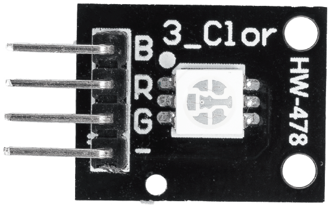
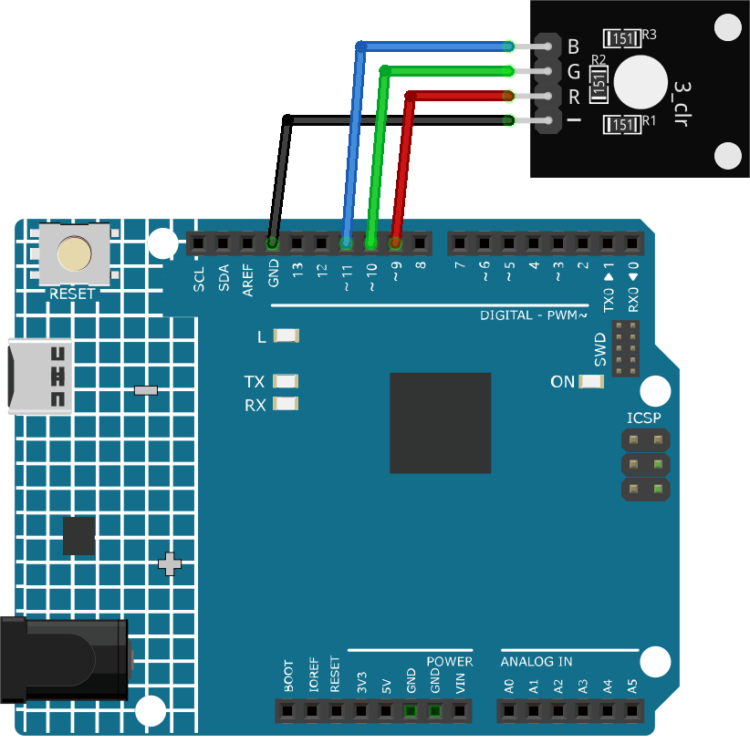

.. _cpn_rgb:

RGB Module
==========================

Introduction
---------------------------
The RGB Full Color LED module emits a range of colors by mixing red, green, and blue light. Each color is adjusted by using PWM.It can be used to create colorful lighting effects or to learn how to use PWM (pulse-width modulation) with Arduino.

Principle
---------------------------
The RGB MODULE works by using a full-color LED that uses R, G, and B pins with adjustable PWM voltage input. 
Colors from the LED can be combined. For example, mix blue light and green light give cyan light, red light and green light give yellow light. This is called "The additive method of color mixing".

* `Additive color - Wikipedia <https://en.wikipedia.org/wiki/Additive_color>`_

.. image:: img/24_rgb_module_2.png
    :width: 200
    :align: center

Based on this method, we can use the three primary colors to mix the visible light of any color according to different proportions. For example, orange can be produced by more red and less green.
The strength of the primary colors (red, blue, green) is adjusted in order to achieve full color mixing effect.PWM is a technique where the duty cycle of a digital signal is modified, adjusting the percentage of time that the signal remains active within a given period. By changing the duty cycle, we can make the LED appear brighter or dimmer.

Usage
---------------------------

**Hardware components**

- Arduino Uno R4 or R3 board * 1
- RGB Module * 1
- Jumper Wires

**Circuit Assembly**

.. raw:: html
    
         

Code
^^^^^^^^^^^^^^^^^^^^

.. raw:: html
    
    <iframe src=https://create.arduino.cc/editor/sunfounder01/ac279eab-cbc6-4c51-a8b5-4d1b9048ec92/preview?embed style="height:510px;width:100%;margin:10px 0" frameborder=0></iframe>

.. raw:: html

   <video loop autoplay muted style = "max-width:100%">
      <source src="../_static/video/basic/24-component_rgb.mp4"  type="video/mp4">
      Your browser does not support the video tag.
   </video>
       

Code explanation
^^^^^^^^^^^^^^^^^^^^

1. The first segment of the code declares and initializes the pins to which each color channel of the RGB LED module is connected.

   .. code-block:: arduino
       
      const int rledPin = 9;  // pin connected to the red color channel
      const int gledPin = 10;   // pin connected to the green color channel
      const int bledPin = 11;  // pin connected to the blue color channel

2. The ``setup()`` function initializes these pins as OUTPUT. This means we are sending signals OUT from these pins to the RGB LED module.

   .. code-block:: arduino
   
      void setup() {
        pinMode(rledPin, OUTPUT);
        pinMode(gledPin, OUTPUT);
        pinMode(bledPin, OUTPUT);
      }

3. In the ``loop()`` function, the ``setColor()`` function is called with different parameters to display different colors. The ``delay()`` function is used after setting each color to pause for 1000 milliseconds (or 1 second) before moving on to the next color.

   .. code-block:: arduino
   
      void loop() {
        setColor(255, 0, 0);  // Set RGB LED color to red
        delay(1000);
        setColor(0, 255, 0);  // Set RGB LED color to green
        delay(1000);
        // The rest of the color sequence...
      }

4. The ``setColor()`` function uses the ``analogWrite()`` function to adjust the brightness of each color channel on the RGB LED module. The ``analogWrite()`` function employs Pulse Width Modulation (PWM) to simulate varying voltage outputs. By controlling the PWM duty cycle (the percentage of time a signal is HIGH within a fixed period), the brightness of each color channel can be controlled, allowing the mixing of various colors.

   .. code-block:: arduino

      void setColor(int R, int G, int B) {
        analogWrite(rledPin, R);  // Use PWM to control the brightness of the red color channel
        analogWrite(gledPin, G);  // Use PWM to control the brightness of the green color channel
        analogWrite(bledPin, B);  // Use PWM to control the brightness of the blue color channel
      }

Additional Ideas
^^^^^^^^^^^^^^^^^^^^

- Try displaying other colors
- Integrate the RGB LED with sensors, and display different colors based on the sensor's value.

More Projects
---------------------------
* :ref:`fun_gas_leak_alarm`
* :ref:`fun_light_control_switch`
* :ref:`fun_motion_triggered_relay`
* :ref:`iot_Bluetooth_RGB_controller`
* :ref:`iot_Bluetooth_remote_relay`
