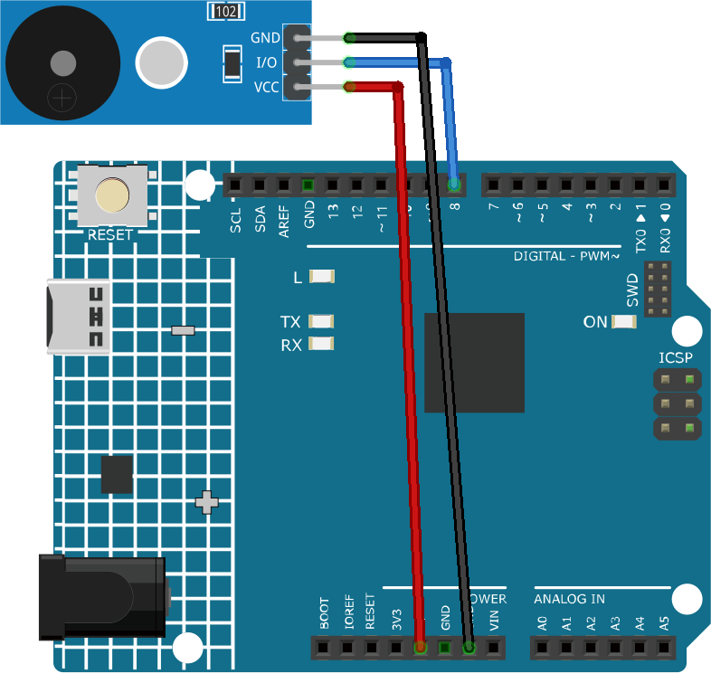

.. note::

    こんにちは、SunFounderのRaspberry Pi & Arduino & ESP32愛好家コミュニティへようこそ！Facebook上でRaspberry Pi、Arduino、ESP32についてもっと深く掘り下げ、他の愛好家と交流しましょう。

    **参加する理由は？**

    - **エキスパートサポート**：コミュニティやチームの助けを借りて、販売後の問題や技術的な課題を解決します。
    - **学び＆共有**：ヒントやチュートリアルを交換してスキルを向上させましょう。
    - **独占的なプレビュー**：新製品の発表や先行プレビューに早期アクセスしましょう。
    - **特別割引**：最新製品の独占割引をお楽しみください。
    - **祭りのプロモーションとギフト**：ギフトや祝日のプロモーションに参加しましょう。

    👉 私たちと一緒に探索し、創造する準備はできていますか？[|link_sf_facebook|]をクリックして今すぐ参加しましょう！

.. _cpn_buzzer:

パッシブブザーモジュール
==========================

.. image:: img/26_passive_buzzer_module.png
    :width: 400
    :align: center

概要
---------------------------
パッシブブザーは、電気信号がかかると音を発生する装置です。内部に発振器を持っていないため「パッシブ」と呼ばれます。音を発生させるためには、Arduinoのようなマイクロコントローラからの外部信号が必要です。パッシブブザーモジュールは、パッシブブザーとそれをArduinoで簡単に使用できるようにする追加の回路を含む小型の電子部品です。

原理
---------------------------
パッシブブザーモジュールの動作原理は、圧電効果に基づいています。電気信号がブザーにかかると、ブザー内部の圧電結晶が特定の周波数で振動します。この振動が我々が聞くことのできる音波を発生させます。ブザーによって発生する音の周波数は、かかる電気信号の周波数に依存します。信号の周波数を変更することで、ブザーによって発生する音のピッチを変更できます。

使い方
---------------------------

**使用する電子部品**

- Arduino Uno R4またはR3ボード * 1
- パッシブブザーモジュール * 1
- ジャンパーワイヤ

**回路の組み立て**

.. raw:: html
    
         

コード
^^^^^^^^^^^^^^^^^^^^

.. raw:: html
    
    <iframe src=https://create.arduino.cc/editor/sunfounder01/5b24a3d9-8688-4dc2-ad3a-cce82f6bd3a7/preview?embed style="height:510px;width:100%;margin:10px 0" frameborder=0></iframe>

.. raw:: html

   <video loop autoplay muted style = "max-width:100%">
      <source src="../_static/video/basic/26-component_buzzer.mp4"  type="video/mp4">
      Your browser does not support the video tag.
   </video>
       

コードの説明
^^^^^^^^^^^^^^^^^^^^

1. pitchesライブラリをインクルード：

   このライブラリは、各音符の周波数値を提供し、コード内で音楽記号を使えるようにします。

   .. code-block:: arduino
       
      #include "pitches.h"

2. 定数と配列の定義：

   * ``buzzerPin`` はブザーが接続されているArduinoのデジタルピンです。

   * ``melody[]`` は、演奏される音符の配列です。

   * ``noteDurations[]`` は、メロディ内の各音符の長さを格納する配列です。

   .. code-block:: arduino
   
      const int buzzerPin = 8;
      int melody[] = {
        NOTE_C4, NOTE_G3, NOTE_G3, NOTE_A3, NOTE_G3, 0, NOTE_B3, NOTE_C4
      };
      int noteDurations[] = {
        4, 8, 8, 4, 4, 4, 4, 4
      };

3. メロディの演奏：

   * ``for`` ループは、メロディの各音符を反復処理します。

   * ``tone()`` 関数は、指定された長さの音符をブザーで演奏します。

   * 音符間には遅延が追加され、それぞれを区別します。

   * ``noTone()`` 関数は音を停止します。

   .. code-block:: arduino
   
      void setup() {
        for (int thisNote = 0; thisNote < 8; thisNote++) {
          int noteDuration = 1000 / noteDurations[thisNote];
          tone(buzzerPin, melody[thisNote], noteDuration);
          int pauseBetweenNotes = noteDuration * 1.30;
          delay(pauseBetweenNotes);
          noTone(buzzerPin);
        }
      }

4. 空のループ関数：
   メロディはsetup()で一度だけ演奏されるため、loop()関数内にはコードがありません。

追加のアイデア
^^^^^^^^^^^^^^^^^^^^

- メロディを変更： ``melody[]`` と ``noteDurations[]`` 配列内の音符と長さを変更して、独自の曲を作成できます。興味があれば、GitHubにArduinoで様々な曲を演奏するコードを提供するリポジトリ（|link_arduino-songs|）もあります。
- ボタンを追加：プッシュボタンを回路に組み込み、ボタンが押されたときにメロディを演奏するようにコードを変更します。

さらに多くのプロジェクト
---------------------------
* :ref:`fun_doorbell`
* :ref:`fun_gas_leak_alarm`
* :ref:`iot_Bluetooth_piano`

