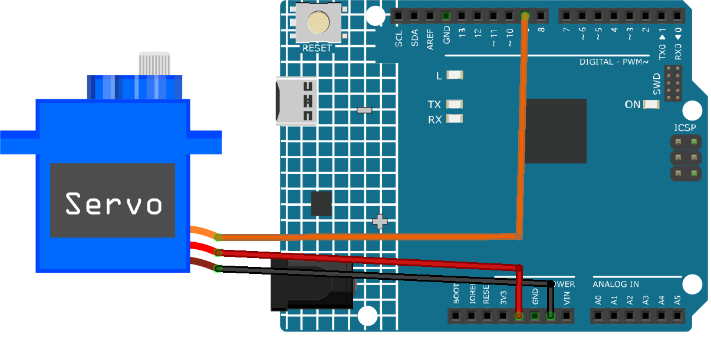

.. note::

    こんにちは、SunFounderのRaspberry Pi & Arduino & ESP32愛好家コミュニティへようこそ！Facebook上でRaspberry Pi、Arduino、ESP32についてもっと深く掘り下げ、他の愛好家と交流しましょう。

    **参加する理由は？**

    - **エキスパートサポート**：コミュニティやチームの助けを借りて、販売後の問題や技術的な課題を解決します。
    - **学び＆共有**：ヒントやチュートリアルを交換してスキルを向上させましょう。
    - **独占的なプレビュー**：新製品の発表や先行プレビューに早期アクセスしましょう。
    - **特別割引**：最新製品の独占割引をお楽しみください。
    - **祭りのプロモーションとギフト**：ギフトや祝日のプロモーションに参加しましょう。

    👉 私たちと一緒に探索し、創造する準備はできていますか？[|link_sf_facebook|]をクリックして今すぐ参加しましょう！

.. _cpn_servo:

サーボモータ（SG90）
==========================

.. image:: img/27_servo.png
    :width: 300
    :align: center

はじめに
---------------------------
サーボモータは、特定の角度や位置に回転できる装置です。ロボットアーム、ステアリングホイール、カメラのジンバルなどに使用されます。サーボモータには電源、接地、信号の3本のケーブルがあります。通常、赤色の電源ケーブルはArduinoボードの5Vピンに、黒または茶色の接地ケーブルはボードのGNDピンに、黄色またはオレンジの信号ケーブルはボードのPWMピンに接続します。

原理
---------------------------
一般的なサーボは、ケース、軸、ギアシステム、ポテンショメータ、DCモータ、組み込みボードから構成されています。

動作は以下のようになります：マイクロコントローラがPWM信号をサーボに送信し、サーボ内の組み込みボードが信号ピンを通じてこれを受信します。それにより、モータがギアシステムを駆動し、減速後に軸を回転させます。サーボの軸とポテンショメータは連動しており、軸が回転するとポテンショメータも動き、組み込みボードに電圧信号を出力します。ボードはこの信号をもとに現在の位置と回転速度を決定し、指定された正確な位置で停止して保持します。

.. image:: img/27_servo_internal.png
    :width: 450
    :align: center

.. raw:: html
    
     

角度は、制御ワイヤーに印加されるパルスの持続時間によって決まります。これをパルス幅変調（PWM）と言います。サーボは20msごとにパルスを受け取ることを期待しています。パルスの長さによって、モータがどれだけ回転するかが決まります。例えば、1.5msのパルスでは、モータは90度の位置（中立位置）に回転します。1.5ms未満のパルスが送られた場合、サーボは中立点から反時計回りに何度か回転して、その位置で軸を保持します。1.5msよりも広いパルスが送られた場合は、逆の現象が起こります。最小幅と最大幅のパルスは、サーボごとに異なります。一般的に、最小幅のパルスは約0.5ms、最大幅のパルスは2.5msとなります。

.. image:: img/27_servo_duty.png
    :width: 500
    :align: center

.. raw:: html
    
     

使い方
---------------------------

**使用する電子部品**

- Arduino Uno R4またはR3ボード * 1
- サーボモータ * 1
- ジャンパワイヤ

**回路組立て**

.. raw:: html
    
         

コード
^^^^^^^^^^^^^^^^^^^^

.. raw:: html
    
    <iframe src=https://create.arduino.cc/editor/sunfounder01/de8e1877-4a8b-46c9-85c6-5dd83514d961/preview?embed style="height:510px;width:100%;margin:10px 0" frameborder=0></iframe>

.. raw:: html

   <video loop autoplay muted style = "max-width:100%">
      <source src="../_static/video/basic/27-component_servo.mp4"  type="video/mp4">
      Your browser does not support the video tag.
   </video>
       

コードの説明
^^^^^^^^^^^^^^^^^^^^

1. ここでは、サーボモータを簡単に制御するための ``Servo`` ライブラリを読み込んでいます。また、サーボに接続されたピンとサーボの初期角度も定義しています。

   .. code-block:: arduino

      #include <Servo.h>
      const int servoPin = 9;  // サーボピンの定義
      int angle = 0;           // 角度変数を0度で初期化
      Servo servo;             // Servoオブジェクトの作成

2. ``setup()`` 関数はArduinoが起動したときに一度だけ実行されます。 ``attach()`` 関数を使用して、定義されたピンにサーボを接続します。

   .. code-block:: arduino

      void setup() {
        servo.attach(servoPin);
      }

3. メインループには2つの ``for`` ループがあります。最初のループは角度を0度から180度まで増加させ、次のループは180度から0度まで角度を減らします。 ``servo.write(angle)`` コマンドでサーボを指定された角度にセットします。 ``delay(15)`` はサーボが次の角度に移る前に15ミリ秒待機することで、走査動作の速度を制御します。

   .. code-block:: arduino

      void loop() {
        // scan from 0 to 180 degrees
        for (angle = 0; angle < 180; angle++) {
          servo.write(angle);
          delay(15);
        }
        // now scan back from 180 to 0 degrees
        for (angle = 180; angle > 0; angle--) {
          servo.write(angle);
          delay(15);
        }
      }

追加のアイディア
^^^^^^^^^^^^^^^^^^^^

- ポテンショメータを使用して、サーボの動きを制御します。ポテンショメータの回転により、サーボの角度を直接制御できます。

さらに多くのプロジェクト
---------------------------
* :ref:`fun_smart_trashcan`
* :ref:`iot_Bluetooth_lock_controller`
