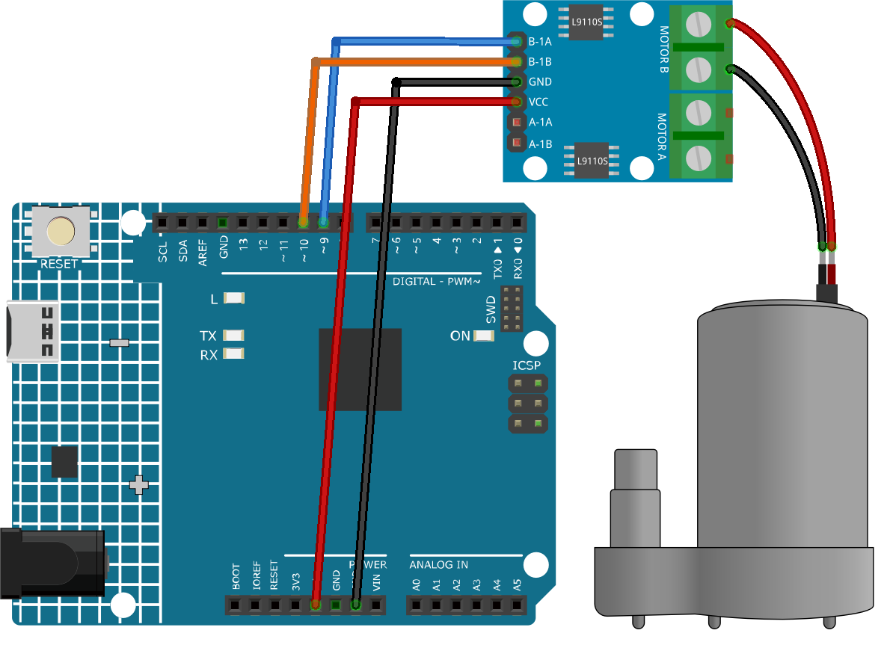

.. _cpn_pump:

遠心ポンプ
==========================

.. image:: img/28_pump.png
    :width: 400
    :align: center

.. raw:: html
    
     

概要
---------------------------
遠心ポンプは、回転するインペラを使用して液体を一か所から別の場所に移動させる装置です。水、油、化学薬品などをポンプアップするために使用できます。遠心ポンプには主にモーターとポンプの2つの部分があります。モーターはポンプに電力を供給し、ポンプは回転エネルギーを圧力と流れに変換します。

原理
---------------------------
遠心ポンプは、流体の速度を増加させるために回転するインペラを使用して動作します。液体はインレットパイプを通じてポンプに引き込まれます。液体がインペラの外縁を出るとき、遠心力によってそれはアウトレットパイプを通じて外部に押し出され、その結果として圧力が増加します。インペラが早く回転するほど、液体の圧力と流れは高くなります。

使い方
---------------------------

**使用する電子部品**

- Arduino Uno R4 または R3 ボード * 1
- 遠心ポンプ * 1
- ジャンパーワイヤー

**回路組み立て**

.. raw:: html
    
         

コード
^^^^^^^^^^^^^^^^^^^^

.. raw:: html
    
    <iframe src=https://create.arduino.cc/editor/sunfounder01/4c1aa3f1-7b17-4906-90e3-eb1e092fae09/preview?embed style="height:510px;width:100%;margin:10px 0" frameborder=0></iframe>

.. raw:: html

   <video loop autoplay muted style = "max-width:100%">
      <source src="../_static/video/basic/28-component_pump.mp4"  type="video/mp4">
      あなたのブラウザはこのビデオタグをサポートしていません。
   </video>
       

コードの説明
^^^^^^^^^^^^^^^^^^^^

1. モーターの制御のために2つのピンが定義されています。具体的には ``motorB_1A`` および ``motorB_2A`` です。これらのピンはL9110モーターコントロールボードに接続してモーターの方向と速度を制御します。
  
   .. code-block:: arduino
   
      const int motorB_1A = 9;
      const int motorB_2A = 10;

2. ピンの設定とモーターの制御：

   - ``setup()`` 関数は、ピンを ``OUTPUT`` として初期化します。これはモーター制御ボードに信号を送ることができることを意味します。
   
   - ``analogWrite()`` 関数は、モーターの速度を設定するために使用されます。ここでは、1つのピンを ``HIGH`` に設定し、もう1つのピンを ``LOW`` に設定することで、ポンプが一方向に回転します。5秒間の遅延の後、両方のピンは0に設定され、モーターがオフになります。

   .. code-block:: arduino
   
      void setup() {
         pinMode(motorB_1A, OUTPUT);  // set pump pin 1 as output
         pinMode(motorB_2A, OUTPUT);  // set pump pin 2 as output
         analogWrite(motorB_1A, HIGH); 
         analogWrite(motorB_2A, LOW);
         delay(5000);// wait for 5 seconds
         analogWrite(motorB_1A, 0);  // turn off the pump
         analogWrite(motorB_2A, 0);
      }

追加のアイディア
^^^^^^^^^^^^^^^^^^^^

- ピンの間で ``HIGH`` と ``LOW`` の値を切り替えることで、ポンプの方向を反転させます。

- ボタンプレスでポンプの状態（オン/オフ）を切り替えるシステムを実装します。

- PWMを使用してポテンショメーターでポンプの速度を制御します。

- 特定の条件に基づいてポンプの動作を自動化するセンサーを組み込みます。例えば、タンク内の水位に応じてポンプをオン/オフにします。

さらに多くのプロジェクト
---------------------------
* :ref:`fun_soap_dispenser`
* :ref:`iot_Auto_watering_system`

