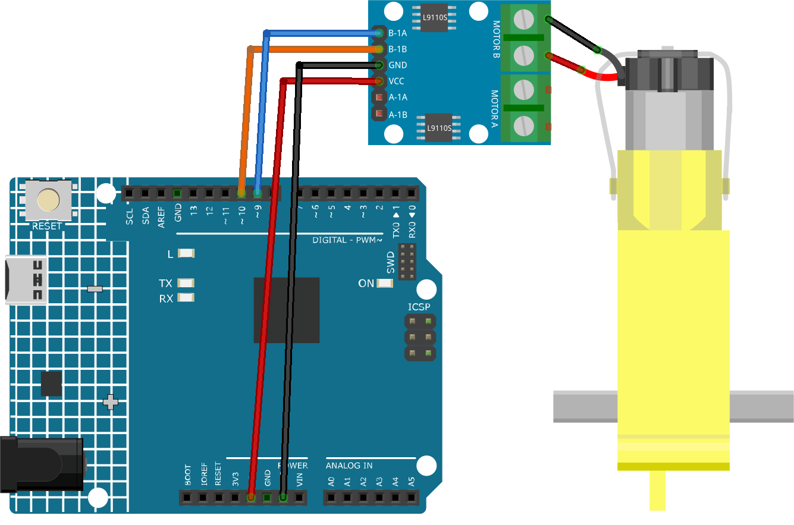

.. _cpn_ttmotor:

TT Motor
==========================

.. image:: img/29_tt_motor.jpg
    :width: 400
    :align: center

.. raw:: html
    
     

Introduction
---------------------------
A TT motor is a type of DC motor that has a gearbox attached to it. The gearbox reduces the speed of the motor and increases its torque. A TT motor is commonly used in applications such as driving wheels, propellers, fans, among others. A TT motor has two wires: a positive wire and a negative wire. The positive wire is usually red and the negative wire is usually black.

A TT DC gearbox motor with a 1:48 gear ratio is used in the product, it comes with 2 x 200mm wires with 0.1” male connectors that fit into a breadboard. Perfect for plugging into a breadboard or terminal block.

You can power these motors with 3 ~ 6VDC, but of course, they will go a little faster at higher voltages.

Principle
---------------------------
A TT motor works by converting electrical energy into mechanical energy. When a voltage is applied to the wires of the motor, it creates a magnetic field that causes the motor to spin. The speed and direction of the motor depend on the voltage and polarity of the power supply. The higher the voltage, the faster the motor spins. Reversing the polarity will cause the motor to spin in the opposite direction.

Usage
---------------------------

**Hardware components**

- Arduino Uno R4 or R3 board * 1
- TT Motor * 1
- Jumper Wires

**Circuit Assembly**

.. raw:: html
    
         

Code
^^^^^^^^^^^^^^^^^^^^

.. raw:: html
    
    <iframe src=https://create.arduino.cc/editor/sunfounder01/045d66e3-280d-4ef8-aa96-a1770ade414f/preview?embed style="height:510px;width:100%;margin:10px 0" frameborder=0></iframe>

.. raw:: html

   <video loop autoplay muted style = "max-width:100%">
      <source src="../_static/video/basic/29-component_ttmotor.mp4"  type="video/mp4">
      Your browser does not support the video tag.
   </video>
       

Code explanation
^^^^^^^^^^^^^^^^^^^^

1. The first part of the code defines the motor control pins. These are connected to the L9110 motor control board.

   .. code-block:: arduino
   
      // Define the motor pins
      const int motorB_1A = 9;
      const int motorB_2A = 10;

2. The ``setup()`` function initializes the motor control pins as output using the ``pinMode()`` function. Then it uses ``analogWrite()`` to set the speed of the motor. The value passed to ``analogWrite()`` can range from 0 (off) to 255 (full speed). A ``delay()`` function is then used to pause the code for 5000 milliseconds (or 5 seconds), after which the motor speed is set to 0 (off).

   .. code-block:: arduino
   
      void setup() {
        pinMode(motorB_1A, OUTPUT);  // set motor pin 1 as output
        pinMode(motorB_2A, OUTPUT);  // set motor pin 2 as output
   
        analogWrite(motorB_1A, 255);  // set motor speed (0-255)
        analogWrite(motorB_2A, 0);
   
        delay(5000);
   
        analogWrite(motorB_1A, 0);  
        analogWrite(motorB_2A, 0);
      }

Additional Ideas
^^^^^^^^^^^^^^^^^^^^

- Control Motor Speed with a Potentiometer: Instead of hardcoding the motor speed, you could use a potentiometer to dynamically control the speed of the motor.

