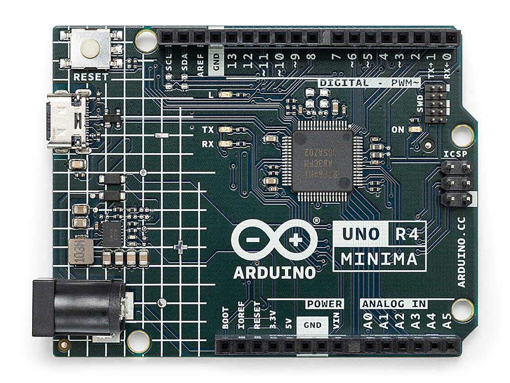

.. _cpn_uno:

Arduino UNO R4 Minima Board
===========================

The **Arduino UNO R4 Minima** is a development board with the classic UNO form factor, based on the RA4M1(|link_ra4m1_datasheet|) microcontroller from Renesas. It is faster and has more memory than the previous versions of the board. It has a number of built-in features such as a DAC, RTC and HID. The UNO R4 Minima is a **5 V only board**. It has 14 digital I/O, 6 analog inputs with up to 14-bit resolution, a clock speed of 48 MHz, and 32 kB SRAM, 256 kB flash memory & 8 kB of EEPROM.

**Technical Parameters**

+-----------------+---------------------------+-------------------------+
| Board           | Name                      | Arduino® UNO R4 Minima  |
+=================+===========================+=========================+
| Microcontroller | Renesas RA4M1 (Arm® Cortex®-M4)                     |
+-----------------+---------------------------+-------------------------+
| USB             | USB-C®                    | Programming Port        |
+-----------------+---------------------------+-------------------------+
| Pins            | Digital I/O Pins          | 14                      |
+-----------------+---------------------------+-------------------------+
| Pins            | Analog input pins         | 6                       |
|                 +---------------------------+-------------------------+
|                 | DAC                       | 1                       |
|                 +---------------------------+-------------------------+
|                 | PWM pins                  | 6                       |
+-----------------+---------------------------+-------------------------+
| Communication   | UART                      | Yes, 1x                 |
|                 +---------------------------+-------------------------+
|                 | I2C                       | Yes, 1x                 |
|                 +---------------------------+-------------------------+
|                 | SPI                       | Yes, 1x                 |
|                 +---------------------------+-------------------------+
|                 | CAN                       | Yes 1 CAN Bus           |
+-----------------+---------------------------+-------------------------+
| Power           | Circuit operating voltage | 5 V                     |
|                 +---------------------------+-------------------------+
|                 | Input voltage (VIN)       | 6-24 V                  |
|                 +---------------------------+-------------------------+
|                 | DC Current per I/O Pin    | 8 mA                    |
+-----------------+---------------------------+-------------------------+
| Clock speed     | Main core                 | 48 MHz                  |
+-----------------+---------------------------+-------------------------+
| Memory          | RA4M1                     | 256 kB Flash, 32 kB RAM |
+-----------------+---------------------------+-------------------------+
| Dimensions      | Width                     | 68.85 mm                |
|                 +---------------------------+-------------------------+
|                 | Length                    | 53.34 mm                |
+-----------------+---------------------------+-------------------------+

**What's More**

* `Arduino IDE <https://www.arduino.cc/en/software>`_
* :ref:`install_arduino`
* `Arduino Programming Language Reference <https://www.arduino.cc/reference/en/>`_
* |link_uno_r4|
* |link_r4_datasheet| 
* |link_ra4m1_datasheet|

