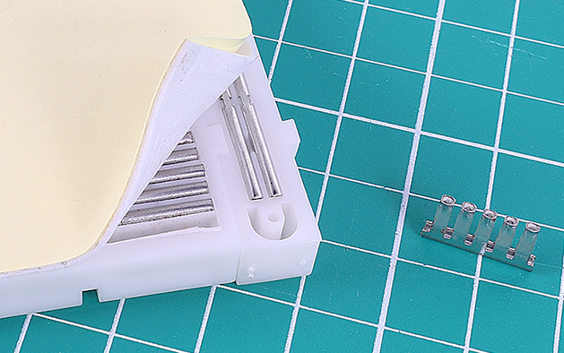
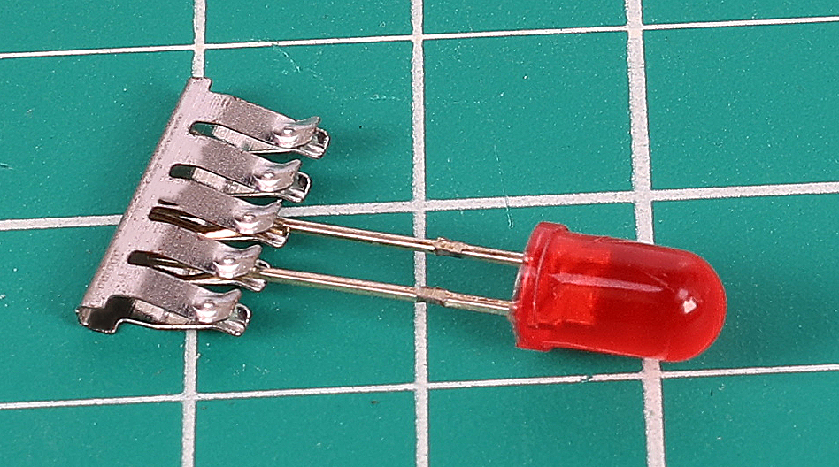
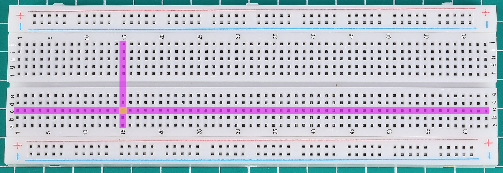
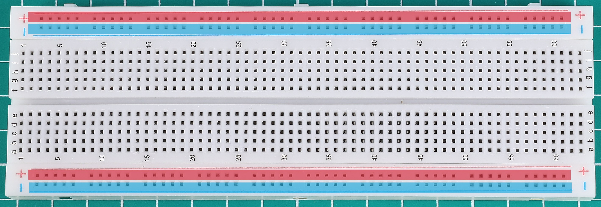

.. note::

    こんにちは、SunFounderのRaspberry Pi & Arduino & ESP32愛好家コミュニティへようこそ！Facebook上でRaspberry Pi、Arduino、ESP32についてもっと深く掘り下げ、他の愛好家と交流しましょう。

    **参加する理由は？**

    - **エキスパートサポート**：コミュニティやチームの助けを借りて、販売後の問題や技術的な課題を解決します。
    - **学び＆共有**：ヒントやチュートリアルを交換してスキルを向上させましょう。
    - **独占的なプレビュー**：新製品の発表や先行プレビューに早期アクセスしましょう。
    - **特別割引**：最新製品の独占割引をお楽しみください。
    - **祭りのプロモーションとギフト**：ギフトや祝日のプロモーションに参加しましょう。

    👉 私たちと一緒に探索し、創造する準備はできていますか？[|link_sf_facebook|]をクリックして今すぐ参加しましょう！

.. _cpn_breadboard:

ブレッドボード
==============

.. image:: img/39_breadboard.png
    :width: 100%

ブレッドボードは、電子機器の試作のための基盤です。もともと「ブレッドボード」という言葉は、パンをスライスするために使われる木の板を指していました。1970年代に、はんだ付け不要のブレッドボード（プラグボード、端子アレイボードとも呼ばれる）が登場し、現在では「ブレッドボード」という用語はこれらを指すのが一般的です。

ブレッドボードは、回路設計を仕上げる前に迅速に回路を構築し、テストするために使用されます。ICや抵抗器、ジャンパーワイヤーなどのコンポーネントを挿入するための多くの穴があります。ブレッドボードは、コンポーネントの差し込みと取り外しが容易です。

.. image:: img/39_breadboard_internal.png
    :width: 100%

この画像は、ブレッドボードの内部構造を示しています。ブレッドボードの穴は独立しているように見えますが、実際には内部で金属ストリップによって接続されています。

.. raw:: html

    

ブレッドボードの内部は、プラスチックの表面の裏側に金属ストリップの列があります。各ストリップには、小さな金属クリップがあり、これがコンポーネントの脚をしっかりとつかみます。これらのクリップは、同じ列に挿入されたコンポーネント間の確実な電気接続を保証します。サイドのパワーレールには、電源接続用の長いストリップがあります。

.. raw:: html

    

ほとんどのブレッドボードには、数字、文字、プラスおよびマイナスの記号が付いています。これらのラベルは、回路を構築する際に対応する穴を素早く見つけるのに役立ちます。行番号と列文字は、ブレッドボード上の穴を正確に特定するのに役立ちます。例えば、「C15」の穴は、列Cと行15の交差する場所にあります。

.. raw:: html

    

一つのプロジェクトで複数の種類のジャンパーワイヤーを使用することができます。ジャンパーワイヤーの色は、回路の異なる部分間の接続を識別するのに役立ちますが、色自体が異なる機能を示すわけではありません。しかし、一般的な慣習として、正電源接続には赤いワイヤー、負電源またはグランド接続には黒いワイヤーを使用します。

