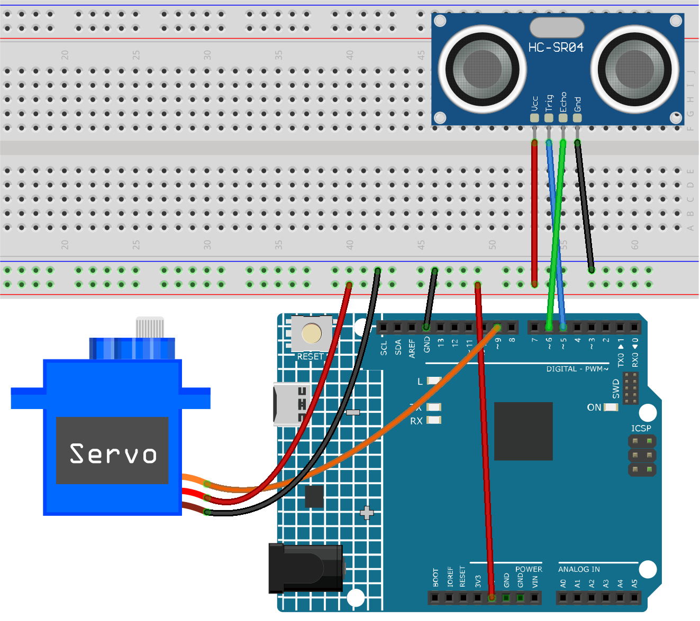

.. note::

    Hallo und willkommen in der SunFounder Raspberry Pi & Arduino & ESP32 Enthusiasten-Gemeinschaft auf Facebook! Tauchen Sie tiefer ein in die Welt von Raspberry Pi, Arduino und ESP32 mit anderen Enthusiasten.

    **Warum beitreten?**

    - **Expertenunterstützung**: Lösen Sie Nachverkaufsprobleme und technische Herausforderungen mit Hilfe unserer Gemeinschaft und unseres Teams.
    - **Lernen & Teilen**: Tauschen Sie Tipps und Anleitungen aus, um Ihre Fähigkeiten zu verbessern.
    - **Exklusive Vorschauen**: Erhalten Sie frühzeitigen Zugang zu neuen Produktankündigungen und exklusiven Einblicken.
    - **Spezialrabatte**: Genießen Sie exklusive Rabatte auf unsere neuesten Produkte.
    - **Festliche Aktionen und Gewinnspiele**: Nehmen Sie an Gewinnspielen und Feiertagsaktionen teil.

    👉 Sind Sie bereit, mit uns zu erkunden und zu erschaffen? Klicken Sie auf [|link_sf_facebook|] und treten Sie heute bei!

.. _fun_smart_trashcan:

Intelligenter Mülleimer
==========================

.. raw:: html

   <video loop autoplay muted style = "max-width:100%">
      <source src="../_static/video/fun/01-fun_Smart_trashcan.mp4"  type="video/mp4">
      Ihr Browser unterstützt das Video-Tag nicht.
   </video>

Dieses Projekt beschäftigt sich mit der Idee eines intelligenten Mülleimers. Das Hauptziel ist, dass sich der Deckel des Mülleimers automatisch öffnet, wenn sich ein Objekt in einem bestimmten Abstand (in diesem Fall 20 cm) nähert. Diese Funktionalität wird durch die Kombination eines Ultraschall-Entfernungssensors mit einem Servomotor erreicht. Die Entfernung zwischen dem Objekt und dem Sensor wird kontinuierlich gemessen. Nähert sich das Objekt ausreichend, wird der Servomotor aktiviert und der Deckel geöffnet.

1. Schaltungsaufbau
-----------------------------

* :ref:`cpn_uno`
* :ref:`cpn_ultrasonic`
* :ref:`cpn_servo`

2. Programmcode
-----------------------------

#. Öffnen Sie die Datei ``01-Smart_trashcan.ino`` im Verzeichnis ``ultimate-sensor-kit\fun_project\01-Smart_trashcan``, oder kopieren Sie diesen Code in die **Arduino IDE**.

   .. raw:: html
       
       <iframe src=https://create.arduino.cc/editor/sunfounder01/0e371717-97dc-43ad-bdc2-e468589da2a0/preview?embed style="height:510px;width:100%;margin:10px 0" frameborder=0></iframe>

3. Code-Erklärung
-----------------------------

Das Projekt basiert auf der Echtzeitüberwachung der Entfernung zwischen einem Objekt und einem Mülleimer. Ein Ultraschallsensor misst diese Entfernung kontinuierlich. Nähert sich ein Objekt auf weniger als 20 cm, interpretiert der Mülleimer dies als Absicht, Abfall zu entsorgen, und öffnet automatisch seinen Deckel. Diese Automatisierung macht einen herkömmlichen Mülleimer smarter und komfortabler.

#. **Erstkonfiguration und Variablendeklaration**

   An dieser Stelle binden wir die ``Servo``-Bibliothek ein und definieren die Konstanten und Variablen, die wir verwenden werden. Die Pins für den Servomotor und den Ultraschallsensor werden deklariert. Zudem steht uns ein Array ``averDist`` zur Verfügung, in dem die drei Entfernungsmessungen gespeichert werden.

   .. code-block:: arduino
       
      #include <Servo.h>
      Servo servo;
      const int servoPin = 9;
      const int openAngle = 0;
      const int closeAngle = 90;
      const int trigPin = 5;
      const int echoPin = 6;
      long distance, averageDistance;
      long averDist[3];
      const int distanceThreshold = 20;

#. setup() Funktion

   Die ``setup()``-Funktion initialisiert die serielle Kommunikation, konfiguriert die Pins des Ultraschallsensors und bringt den Servomotor in die geschlossene Position.

   .. code-block:: arduino
   
      void setup() {
        Serial.begin(9600);
        pinMode(trigPin, OUTPUT);
        pinMode(echoPin, INPUT);
        servo.attach(servoPin);
        servo.write(closeAngle);
        delay(100);
      }
   

#. loop() Funktion

   Die ``loop()``-Funktion ist dafür verantwortlich, die Entfernung kontinuierlich zu messen, den Durchschnitt zu berechnen und auf dieser Grundlage zu entscheiden, ob der Deckel des Mülleimers geöffnet oder geschlossen werden soll.

   .. code-block:: arduino
   
      void loop() {
        for (int i = 0; i <= 2; i++) {
          distance = readDistance();
          averDist[i] = distance;
          delay(10);
        }
        averageDistance = (averDist[0] + averDist[1] + averDist[2]) / 3;
        Serial.println(averageDistance);
        if (averageDistance <= distanceThreshold) {
          servo.write(openAngle);
          delay(3500);
        } else {
          servo.write(closeAngle);
          delay(1000);
        }
      }

#. Entfernungslesefunktion

   Diese Funktion, ``readDistance()``, interagiert tatsächlich mit dem Ultraschallsensor. Sie sendet einen Impuls aus und wartet auf ein Echo. Die Zeit bis zum Eintreffen des Echos wird verwendet, um die Entfernung zwischen dem Sensor und einem Objekt davor zu berechnen.

   Für weitere Informationen zum Prinzip des Ultraschallsensors siehe :ref:`cpn_ultrasonic_principle`.

   .. code-block:: arduino
   
      float readDistance() {
        digitalWrite(trigPin, LOW);
        delayMicroseconds(2);
        digitalWrite(trigPin, HIGH);
        delayMicroseconds(10);
        digitalWrite(trigPin, LOW);
        float distance = pulseIn(echoPin, HIGH) / 58.00;
        return distance;
      }

