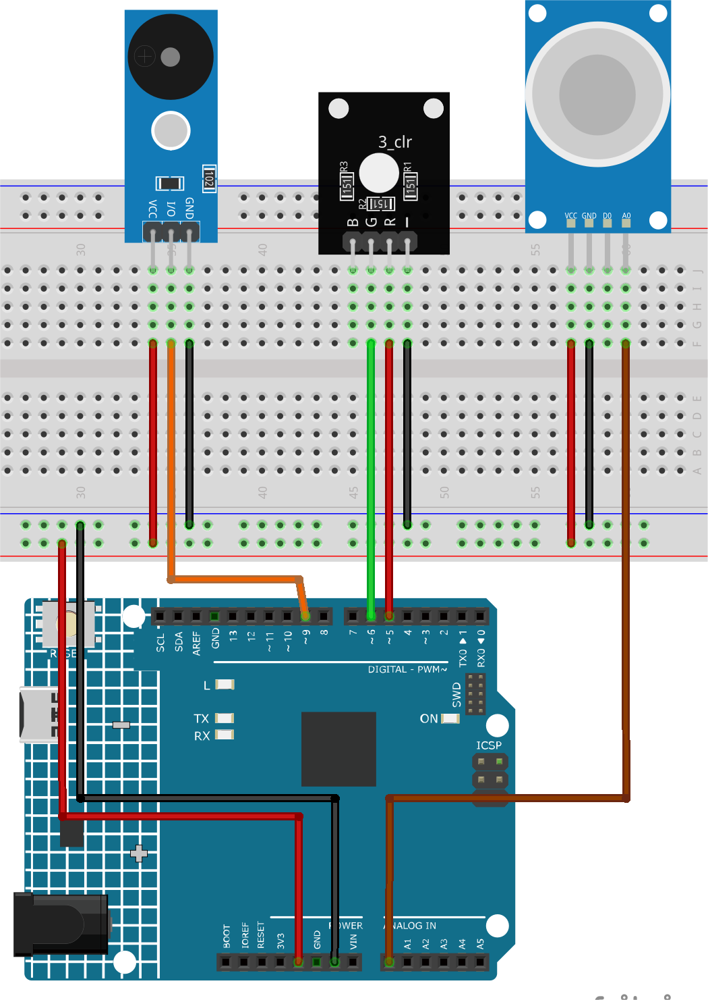

.. note::

    こんにちは、SunFounderのRaspberry Pi & Arduino & ESP32愛好家コミュニティへようこそ！Facebook上でRaspberry Pi、Arduino、ESP32についてもっと深く掘り下げ、他の愛好家と交流しましょう。

    **参加する理由は？**

    - **エキスパートサポート**：コミュニティやチームの助けを借りて、販売後の問題や技術的な課題を解決します。
    - **学び＆共有**：ヒントやチュートリアルを交換してスキルを向上させましょう。
    - **独占的なプレビュー**：新製品の発表や先行プレビューに早期アクセスしましょう。
    - **特別割引**：最新製品の独占割引をお楽しみください。
    - **祭りのプロモーションとギフト**：ギフトや祝日のプロモーションに参加しましょう。

    👉 私たちと一緒に探索し、創造する準備はできていますか？[|link_sf_facebook|]をクリックして今すぐ参加しましょう！

.. _fun_gas_leak_alarm:

ガス漏れ警報器
==========================

.. raw:: html

   <video loop autoplay muted style = "max-width:100%">
      <source src="../_static/video/fun/02-fun_Gas_leak_alarm.mp4"  type="video/mp4">
      ご利用のブラウザはビデオタグをサポートしていません。
   </video>

このプロジェクトは、Arduino Unoボードを用いてガス漏れ検出のシミュレーションを行います。MQ-2ガスセンサーとRGB LEDを組み込むことで、ガス濃度を連続的に監視します。濃度があらかじめ設定した閾値を超えた場合、警報（ブザー）が鳴り、RGB LEDが赤く点灯します。逆に、濃度がこの閾値以下であれば、警報は作動せず、LEDは緑色に輝きます。このデモは純粋に説明的なものであり、実際のガス漏れ検出システムの代わりにはなりません。

1. 回路の作成
-----------------------------

* :ref:`cpn_uno`
* :ref:`cpn_gas`
* :ref:`cpn_rgb`
* :ref:`cpn_buzzer`

2. コード
-----------------------------

#. ``ultimate-sensor-kit\fun_project\02-Gas_leak_alarm`` のパスにある ``02-Gas_leak_alarm.ino`` ファイルを開くか、このコードを **Arduino IDE** にコピーしてください。

   .. raw:: html
       
       <iframe src=https://create.arduino.cc/editor/sunfounder01/a8ac24b4-bbab-4d9d-b0ed-a890b764d52d/preview?embed style="height:510px;width:100%;margin:10px 0" frameborder=0></iframe>

3. コードの説明
-----------------------------

このプロジェクトの核心は、ガス濃度を継続的に監視することです。検出されたガス濃度が特定の閾値を超えた場合、警報が作動し、LEDの色が赤に変わります。これは、危険な状況を示す模擬警報機構となります。濃度が閾値以下になった場合、警報は解除され、LEDは緑色に戻り、安全な環境であることを示します。

1. 定数と変数の定義

   この部分で、各コンポーネントのピン番号を宣言し、初期化します。 ``sensorPin`` はMQ-2ガスセンサーが接続されているアナログピンを示します。 ``sensorValue`` はセンサーのアナログ出力を格納する整数変数です。 ``buzzerPin`` はブザーが接続されているデジタルピンを示します。最後に、 ``RPin`` と ``GPin`` はRGB LEDの赤と緑のチャンネルに対応するピンです。

   .. code-block:: arduino
   
      // Define the pin numbers for the Gas Sensor
      const int sensorPin = A0;
      int sensorValue;
   
      // Define the pin number for the buzzer
      const int buzzerPin = 9;
   
      // Define pin numbers for the RGB LED
      const int RPin = 5;  // R channel of RGB LED
      const int GPin = 6;  // G channel of RGB LED

2. ``setup()`` 内での初期化

   ``setup()`` 関数では、必要な設定を初期化します。9600ボードレートでシリアル通信を開始し、センサーの値をシリアルモニターで確認できます。ブザーとRGB LEDのピンは ``OUTPUT`` として設定され、外部コンポーネントへ信号を送ります。

   .. code-block:: arduino
   
      void setup() {
        Serial.begin(9600);  // Start serial communication at 9600 baud rate
   
        // Initialize the buzzer and RGB LED pins as output
        pinMode(buzzerPin, OUTPUT);
        pinMode(RPin, OUTPUT);
        pinMode(GPin, OUTPUT);
      }

3. メインループ：センサーの読み取りと警報の作動

   ``loop()`` 関数は、ガスセンサーの出力を継続的に読み取ります。この値はシリアルモニターで確認可能です。センサー値に応じて、以下の2つのシナリオが発生します。
   
   - 値が300を超えた場合、 ``tone()`` を使用してブザーが作動し、RGB LEDは赤く点灯します。
   - 値が300以下であれば、 ``noTone()`` を使用してブザーは消音され、LEDは緑色になります。
   
   最後に、次のループの前に50ミリ秒の遅延が設けられ、読み取り頻度とCPU負荷を管理します。

   .. code-block:: arduino
   
      void loop() {
        // Read the analog value of the gas sensor
        sensorValue = analogRead(sensorPin);
   
        // Print the sensor value to the serial monitor
        Serial.print("Analog output: ");
        Serial.println(sensorValue);
   
        // If the sensor value exceeds the threshold, trigger the alarm and make the RGB LED red
        if (sensorValue > 300) {
          tone(buzzerPin, 500, 300);
          digitalWrite(GPin, LOW);
          digitalWrite(RPin, HIGH);
        } else {
          // If the sensor value is below the threshold, turn off the alarm and make the RGB LED green
          noTone(buzzerPin);
          digitalWrite(RPin, LOW);
          digitalWrite(GPin, HIGH);
        }
   
        // Wait for 50 milliseconds before the next loop iteration
        delay(50);
      }
   
