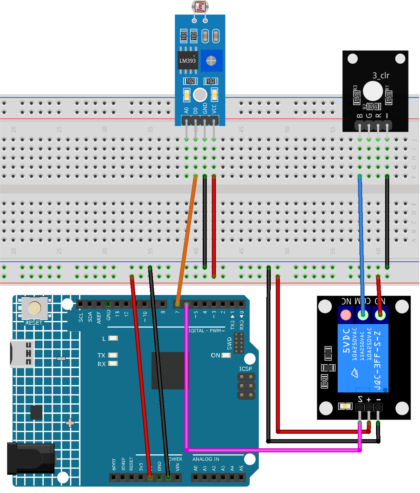

.. _fun_light_control_switch:

光制御スイッチ
==========================

.. raw:: html

   <video loop autoplay muted style = "max-width:100%">
      <source src="../_static/video/fun/03-fun_Light_control_switch.mp4"  type="video/mp4">
      お使いのブラウザはビデオタグをサポートしていません。
   </video>

このプロジェクトは、環境光のレベルをフォトレジスタセンサモジュールで検出し、その検出結果に基づいてリレーモジュールを制御する、光制御スイッチシステムです。環境光がある閾値以下の場合、リレーがオンになります。逆に、環境光が閾値よりも高い場合、リレーがオフになります。

.. warning ::
    このデモンストレーションでは、RGB LEDモジュールを制御するためにリレーを使用していますが、実際のシナリオでは最も実用的な方法とは言えないかもしれません。

    **実際の用途でリレーを他の機器に接続することもできますが、高電圧ACと取り扱う際には極度の注意が必要です。不適切または誤った使用は重大な傷害や死につながる可能性があります。したがって、高電圧ACに精通している方のみが対象です。常に安全を最優先してください。**

1. 回路を組む
-----------------------------

* :ref:`cpn_uno`
* :ref:`cpn_photoresistor`
* :ref:`cpn_relay`
* :ref:`cpn_rgb`

2. コード
-----------------------------

#. ``ultimate-sensor-kit\fun_project\03-fun_Light_control_switch`` パスの下にある ``03-fun_Light_control_switch.ino`` ファイルを開くか、このコードを **Arduino IDE** にコピーしてください。

   .. raw:: html
       
       <iframe src=https://create.arduino.cc/editor/sunfounder01/ffe65b97-0ce0-4f27-841e-92b792233dd4/preview?embed style="height:510px;width:100%;margin:10px 0" frameborder=0></iframe>

3. コードの解説
-----------------------------

このプロジェクトの主要な原理は、フォトレジスタセンサを使用して環境光のレベルを検出することです。フォトレジスタは、照らされる光の量に応じて抵抗が変わります。この性質を利用して、センサモジュールからデジタルの出力を得ます。光が設定された閾値以下の場合、センサはArduinoにHIGH信号を送ります。この信号は、他のデバイスを制御するリレーを活性化するために使用されます。

.. note::
    フォトレジスタセンサには、HIGHとLOWの出力を切り替える閾値を設定するためのポテンショメータ（小さな調整可能なつまみ）があります。この閾値は、スイッチングに必要な光レベルに応じて調整する必要があるかもしれません。

1. **定数とピンの定義**

   ここでは、リレーとセンサーに使用するピンを定義しています。これらのピン番号はプログラム全体で変更されることはないため、``const`` キーワードを使用しています。

   .. code-block:: arduino
   
      const int RelayPin = 6;
      const int sensorPin = 7;
   

2. **setup()関数内での初期化**

   ``setup()`` 関数は、プログラムが開始されたときに一度だけ実行されます。ここでは、``RelayPin`` を出力ピンとして宣言し、デバッグ目的で9600ボーのシリアル通信を開始しています。

   .. code-block:: arduino
   
      void setup() {
        // Set RelayPin as an output pin
        pinMode(RelayPin, OUTPUT);
        // Start the Serial communication for debugging
        Serial.begin(9600);
      }
   

3. **センサーの読み取りとリレーの制御**

   ``loop()`` 関数は、主要なロジックが置かれています。この関数は、フォトレジスタセンサからの値を何度も確認します。センサが1の値（閾値以下の光レベルを示す）を読み取った場合、``RelayPin`` をHIGHに設定してリレーをオンにします。それ以外の場合は、``RelayPin`` をLOWに設定してリレーをオフにします。

   .. code-block:: arduino
   
      void loop() {
        // Read the value from the photoresistance sensor module
        const int sensorValue = digitalRead(sensorPin);
        // If the light level is lower than the threshold (sensor value equals 1),
        // switch the relay module ON.
        if (sensorValue == 1) {
          digitalWrite(RelayPin, HIGH);
        } else
        // If the light level is higher than the threshold (sensor value equal 0),
        // switch the relay module OFF.
        {
          digitalWrite(RelayPin, LOW);
        }
      }
   
