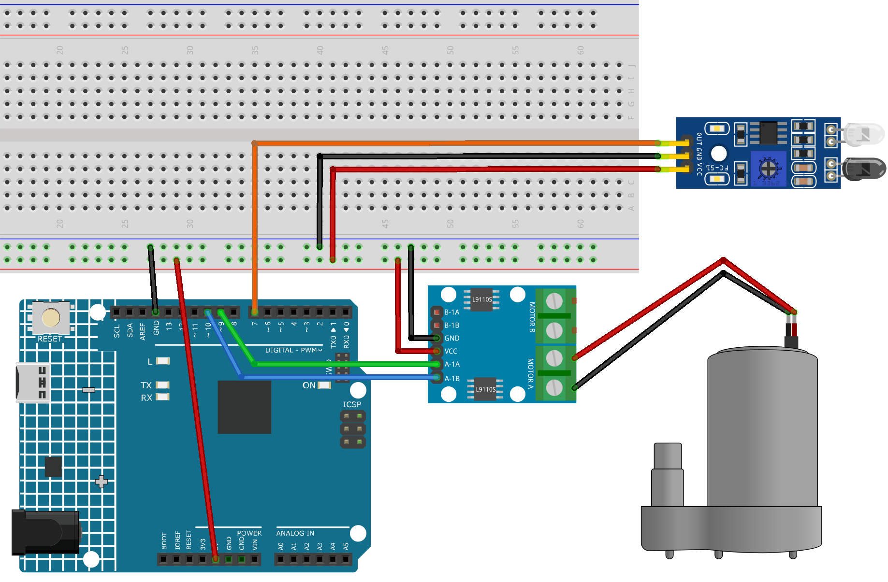

.. note::

    Hallo und willkommen in der SunFounder Raspberry Pi & Arduino & ESP32 Enthusiasten-Gemeinschaft auf Facebook! Tauchen Sie tiefer ein in die Welt von Raspberry Pi, Arduino und ESP32 mit anderen Enthusiasten.

    **Warum beitreten?**

    - **Expertenunterstützung**: Lösen Sie Nachverkaufsprobleme und technische Herausforderungen mit Hilfe unserer Gemeinschaft und unseres Teams.
    - **Lernen & Teilen**: Tauschen Sie Tipps und Anleitungen aus, um Ihre Fähigkeiten zu verbessern.
    - **Exklusive Vorschauen**: Erhalten Sie frühzeitigen Zugang zu neuen Produktankündigungen und exklusiven Einblicken.
    - **Spezialrabatte**: Genießen Sie exklusive Rabatte auf unsere neuesten Produkte.
    - **Festliche Aktionen und Gewinnspiele**: Nehmen Sie an Gewinnspielen und Feiertagsaktionen teil.

    👉 Sind Sie bereit, mit uns zu erkunden und zu erschaffen? Klicken Sie auf [|link_sf_facebook|] und treten Sie heute bei!

.. _fun_soap_dispenser:

Automatischer Seifenspender
===========================

.. raw:: html

   <video loop autoplay muted style = "max-width:100%">
      <source src="../_static/video/fun/04-fun_Automatic_soap_dispenser.mp4"  type="video/mp4">
      Your browser does not support the video tag.
   </video>

Das Projekt "Automatischer Seifenspender" nutzt ein Arduino Uno Board zusammen mit einem Infrarot-Hindernisvermeidungssensor und einer Wasserpumpe. Der Sensor erkennt die Anwesenheit eines Objekts wie einer Hand, was die Wasserpumpe aktiviert, um Seife zu spenden.

1. Schaltkreis aufbauen
------------------------

* :ref:`cpn_uno`
* :ref:`cpn_ir_obstacle`
* :ref:`cpn_pump`

2. Programmcode
----------------

#. Öffnen Sie die Datei ``04-Automatic_soap_dispenser.ino`` im Pfad ``ultimate-sensor-kit\fun_project\04-Automatic_soap_dispenser`` oder kopieren Sie diesen Code in die **Arduino IDE**.

   .. raw:: html
       
       <iframe src=https://create.arduino.cc/editor/sunfounder01/0ee4125a-39fe-4493-bbe6-8bef68721896/preview?embed style="height:510px;width:100%;margin:10px 0" frameborder=0></iframe>

3. Code-Erklärung
------------------

Die Hauptidee dieses Projekts besteht darin, ein berührungsloses Seifenspendersystem zu schaffen. Der Infrarot-Hindernisvermeidungssensor erkennt, wenn sich ein Objekt (wie eine Hand) nähert. Bei Erkennung eines Objekts sendet der Sensor ein Signal an den Arduino, der daraufhin die Wasserpumpe aktiviert, um Seife zu spenden. Die Pumpe bleibt für eine kurze Zeit aktiv, spendet Seife und schaltet dann ab.

#. **Definieren der Pins für den Sensor und die Pumpe**

   In diesem Code-Ausschnitt definieren wir die Arduino-Pins, die mit dem Sensor und der Pumpe verbunden sind. Pin 7 ist als Sensor-Pin definiert und wir verwenden die Variable ``sensorValue``, um die von diesem Sensor gelesenen Daten zu speichern. Für die Wasserpumpe verwenden wir zwei Pins, 9 und 10.

   .. code-block:: arduino
   
      const int sensorPin = 7;
      int sensorValue;
      const int pump1A = 9;
      const int pump1B = 10;

#. **Einrichten des Sensors und der Pumpe**

   In der Funktion ``setup()`` legen wir die Modi für die verwendeten Pins fest. Der Sensor-Pin ist als ``INPUT`` eingestellt, da er Daten vom Sensor empfangen wird. Die Pumpen-Pins sind als ``OUTPUT`` eingestellt, da sie Befehle an die Pumpe senden werden. Wir stellen sicher, dass der Pin ``pump1B`` in einem ``LOW``-Zustand (aus) startet und beginnen die serielle Kommunikation mit einer Baudrate von 9600.

   .. code-block:: arduino
   
      void setup() {
        pinMode(sensorPin, INPUT);
        pinMode(pump1A, OUTPUT);    
        pinMode(pump1B, OUTPUT);    
        digitalWrite(pump1B, LOW);  
        Serial.begin(9600);
      }

#. **Kontinuierliche Überprüfung des Sensors und Steuerung der Pumpe**

   In der Funktion ``loop()`` liest der Arduino ständig den Wert vom Sensor mit ``digitalRead()`` und weist ihn ``sensorValue()`` zu. Dieser Wert wird dann zum Seriellen Monitor für Debugging-Zwecke ausgegeben. Wenn der Sensor ein Objekt erkennt, wird ``sensorValue()`` 0 sein. In diesem Fall wird ``pump1A`` auf ``HIGH`` gesetzt, wodurch die Pumpe aktiviert wird, und eine Verzögerung von 700 Millisekunden ermöglicht es der Pumpe, Seife zu spenden. Die Pumpe wird dann durch Setzen von ``pump1A`` auf ``LOW`` deaktiviert, und eine Verzögerung von 1 Sekunde gibt dem Benutzer Zeit, seine Hand wegzubewegen, bevor der Zyklus sich wiederholt.

   .. code-block:: arduino
   
      void loop() {
        sensorValue = digitalRead(sensorPin);
        Serial.println(sensorValue);
        if (sensorValue == 0) {  
          digitalWrite(pump1A, HIGH);
          delay(700);
          digitalWrite(pump1A, LOW);
          delay(1000);
        }
      }
   
