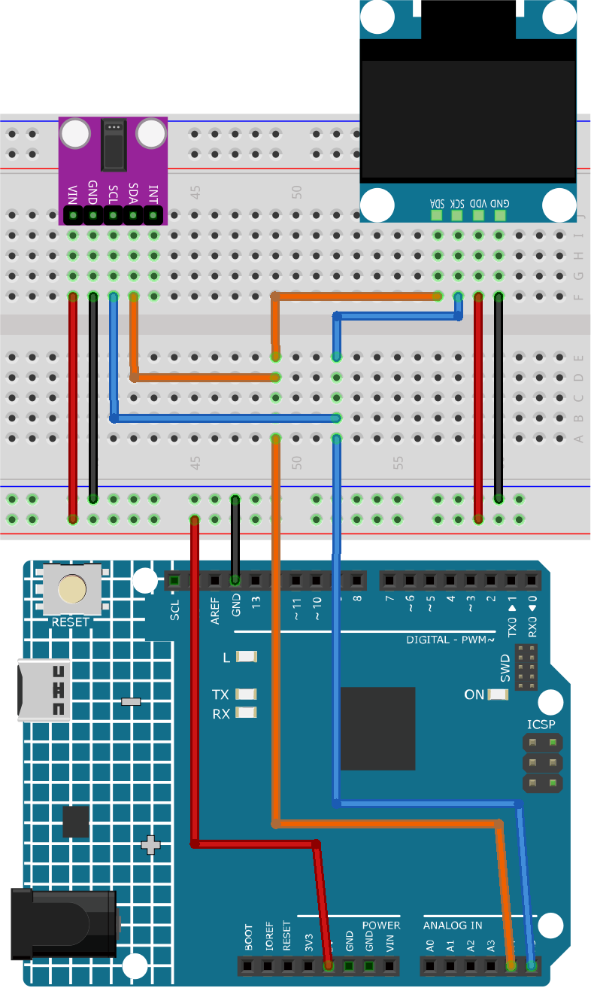

.. _fun_herzfrequenz_monitor:

Herzfrequenzmonitor
==========================

.. raw:: html

   <video loop autoplay muted style = "max-width:100%">
      <source src="../_static/video/fun/06-fun_Heart_rate_monitor.mp4"  type="video/mp4">
      Ihr Browser unterstützt das Video-Tag nicht.
   </video>

Dieses Arduino-Projekt dient dem Aufbau eines einfachen Herzfrequenzmonitors mit einem MAX30102-Pulsoximeter-Sensor und einem SSD1306-OLED-Display. Der Code erfasst die Herzfrequenz durch Messung der Zeitintervalle zwischen den Herzschlägen. Nach vier Messungen wird deren Durchschnitt berechnet und auf dem OLED-Bildschirm angezeigt. Erkennt der Sensor keinen Finger, wird dem Benutzer eine Aufforderung angezeigt, den Finger korrekt auf dem Sensor zu positionieren.

1. Schaltung aufbauen
-----------------------------

* :ref:`cpn_uno`
* :ref:`cpn_max30102`
* :ref:`cpn_olde`

2. Code
-----------------------------

#. Öffnen Sie die Datei ``06-Heart_rate_monitor.ino`` im Verzeichnis ``ultimate-sensor-kit\fun_project\06-Heart_rate_monitor`` oder kopieren Sie diesen Code in die **Arduino IDE**.

   .. raw:: html
       
       <iframe src=https://create.arduino.cc/editor/sunfounder01/62989671-0ed0-479a-a91c-9c8f37c170ab/preview?embed style="height:510px;width:100%;margin:10px 0" frameborder=0></iframe>

3. Code-Erklärung
-----------------------------

Der Hauptgedanke dieses Projekts besteht darin, die Pulsation des Blutflusses durch einen Finger mithilfe des MAX30102-Sensors zu erfassen. Durch die Blutzirkulation im Körper verändert sich das Blutvolumen in den Gefäßen der Fingerspitze geringfügig. Der Sensor erkennt diese minimalen Veränderungen, indem er Licht durch den Finger sendet und misst, wie viel davon absorbiert oder reflektiert wird. Die Zeitintervalle zwischen den einzelnen Pulsschlägen dienen zur Berechnung der Herzfrequenz in Schlägen pro Minute (BPM). Dieser Wert wird dann aus vier Messungen gemittelt und auf dem OLED-Display angezeigt.

1. **Einbindung von Bibliotheken und erste Deklarationen**:

   Der Code beginnt mit der Einbindung der erforderlichen Bibliotheken für das OLED-Display, den MAX30102-Sensor und die Herzfrequenzberechnung. Zusätzlich werden die Konfiguration für das OLED-Display und die Variablen für die Herzfrequenzberechnung deklariert.

   .. code-block:: arduino

      #include <Adafruit_GFX.h>  // OLED  libraries
      #include <Adafruit_SSD1306.h>
      #include <Wire.h>
      #include "MAX30105.h"   // MAX3010x library
      #include "heartRate.h"  // Heart rate  calculating algorithm

      // ... Variables and OLED configuration

   In diesem Projekt haben wir auch einige Bitmaps erstellt. Das Schlüsselwort „PROGMEM“ zeigt an, dass das Array im Programmspeicher des Arduino-Mikrocontrollers gespeichert ist. Die Verwendung von Programmspeicher (PROGMEM) anstelle von RAM ist bei großen Datenmengen sinnvoll, die sonst zu viel RAM belegen würden.

   .. code-block:: arduino

      static const unsigned char PROGMEM beat1_bmp[] = {...}

      static const unsigned char PROGMEM beat2_bmp[] = {...}

2. **Setup-Funktion**:

   Initialisiert die I2C-Kommunikation, startet die serielle Kommunikation, aktiviert das OLED-Display und konfiguriert den MAX30102-Sensor.

   .. code-block:: arduino

      void setup() {
          Wire.setClock(400000);
          Serial.begin(9600);
          display.begin(SSD1306_SWITCHCAPVCC, SCREEN_ADDRESS);
          // ... Rest of the setup code

3. **Hauptschleife**:

   Hier befindet sich die Kernfunktionalität. Der IR-Wert wird vom Sensor gelesen. Wenn ein Finger erkannt wird (IR-Wert über 50.000), prüft das Programm, ob ein Herzschlag erfasst wurde. Bei Erkennung eines Herzschlags aktualisiert das OLED-Display die BPM und die Zeit zwischen den Herzschlägen wird zur BPM-Berechnung herangezogen. Andernfalls wird der Benutzer aufgefordert, seinen Finger auf den Sensor zu legen.

   Um einen dynamischen visuellen Effekt zu erzielen, haben wir auch zwei Bitmaps mit Herzschlägen vorbereitet. Durch das Wechseln zwischen diesen beiden Bitmaps wird der Effekt erzeugt.

   .. code-block:: arduino

      void loop() {
        // Get IR value from sensor
        long irValue = particleSensor.getIR();  
      
        //If a finger is detected
        if (irValue > 50000) {
      
          // Check if a beat is detected
          if (checkForBeat(irValue) == true) {

            // Update OLED display
            // Calculate the BPM
      
            // Calculate the average BPM
            //Print the IR value, current BPM value, and average BPM value to the serial monitor

            // Update OLED display
            
          }
        }
        else {
          // ... Prompt to place the finger on the sensor
        }
      }
