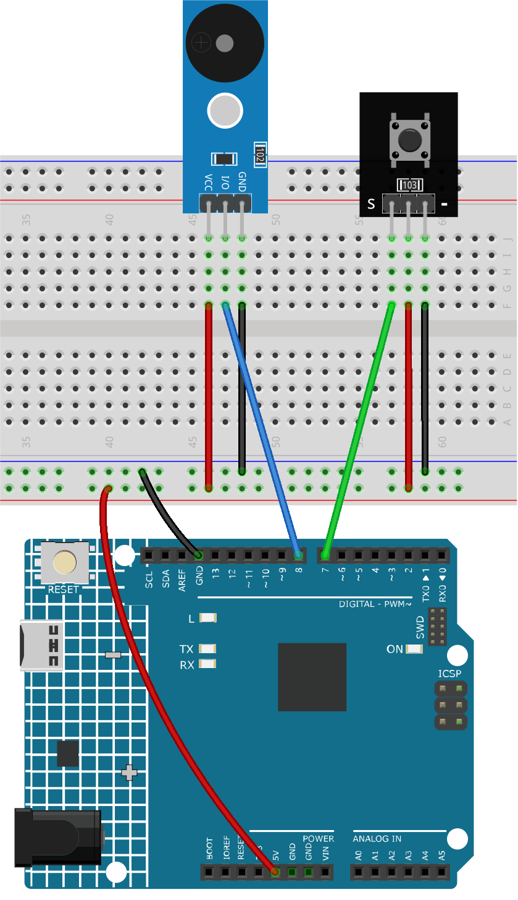

.. _fun_doorbell_jp:

ドアベル
==========================

.. raw:: html

   <video controls autoplay style = "max-width:100%">
      <source src="../_static/video/fun/07-fun_Doorbell.mp4"  type="video/mp4">
      ご利用のブラウザはビデオタグをサポートしていません。
   </video>

この「ドアベル」プロジェクトは、ボタンが押された際にArduinoを使って事前に定義されたメロディをパッシブブザーモジュールで再生する、というドアベルの機能をシミュレートすることを目的としています。

1. 回路の組み立て
-----------------------------

* :ref:`cpn_uno`
* :ref:`cpn_button`
* :ref:`cpn_buzzer`

2. コード
-----------------------------

#. ``ultimate-sensor-kit\fun_project\07-Doorbell`` のパス下で ``07-Doorbell.ino`` ファイルを開くか、このコードを **Arduino IDE** にコピーしてください。

   .. raw:: html
       
       <iframe src=https://create.arduino.cc/editor/sunfounder01/a6511078-ed6f-49d0-a4a5-2cafc3d63e4e/preview?embed style="height:510px;width:100%;margin:10px 0" frameborder=0></iframe>

3. コード解説
-----------------------------

このプロジェクトの主要なコンセプトは、Arduino Unoボードを使ってボタンの押下を検出し、それに応じてパッシブブザーでメロディを再生することです。このメロディは、音のピッチ（定義された音程）とその持続時間によって構成されます。

#. 必要なライブラリとグローバル変数の設定

   .. code-block:: arduino
   
      #include "pitches.h"  // This library provides the frequency values for musical notes.
   
      const int buttonPin = 7;  // Button connected to digital pin 7
      const int buzzerPin = 8;  // Buzzer connected to digital pin 8
   
      // Arrays to define the melody and the corresponding note durations
      int melody[] = {...};
      int noteDurations[] = {...};

   このセグメントには、音符のための必要なライブラリが含まれ、コンポーネント用のピンが設定されます。さらに、メロディとその長さは配列で定義されています。

#. ボタンの初期化とシリアル通信の開始

   .. code-block:: arduino
   
      void setup() {
        Serial.begin(9600);           // Start serial communication at 9600 baud rate
        pinMode(buttonPin, INPUT);    // Set the button pin as an input
      }

   ``setup()`` 関数では、シリアル通信を開始し、buttonPinを入力として構成します。

#. ボタンの押下を監視し、メロディを再生

   .. code-block:: arduino
   
      void loop() {
        int buttonState = digitalRead(buttonPin);  // Read the state of the button
   
        if (buttonState == LOW) {                  // Check if the button is pressed
          Serial.println("Button pressed");        // Send a message to serial monitor
          buzzer();                                // Play the buzzer melody
        }
      }

   ここでは、ループ内でボタンの状態を常にチェックしています。もし押された場合は、シリアルモニターにメッセージが送信され、 ``buzzer()`` 関数（メロディを演奏する）が呼び出されます。

#. ``buzzer()`` 関数でメロディを再生

   .. code-block:: arduino
      
      void buzzer() {
        int size = sizeof(noteDurations) / sizeof(int);   // Calculate the number of notes
   
        for (int thisNote = 0; thisNote < size; thisNote++) {
          int noteDuration = 1000 / noteDurations[thisNote];   // Calculate note's play duration
          tone(buzzerPin, melody[thisNote], noteDuration);    // Play the note on the buzzer
   
          int pauseBetweenNotes = noteDuration * 1.30;        // Calculate pause between notes
          delay(pauseBetweenNotes);                           // Introduce the pause
          noTone(buzzerPin);                                  // Stop playing the note
        }
      }

   ``buzzer()`` 関数では、メロディの音符が順番に演奏されます。 ``tone()`` 関数は、指定された時間だけブザーでトーンを生成します。各音符を演奏した後、次の音符を演奏する前に短い休止があります。

