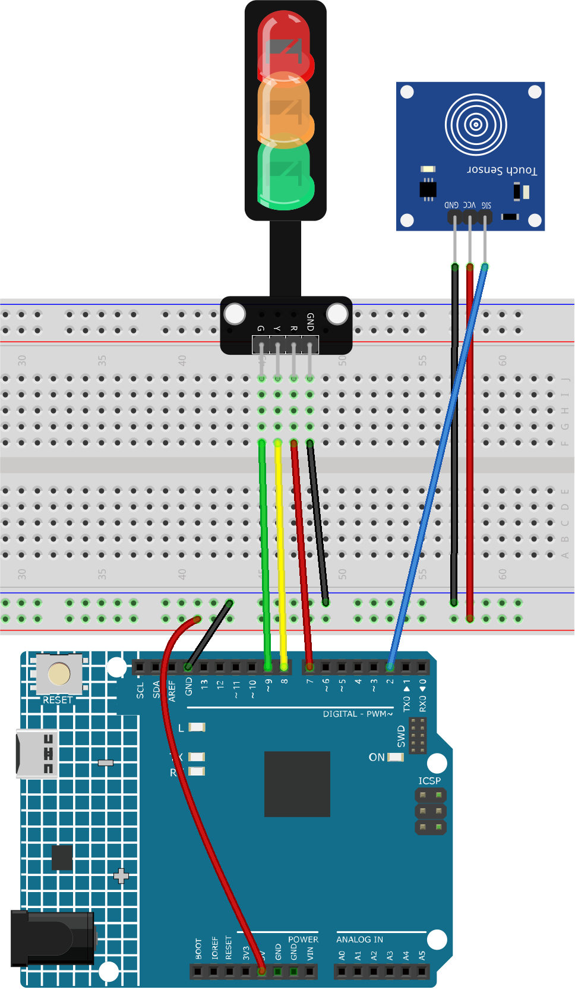

.. _fun_touch_toggle_light:

Touch toggle light
==========================

.. raw:: html

   <video loop autoplay muted style = "max-width:100%">
      <source src="../_static/video/fun/08-fun-Touch_toggle_light.mp4"  type="video/mp4">
      Your browser does not support the video tag.
   </video>

The project involves creating a simple traffic light control mechanism using a touch sensor and a traffic light LED module. When the touch sensor is activated, the LEDs will cycle through the following sequence: Red -> Yellow -> Green.

1. Build the Cirduit
-----------------------------

* :ref:`cpn_uno`
* :ref:`cpn_touch`
* :ref:`cpn_traffic`

2. Code
-----------------------------

#. Open the ``08-Touch_toggle_light.ino`` file under the path of ``ultimate-sensor-kit\fun_project\08-Touch_toggle_light``, or copy this code into **Arduino IDE**.

   .. raw:: html
       
       <iframe src=https://create.arduino.cc/editor/sunfounder01/7e6106dd-6a46-4bbb-8057-5b93d5fa25b5/preview?embed style="height:510px;width:100%;margin:10px 0" frameborder=0></iframe>

3. Code explanation
-----------------------------

This project operates on a simple principle: when a touch is detected on the touch sensor, the next LED in the sequence (Red -> Yellow -> Green) will light up. The state of which LED is currently active is managed by the variable ``currentLED``.

1. Define pins and initial values

   .. code-block:: arduino
   
       const int touchSensorPin = 2;  // touch sensor pin
       const int rledPin = 9;         // red LED pin
       const int yledPin = 8;         // yellow LED pin
       const int gledPin = 7;         // green LED pin
       int lastTouchState;     // the previous state of touch sensor
       int currentTouchState;  // the current state of touch sensor
       int currentLED = 0;     // current LED 0->Red, 1->Yellow, 2->Green
   
   These lines define the pins that we connect the components to on the Arduino board and initialize the states for touch and LEDs.

2. setup() function

   .. code-block:: arduino
   
       void setup() {
         Serial.begin(9600);              // initialize serial
         pinMode(touchSensorPin, INPUT);  // configure touch sensor pin as input
         // set LED pins as outputs
         pinMode(rledPin, OUTPUT);
         pinMode(yledPin, OUTPUT);
         pinMode(gledPin, OUTPUT);
         currentTouchState = digitalRead(touchSensorPin);
       }
   
   This function runs once when the Arduino is powered on or reset. Here, the touch sensor is set as an input (it will read values), while the LEDs are set as outputs (we will set their values). Also, the serial communication is started to allow debugging, and the initial touch state is read.

3. loop() function

   .. code-block:: arduino
   
       void loop() {
         lastTouchState = currentTouchState;               // save the last state
         currentTouchState = digitalRead(touchSensorPin);  // read new state
         if (lastTouchState == LOW && currentTouchState == HIGH) {
           Serial.println("The sensor is touched");
           turnAllLEDsOff();  // Turn off all LEDs
           // switch on the next LED in sequence
           switch (currentLED) {
             case 0:
               digitalWrite(rledPin, HIGH);
               currentLED = 1;
               break;
             case 1:
               digitalWrite(yledPin, HIGH);
               currentLED = 2;
               break;
             case 2:
               digitalWrite(gledPin, HIGH);
               currentLED = 0;
               break;
           }
         }
       }

   In the main loop, the current touch state is read and compared with the previous one. If a touch is detected (transition from LOW to HIGH), all LEDs are turned off, and the next one in the sequence is turned on. 

4. Turn off LEDs function

   .. code-block:: arduino
      
       void turnAllLEDsOff() {
         digitalWrite(rledPin, LOW);
         digitalWrite(yledPin, LOW);
         digitalWrite(gledPin, LOW);
       }

   This function, when called, will turn off all the LEDs by setting their pins to LOW.

