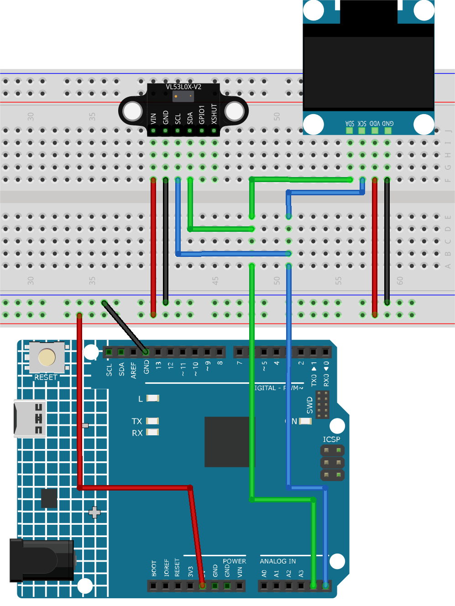

.. _fun_tof_distance_monitor:

ToF distance monitor
==========================

.. raw:: html

   <video loop autoplay muted style = "max-width:100%">
      <source src="../_static/video/fun/09-fun_ToF_distance_monitor.mp4"  type="video/mp4">
      Your browser does not support the video tag.
   </video>

This project is designed to measure and display the distance to an object using the VL53L0X Time of Flight (ToF) Micro-LIDAR Distance Sensor. The measured distance in millimeters is displayed on an OLED screen, and the values are also output to the serial monitor. The VL53L0X can measure a range of approximately 50mm to 1200mm. 

1. Build the Cirduit
-----------------------------

* :ref:`cpn_uno`
* :ref:`cpn_VL53L0X`
* :ref:`cpn_olde`

2. Code
-----------------------------

#. Open the ``09-ToF_distance_monitor.ino`` file under the path of ``ultimate-sensor-kit\fun_project\09-ToF_distance_monitor``, or copy this code into **Arduino IDE**.

   .. raw:: html
       
       <iframe src=https://create.arduino.cc/editor/sunfounder01/8077aa45-8e0c-4c13-9211-b23926b79462/preview?embed style="height:510px;width:100%;margin:10px 0" frameborder=0></iframe>

3. Code explanation
-----------------------------

This project uses the VL53L0X Time of Flight sensor to measure distances by measuring the time it takes for light to travel to an object and return to the sensor. The OLED display then shows the distance measurement in millimeters. Serial communication is also used to print the measurement values for monitoring and debugging. Both the OLED display and the VL53L0X sensor communicate with the Arduino using the I2C protocol.

#. Include necessary libraries and initialize components

   .. code-block:: arduino

      #include <Wire.h>
      #include "Adafruit_VL53L0X.h"
      #include <SPI.h>
      #include <Adafruit_GFX.h>
      #include <Adafruit_SSD1306.h>
   
      // Initialize the OLED display module with a resolution of 128x64
      Adafruit_SSD1306 display = Adafruit_SSD1306(128, 64, &Wire, -1);
      
      // Initialize the VL53L0X distance sensor
      Adafruit_VL53L0X lox = Adafruit_VL53L0X();
   
   
   - Necessary libraries for handling I2C communication, the distance sensor, SPI protocol, and the OLED display are included.
   - The OLED display and the VL53L0X distance sensor are initialized.

#. Initialize the serial communication and prepare the display as well as the VL53L0X distance sensor.

   .. code-block:: arduino

      void setup() {
        Serial.begin(9600);
      
        // Start the OLED display with I2C address 0x3C
        display.begin(SSD1306_SWITCHCAPVCC, 0x3C);
        display.display();
        delay(1000);
      
        // Begin I2C communication
        Wire.begin();
   
        // Start the VL53L0X distance sensor, halt if initialization fails
        if (!lox.begin()) {
          Serial.println(F("Failed to boot VL53L0X"));
          while (1)
            ;
        }
      
        // Set OLED display text size and color
        display.setTextSize(3);
        display.setTextColor(WHITE);
      }
   
   
   - Start serial communication at 9600 baud.
   - Initialize the OLED display with its I2C address.
   - Begin I2C communication.
   - Check if the VL53L0X distance sensor is initialized properly. If not, an error message is displayed, and the Arduino enters an infinite loop.
   - Set text size and color for the OLED display.

#. Main loop() to measure the distance and display the result.

   .. code-block:: arduino

      void loop() {
        VL53L0X_RangingMeasurementData_t measure;
      
        lox.rangingTest(&measure, false);  // pass in 'true' to get debug data printout
      
        // If there are no phase failures, display the measured distance
        if (measure.RangeStatus != 4) {
          display.clearDisplay();
          display.setCursor(12, 22);
          display.print(measure.RangeMilliMeter);
          display.print("mm");
          display.display();
          Serial.println();
          delay(50);
        } else {
          display.display();
          display.clearDisplay();
          return;
        }
      }
   
   
   - Create a variable to store the measurement data.
   - Take a measurement using the VL53L0X sensor.
   - Check if the measurement is valid (i.e., no phase failures).
   - If the measurement is valid, clear the OLED display, set the cursor position, and display the measured distance.
   - Else, refresh the display and clear it for the next reading.