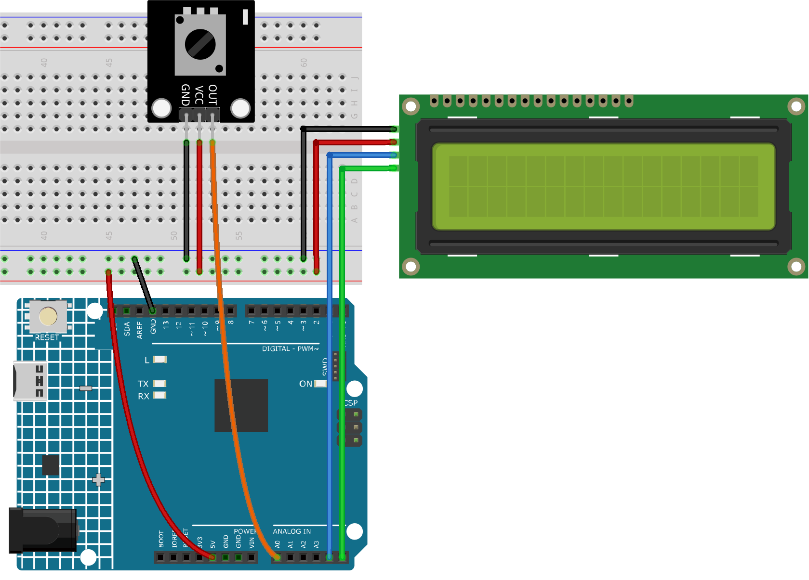

.. _fun_potentiometer_scale_value:

ポテンショメータのスケール値
==========================

.. raw:: html

   <video loop autoplay muted style = "max-width:100%">
      <source src="../_static/video/fun/10-fun-Potentiometer_scale_value.mp4"  type="video/mp4">
      お使いのブラウザはビデオタグをサポートしていません。
   </video>

このプロジェクトは、ポテンショメータから値を読み取り、I2Cインターフェースを持つLCD 1620にその読み取り値を表示するように設計されています。また、シリアルモニタにも値がリアルタイムで送信されます。このプロジェクトのユニークな特長は、LCD上でポテンショメータの値を視覚的に表現し、その値に応じて長さが変わるバーを表示する点です。

1. 回路の組み立て
-----------------------------

* :ref:`cpn_uno`
* :ref:`cpn_potentiometer`
* :ref:`cpn_i2c_lcd1602`

2. コード
-----------------------------

#.  ``ultimate-sensor-kit\fun_project\10-Potentiometer_scale_value`` パスの下にある ``10-Potentiometer_scale_value.ino`` ファイルを開くか、このコードを **Arduino IDE** にコピーします。

   .. raw:: html
       
       <iframe src=https://create.arduino.cc/editor/sunfounder01/8adabab1-9d8b-4b84-9007-18f86eda247a/preview?embed style="height:510px;width:100%;margin:10px 0" frameborder=0></iframe>

3. コードの説明
-----------------------------

このプロジェクトは、接続されたポテンショメータから値を連続的に読み取ります。この値は小さいスケール（0-16）にマッピングされ、LCD上で数値と視覚的にも表示されます。連続した読み取りの差を確認することで、表示上に重要な変化だけが反映され、ジッターが低減されます。ジッターを低減することで、LCD画面の頻繁なリフレッシュによる望ましくない視覚効果を防ぎます。

1. **ライブラリのインクルードと初期化**:

   .. code-block:: arduino
   
      #include <Wire.h>
      #include <LiquidCrystal_I2C.h>
      LiquidCrystal_I2C lcd(0x27, 16, 2);

   ここでは、必要なライブラリ（I2C通信の ``Wire`` とLCD用の ``LiquidCrystal_I2C`` ）がインクルードされています。I2Cアドレス ``0x27`` を持つLCDオブジェクトが作成され、 ``16`` 列と ``2`` 行で定義されています。

2. **変数宣言**:

   .. code-block:: arduino
   
      int lastRead = 0;     // 前回のポテンショメータの値
      int currentRead = 0;  // 現在のポテンショメータの値

   ``lastRead`` は前回読み取ったポテンショメータの値を格納します。 ``currentRead`` はポテンショメータからの現在の読み取りを格納するために使用されます。

3. **setup()関数**:

   .. code-block:: arduino
   
      void setup() {
        lcd.init();          // LCDの初期化
        lcd.backlight();     // LCDのバックライトをオンにする
        Serial.begin(9600);  // 9600ボーのレートでシリアル通信を開始
      }

   LCDが初期化され、そのバックライトが点灯し、9600ボーのレートでシリアル通信が開始されます。

4. **メインループ**:

   .. code-block:: arduino
   
      void loop() {
        int currentRead = analogRead(A0);
        int barLength = map(currentRead, 0, 1023, 0, 16);
        if (abs(lastRead - currentRead) > 2) {
          lcd.clear();
          lcd.setCursor(0, 0);
          lcd.print("Value:");
          lcd.setCursor(7, 0);
          lcd.print(currentRead);
          Serial.println(currentRead);
          for (int i = 0; i < barLength; i++) {
            lcd.setCursor(i, 1);
            lcd.print(char(255));
          }
        }
        lastRead = currentRead;
        delay(200);
      }

   * ポテンショメータの値が読み取られ、バーの長さ（0-16）にマッピングされます。
   * 最後の読み取りと現在の読み取りとの差が ``2`` 以上ならば、LCDが更新されます。
   * 値が第一行に、マッピングされた値に基づいたバーが第二行に表示されます。
   * その値はまたシリアルモニタにも送信されます。
   * 次の反復の前に、 ``lastRead`` が更新され、安定性のために ``200ms`` の遅延が導入されます。
