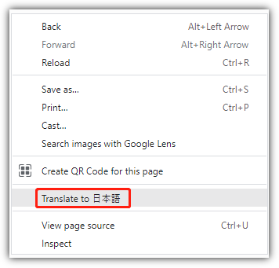
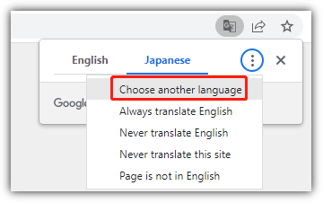
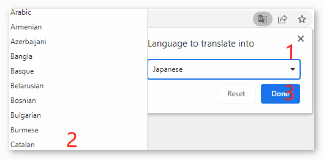

SunFounder Ultimate Sensor Kit
==================================================

.. image:: img/ultimate-sensor-kit-cover.png
    :width: 800

Ever been disappointed by an online learning kit that came with just a basic guide? Have you dreamed of delving into the world of electronics, but felt overwhelmed by the complexity?

Seen brilliant electronic projects showcased by enthusiasts and wondered how they got started?

Introducing: The Ultimate Sensor Kit with Arduino Uno R4 Minima. The answer to all your creative challenges in one compact package.

Driven by the revolutionary Arduino R4, this kit signifies a new era for open-source enthusiasts. With a powerful 32-bit processor, ample memory, and more, it's designed to seamlessly integrate with both new and existing projects.

Not only does it come with over 30 state-of-the-art modules like the Ultrasonic Sensor, Flame Sensor, Accelerometer & Gyroscope, and even the Pulse Oximeter and Heart Rate Sensor, but each component is paired with a beginner-friendly code example. This ensures you not only possess the tools but also the initial know-how.

Dive deep into the world of IoT with tailored projects that link the Arduino to platforms like Blynk via the ESP8266 WiFi module. Unleash your innovation by designing projects such as the Flame Alert System, Intrusion Alert System, and even a Bluetooth-controlled environmental monitor.

But that's not all; dive into an array of engaging projects! Construct a smart trash can, develop an automatic soap dispenser, or perhaps a motion-triggered relay. The kit expands your horizons, allowing you to translate imagination into tangible creations.

This isn't just about following steps; it’s about understanding, experimenting, and inventing. Instead of merely replicating, you'll be crafting projects that are uniquely yours.

Why just be a spectator when you can be a creator? Begin your journey into the captivating world of electronics with the Ultimate Sensor Kit. Your adventure starts here!

If you have any questions or other interesting ideas, feel free to send an email to cs@sunfounder.com.

* :ref:`About the display language`
* :ref:`Table of contents`
* :ref:`Copyright Notice`

About the display language
--------------------------------

In addition to English, we are working on other languages for this course. Please contact service@sunfounder.com if you are interested in helping, and we will give you a free product in return. 
In the meantime, we recommend using Google Translate to translate English into your desired language.

The steps are as follows.

* In this course page, right-click and select **Translate to xx**. If the current language is not what you want, you can change it later.

* There will be a language popup in the upper right corner. Click on the menu button to **choose another language**.

* Select the language from the inverted triangle box, and then click **Done**.

.. raw:: html
    
            

Table of contents
--------------------------------

.. toctree:: 
    :maxdepth: 2

    About Ultimate Sensor Kit <self>
    arduino_start/00_get_start
    download_code
    components_basic/00-component_list
    iot_project/00-iot_project
    fun_project/fun_project
    faq/00_faq
    thank-learning

Copyright Notice
-----------------------

All contents including but not limited to texts, images, and code in this manual are owned by the SunFounder Company. You should only use it for personal study, investigation, enjoyment, or other non-commercial or nonprofit purposes, under the related regulations and copyrights laws, without infringing the legal rights of the author and relevant right holders. For any individual or organization that uses these for commercial profit without permission, the Company reserves the right to take legal action.
