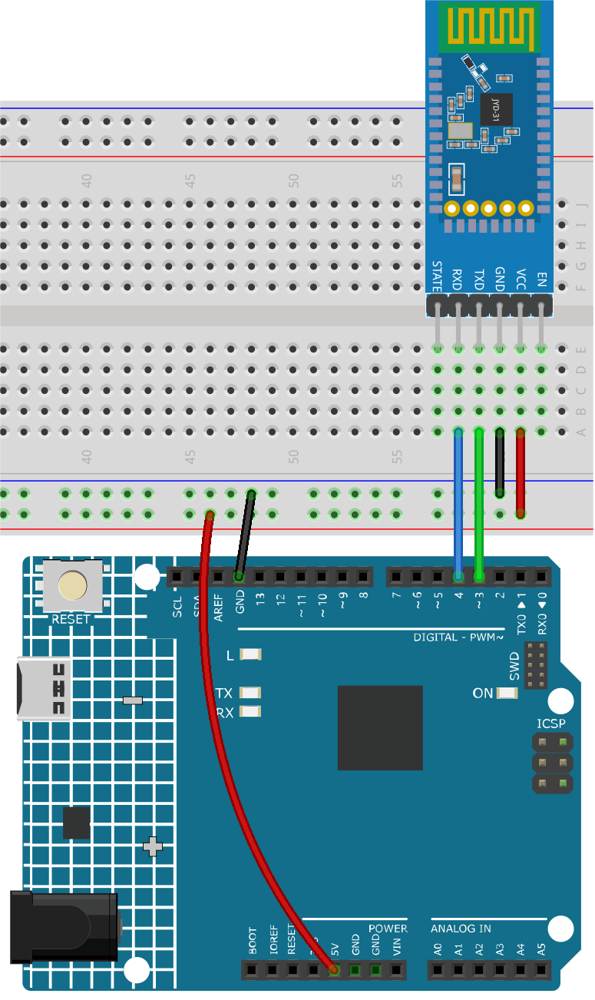

.. _iot_Bluetooth_start:

Bluetooth-Einstieg
=============================

In diesem Projekt zeigen wir, wie eine Kommunikation mit einem Bluetooth-Modul über Arduino erfolgen kann.

Zunächst müssen wir die Schaltung aufbauen und die serielle Kommunikation über Software nutzen. Verbinden Sie den TX-Pin des Bluetooth-Moduls mit Pin 3 des Uno-Boards und den RX-Pin des Bluetooth-Moduls mit Pin 4 des Uno-Boards.

1. Schaltungsaufbau
-----------------------------

* :ref:`cpn_uno`
* :ref:`cpn_jdy31`

2. Code hochladen
-----------------------------

Öffnen Sie die Datei ``00-Bluetooth_start.ino`` im Pfad ``ultimate-sensor-kit\iot_project\bluetooth\00-Bluetooth_start`` oder kopieren Sie diesen Code in die **Arduino IDE**.

Der Code stellt eine serielle Kommunikation über die SoftwareSerial-Bibliothek von Arduino her. Dadurch kann das Arduino mit dem JDY-31 Bluetooth-Modul über die digitalen Pins 3 und 4 (als Rx und Tx) kommunizieren. Es überprüft den Datentransfer zwischen beiden und leitet empfangene Nachrichten mit einer Baudrate von 9600 weiter. **Mit diesem Code können Sie AT-Befehle an das JDY-31 Bluetooth-Modul senden und dessen Antworten empfangen**.

.. raw:: html
    
    <iframe src=https://create.arduino.cc/editor/sunfounder01/d95650c4-ae16-42a2-bd4e-c43849b61941/preview?embed style="height:510px;width:100%;margin:10px 0" frameborder=0></iframe>

3. Bluetooth-Modul konfigurieren
-----------------------------------------

Klicken Sie auf das Lupensymbol (Serieller Monitor) in der oberen rechten Ecke und stellen Sie die Baudrate auf ``9600`` ein. Wählen Sie dann ``both NL & CR`` aus dem Drop-down-Menü für die ``New Line``.

.. image:: img/new/00-bluetooth_serial_1_shadow.png 

Im Folgenden finden Sie einige Beispiele für die Verwendung von AT-Befehlen zur Konfiguration von Bluetooth-Modulen: Geben Sie ``AT+NAME`` ein, um den Namen des Bluetooth-Geräts zu erfahren. Wenn Sie den Bluetooth-Namen ändern möchten, fügen Sie nach ``AT+NAME`` einen neuen Namen hinzu.

* **Bluetooth-Gerätenamen abfragen:** ``AT+NAME`` 

  .. image:: img/00-bluetooth_serial_2.gif

* **Bluetooth-Gerätenamen festlegen:** ``AT+NAME`` (gefolgt vom neuen Namen). ``+OK`` bedeutet, dass die Einstellung erfolgreich war. Sie können ``AT+NAME`` erneut senden, um dies zu überprüfen.

  .. image:: img/00-bluetooth_serial_3.gif 

.. note::
   Um ein konsistentes Lernerlebnis zu gewährleisten, wird empfohlen, die Standard-Baudrate des Bluetooth-Moduls nicht zu ändern und **sie auf ihrem Standardwert von 4 (d. h. 9600 Baud) zu belassen**. In relevanten Kursen kommunizieren wir mit einer Baudrate von 9600 über Bluetooth.

* **Bluetooth-Baudrate einstellen:** ``AT+BAUD`` (gefolgt von der Zahl, die die Baudrate angibt).

    * 4 == 9600
    * 5 == 19200
    * 6 == 38400
    * 7 == 57600
    * 8 == 115200
    * 9 == 128000

Weitere AT-Befehle finden Sie in der folgenden Tabelle.

+------------+------------------------------------------+-------------+
|   Befehl   |               Funktion                   |   Standard  |
+============+==========================================+=============+
| AT+VERSION | Versionsnummer                           | JDY-31-V1.2 |
+------------+------------------------------------------+-------------+
| AT+RESET   | Soft-Reset                               |             |
+------------+------------------------------------------+-------------+
| AT+DISC    | Trennen (gültig bei Verbindung)          |             |
+------------+------------------------------------------+-------------+
| AT+LADDR   | MAC-Adresse des Moduls abfragen          |             |
+------------+------------------------------------------+-------------+
| AT+PIN     | Verbindungspasswort setzen oder abfragen | 1234        |
+------------+------------------------------------------+-------------+
| AT+BAUD    | Baudrate setzen oder abfragen            | 9600        |
+------------+------------------------------------------+-------------+
| AT+NAME    | Sendenamen setzen oder abfragen          | JDY-31-SPP  |
+------------+------------------------------------------+-------------+
| AT+DEFAULT | Werkseinstellungen wiederherstellen      |             |
+------------+------------------------------------------+-------------+
| AT+ENLOG   | Serieller Port Statusausgabe             | 1           |
+------------+------------------------------------------+-------------+

4. Kommunikation über Bluetooth-Debugging-Tools auf Mobiltelefonen
-----------------------------------------------------------------------------------

Mit einer App namens "Serial Bluetooth Terminal" können wir Nachrichten vom Bluetooth-Modul an Arduino senden, um den Vorgang der Bluetooth-Interaktion zu simulieren. Das Bluetooth-Modul sendet empfangene Nachrichten über die serielle Schnittstelle an Arduino. Ebenso kann Arduino Nachrichten über die serielle Schnittstelle an das Bluetooth-Modul senden.

a. **Serial Bluetooth Terminal installieren**

   Laden Sie die App |link_serial_bluetooth_terminal| im Google Play Store herunter und installieren Sie sie.

b. **Bluetooth verbinden**

   Aktivieren Sie zunächst **Bluetooth** auf Ihrem Smartphone.
   
      .. image:: img/new/09-app_1_shadow.png
         :width: 60%
         :align: center
   
   Navigieren Sie zu den **Bluetooth-Einstellungen** auf Ihrem Smartphone und suchen Sie nach Namen wie **JDY-31-SPP**.
   
      .. image:: img/new/09-app_2_shadow.png
         :width: 60%
         :align: center
   
   Nach dem Anklicken stimmen Sie der **Pairing-Anfrage** im Popup-Fenster zu. Wenn nach einem Pairing-Code gefragt wird, geben Sie "1234" ein.
   
      .. image:: img/new/09-app_3_shadow.png
         :width: 60%
         :align: center

c. **Mit dem Bluetooth-Modul kommunizieren**

   Öffnen Sie das Serial Bluetooth Terminal und verbinden Sie sich mit "JDY-31-SPP".
   
      .. image:: img/new/00-bluetooth_serial_4_shadow.png 

   Nach erfolgreicher Verbindung wird im seriellen Monitor eine Erfolgsmeldung angezeigt.

      .. image:: img/new/00-bluetooth_serial_5_shadow.png 

   Geben Sie die Nachricht im seriellen Monitor ein und senden Sie sie an das Bluetooth-Modul.

      .. image:: img/new/00-bluetooth_serial_6_shadow.png 

   Nach dem Senden sehen Sie diese Nachricht in der Serial Bluetooth Terminal-App. Ebenso können Daten über die **Serial Bluetooth Terminal**-App per Bluetooth an Arduino gesendet werden.

      .. image:: img/new/00-bluetooth_serial_7_shadow.png

   Diese Nachricht vom Bluetooth-Gerät ist im seriellen Monitor sichtbar.

      .. image:: img/new/00-bluetooth_serial_8_shadow.png  
