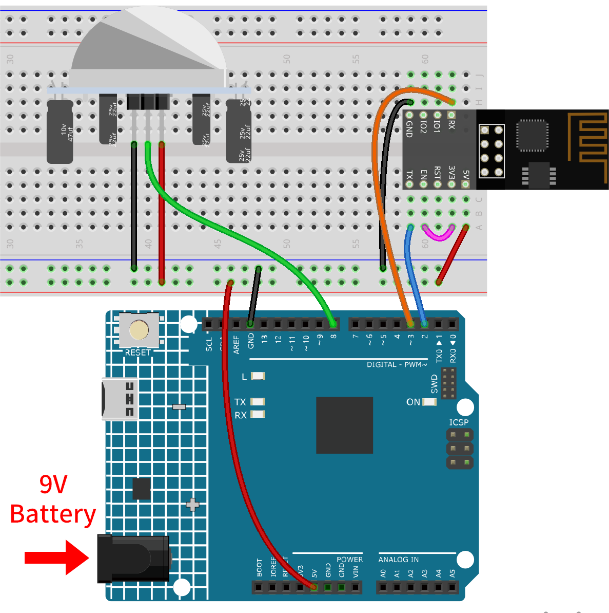

.. note::

    Hallo und willkommen in der SunFounder Raspberry Pi & Arduino & ESP32 Enthusiasten-Gemeinschaft auf Facebook! Tauchen Sie tiefer ein in die Welt von Raspberry Pi, Arduino und ESP32 mit anderen Enthusiasten.

    **Warum beitreten?**

    - **Expertenunterstützung**: Lösen Sie Nachverkaufsprobleme und technische Herausforderungen mit Hilfe unserer Gemeinschaft und unseres Teams.
    - **Lernen & Teilen**: Tauschen Sie Tipps und Anleitungen aus, um Ihre Fähigkeiten zu verbessern.
    - **Exklusive Vorschauen**: Erhalten Sie frühzeitigen Zugang zu neuen Produktankündigungen und exklusiven Einblicken.
    - **Spezialrabatte**: Genießen Sie exklusive Rabatte auf unsere neuesten Produkte.
    - **Festliche Aktionen und Gewinnspiele**: Nehmen Sie an Gewinnspielen und Feiertagsaktionen teil.

    👉 Sind Sie bereit, mit uns zu erkunden und zu erschaffen? Klicken Sie auf [|link_sf_facebook|] und treten Sie heute bei!

.. _iot_Intrusion_alert_system:

Einbruchmeldeanlage mit Blynk
==============================

.. raw:: html

   <video loop autoplay muted style = "max-width:100%">
      <source src="../_static/video/iot/02-iot_Intrusion_alert_system.mp4
       "  type="video/mp4">
      Ihr Browser unterstützt das Video-Tag nicht.
   </video>

Dieses Projekt demonstriert eine einfache häusliche Einbruchmeldeanlage mit einem passiven Infrarot (PIR) Sensor (HC-SR501). Wenn das System über die Blynk-App auf den 'Abwesenheits'-Modus gesetzt ist, überwacht der PIR-Sensor Bewegungen. Jede erkannte Bewegung löst eine Benachrichtigung in der Blynk-App aus und warnt den Benutzer vor einem möglichen Einbruch.

1. Schaltung aufbauen
------------------------

.. note::

    Das ESP8266-Modul benötigt einen hohen Strom, um eine stabile Betriebsumgebung zu gewährleisten. Stellen Sie daher sicher, dass die 9V-Batterie angeschlossen ist.

* :ref:`cpn_uno`
* :ref:`cpn_esp8266`
* :ref:`cpn_pir_motion`

2. Blynk konfigurieren
-------------------------

.. note::
    Wenn Sie mit Blynk noch nicht vertraut sind, wird dringend empfohlen, diese beiden Tutorials zuerst zu lesen. :ref:`iot_blynk_start` ist ein Einsteigerleitfaden für Blynk, der auch die Konfiguration von ESP8266 und die Registrierung bei Blynk umfasst. Und :ref:`iot_Flame` ist ein einfaches Beispiel, aber die Schritterklärung wird detaillierter sein.

**2.1 Vorlage erstellen**
^^^^^^^^^^^^^^^^^^^^^^^^^^^^^

Zunächst müssen wir eine Vorlage in Blynk erstellen. Folgen Sie den untenstehenden Schritten, um eine **"Intrusion Alert System"**-Vorlage zu erstellen.

.. image:: img/new/02-create_template_shadow.png
    :width: 80%
    :align: center

**2.2 Datenströme**
^^^^^^^^^^^^^^^^^^^^^^^^^^^^^

Erstellen Sie **Datastreams** vom Typ **Virtual Pin** auf der **Datenstrom**-Seite, um Daten von ESP8266 und Uno R4-Board zu empfangen.

* Erstellen Sie den virtuellen Pin V0 gemäß dem folgenden Schema:

  Setzen Sie den Namen des **Virtual Pin V0** auf **AwayMode**. Legen Sie den **DATA TYPE** auf **Integer** und MIN und MAX auf **0** und **1** fest.

.. image:: img/new/02-datastream_1_shadow.png
    :width: 90%

* Erstellen Sie den virtuellen Pin V1 gemäß dem folgenden Schema:

  Setzen Sie den Namen des **Virtual Pin V1** auf **Current status**. Legen Sie den **DATA TYPE** auf **String** fest.

.. image:: img/new/02-datastream_2_shadow.png
    :width: 90%

Stellen Sie sicher, dass Sie zwei virtuelle Pins gemäß den oben beschriebenen Schritten eingerichtet haben.

.. image:: img/new/02-datastream_3_shadow.png
    :width: 100%

.. raw:: html
    
      

**2.3 Ereignis**
^^^^^^^^^^^^^^^^^^^^^^^^^^^^^

Als nächstes erstellen wir ein **event**, das die Erkennung von Einbrüchen protokolliert und eine E-Mail-Benachrichtigung sendet.

.. note::
    Es wird empfohlen, die Einstellungen mit meinen Einstellungen konsistent zu halten. Andernfalls müssen Sie möglicherweise den Code ändern, um das Projekt auszuführen. Stellen Sie sicher, dass der **EVENT CODE** als ``intrusion_detected`` festgelegt ist.

.. image:: img/new/02-event_1_shadow.png
    :width: 90%
    :align: center

Gehen Sie zur **Notifications**-Seite und konfigurieren Sie die E-Mail-Einstellungen.

.. image:: img/new/02-event_2_shadow.png
    :width: 90%
    :align: center

.. raw:: html
    
      

**2.4 Web-Dashboard**
^^^^^^^^^^^^^^^^^^^^^^^^^^^^^

Wir müssen auch das **Web-Dashboard** konfigurieren, um mit der Einbruchmeldeanlage interagieren zu können.

Ziehen Sie ein **Switch widget** und ein **Label widget** auf die **Web-Dashboard**-Seite.

.. image:: img/new/02-web_dashboard_1_shadow.png
    :width: 100%
    :align: center

Auf der Einstellungsseite des **Switch widget** wählen Sie **Datenstrom** als **AwayMode(V0)**. Setzen Sie **ONLABEL** und **OFFLABEL**, um "abwesend zu Hause" anzuzeigen, wenn der Schalter eingeschaltet ist, und "zu Hause", wenn der Schalter ausgeschaltet ist.

.. image:: img/new/02-web_dashboard_2_shadow.png
    :width: 100%
    :align: center

Auf der Einstellungsseite des **Label widget** wählen Sie **Datenstrom** als **Current status(V1)**.

.. image:: img/new/02-web_dashboard_3_shadow.png
    :width: 100%
    :align: center

**2.5 Vorlage speichern**
^^^^^^^^^^^^^^^^^^^^^^^^^^^^^

Zum Schluss vergessen Sie nicht, die Vorlage zu speichern.

.. image:: img/new/02-save_template_shadow.png
    :width: 70%
    :align: center

.. raw:: html
    
       

3. Code ausführen
-----------------------------

#. Öffnen Sie die Datei ``02-Intrusion_alert_system.ino`` unter dem Pfad ``ultimate-sensor-kit\iot_project\wifi\02-Intrusion_alert_system`` oder kopieren Sie diesen Code in die **Arduino IDE**.

   .. raw:: html
       
       <iframe src=https://create.arduino.cc/editor/sunfounder01/0f670211-aee7-4bf3-8415-617dc054d514/preview?embed style="height:510px;width:100%;margin:10px 0" frameborder=0></iframe>

#. Erstellen Sie ein Blynk-Gerät mit der Vorlage "Einbruchmeldesystem". Anschließend ersetzen Sie die Werte für ``BLYNK_TEMPLATE_ID``, ``BLYNK_TEMPLATE_NAME`` und ``BLYNK_AUTH_TOKEN`` durch Ihre eigenen.

   .. code-block:: arduino
    
      #define BLYNK_TEMPLATE_ID "TMPxxxxxxx"
      #define BLYNK_TEMPLATE_NAME "Intrusion Alert System"
      #define BLYNK_AUTH_TOKEN "xxxxxxxxxxxxx"

#. Sie müssen auch die ``ssid`` und das ``Passwort`` des von Ihnen verwendeten WLANs eingeben.

   .. code-block:: arduino

    char ssid[] = "your_ssid";
    char pass[] = "your_password";

#. Nach der Auswahl des richtigen Boards und Ports klicken Sie auf die Schaltfläche **Hochladen**.

#. Öffnen Sie den seriellen Monitor (Baudrate auf 115200 einstellen) und warten Sie auf eine Meldung, die eine erfolgreiche Verbindung anzeigt.

   .. image:: img/new/02-ready_1_shadow.png
    :width: 80%
    :align: center

   .. note::

       Sollte die Meldung ``ESP is not responding`` erscheinen, wenn Sie eine Verbindung herstellen, befolgen Sie bitte diese Schritte:

       * Stellen Sie sicher, dass die 9V-Batterie angeschlossen ist.
       * Setzen Sie das ESP8266-Modul zurück, indem Sie den Pin RST für 1 Sekunde mit GND verbinden und dann trennen.
       * Drücken Sie die Reset-Taste auf dem R4-Board.

       Manchmal müssen Sie die oben genannten Schritte 3-5 Mal wiederholen, bitte haben Sie Geduld.

4. Code-Erklärung
-----------------------------

#. **Konfiguration & Bibliotheken**

   Hier werden Konstanten und Anmeldedaten für Blynk festgelegt. Die erforderlichen Bibliotheken für das ESP8266-WiFi-Modul und Blynk werden eingebunden.

   .. code-block:: arduino

      #define BLYNK_TEMPLATE_ID "TMPxxxx"
      #define BLYNK_TEMPLATE_NAME "Intrusion Alert System"
      #define BLYNK_AUTH_TOKEN "xxxxxx-"
      #define BLYNK_PRINT Serial

      #include <ESP8266_Lib.h>
      #include <BlynkSimpleShieldEsp8266.h>

#. **WiFi-Einrichtung**

   Konfigurieren der WLAN-Zugangsdaten und Einrichten der seriellen Software-Kommunikation mit dem ESP01-Modul.

   .. code-block:: arduino

      char ssid[] = "your_ssid";
      char pass[] = "your_password";

      SoftwareSerial EspSerial(2, 3);
      #define ESP8266_BAUD 115200
      ESP8266 wifi(&EspSerial);

#. **PIR-Sensor-Konfiguration**

   Definieren des Pins, an dem der PIR-Sensor angeschlossen ist, und Initialisieren der Zustandsvariablen.

   .. code-block:: arduino

      const int sensorPin = 8;
      int state = 0;
      int awayHomeMode = 0;
      BlynkTimer timer;

#. **setup() Funktion**

   Diese initialisiert den PIR-Sensor als Eingang, richtet die serielle Kommunikation ein, stellt eine Verbindung zum WLAN her und konfiguriert Blynk.

   - Mit ``timer.setInterval(1000L, myTimerEvent)`` wird das Timerintervall in setup() festgelegt. Hier legen wir fest, dass die Funktion ``myTimerEvent()`` alle **1000 ms** ausgeführt wird. Sie können den ersten Parameter von ``timer.setInterval(1000L, myTimerEvent)`` ändern, um das Intervall zwischen den ``myTimerEvent``-Ausführungen zu ändern.

   .. raw:: html
    
      

   .. code-block:: arduino

      void setup() {
         pinMode(sensorPin, INPUT);
         Serial.begin(115200);
         EspSerial.begin(ESP8266_BAUD);
         delay(10);
         Blynk.config(wifi, BLYNK_AUTH_TOKEN);
         Blynk.connectWiFi(ssid, pass);
         timer.setInterval(1000L, myTimerEvent);
      }

#. **loop() Funktion**

   Die Schleifenfunktion führt wiederholt Blynk und die Blynk-Timer-Funktionen aus.

   .. code-block:: arduino

      void loop() {
         Blynk.run();
         timer.run();
      }

#. **Blynk-App-Interaktion**

   Diese Funktionen werden aufgerufen, wenn das Gerät eine Verbindung zu Blynk herstellt und wenn sich der Zustand des virtuellen Pins V0 in der Blynk-App ändert.

   - Jedes Mal, wenn das Gerät eine Verbindung zum Blynk-Server herstellt oder aufgrund schlechter Netzwerkbedingungen erneut eine Verbindung herstellt, wird die Funktion ``BLYNK_CONNECTED()`` aufgerufen. Der Befehl ``Blynk.syncVirtual()`` fordert einen einzelnen virtuellen Pin-Wert an. Der angegebene virtuelle Pin wird ``BLYNK_WRITE()`` aufrufen. Weitere Details finden Sie unter |link_blynk_syncing|.

   - Wann immer sich der Wert eines virtuellen Pins auf dem BLYNK-Server ändert, wird ``BLYNK_WRITE()`` ausgelöst. Weitere Details unter |link_blynk_write|.

   .. raw:: html
    
      

   .. code-block:: arduino
      
      // This function is called every time the device is connected to the Blynk.Cloud
      BLYNK_CONNECTED() {
         Blynk.syncVirtual(V0);
      }
      
      // This function is called every time the Virtual Pin 0 state changes
      BLYNK_WRITE(V0) {
         awayHomeMode = param.asInt();
         // additional logic
      }

#. **Datenverarbeitung**

   Jede Sekunde ruft die Funktion ``myTimerEvent()`` die Funktion ``sendData()`` auf. Wenn der Abwesenheitsmodus in Blynk aktiviert ist, überprüft sie den PIR-Sensor und sendet bei erkannter Bewegung eine Benachrichtigung an Blynk.

   - Wir verwenden ``Blynk.virtualWrite(V1, "Jemand ist in Ihrem Haus! Bitte überprüfen!")``, um den Text eines Labels zu ändern.

   - Mit ``Blynk.logEvent("intrusion_detected");`` wird ein Ereignis in Blynk protokolliert.

   .. raw:: html
    
      

   .. code-block:: arduino

      void myTimerEvent() {
         sendData();
      }

      void sendData() {
         if (awayHomeMode == 1) {
            state = digitalRead(sensorPin);  // Read the state of the PIR sensor

            Serial.print("state:");
            Serial.println(state);
        
            // If the sensor detects movement, send an alert to the Blynk app
            if (state == HIGH) {
              Serial.println("Somebody here!");
              Blynk.virtualWrite(V1, "Somebody in your house! Please check!");
              Blynk.logEvent("intrusion_detected");
            }
         }
      }

**Referenzen**

- |link_blynk_doc|
- |link_blynk_quickstart| 
- |link_blynk_virtualWrite|
- |link_blynk_logEvent|
- |link_blynk_timer_intro|
- |link_blynk_syncing| 
- |link_blynk_write|

