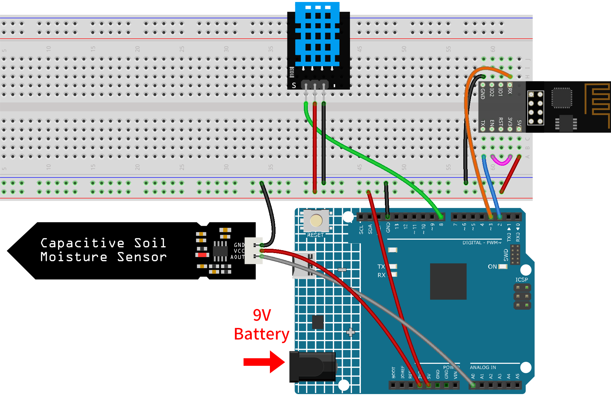
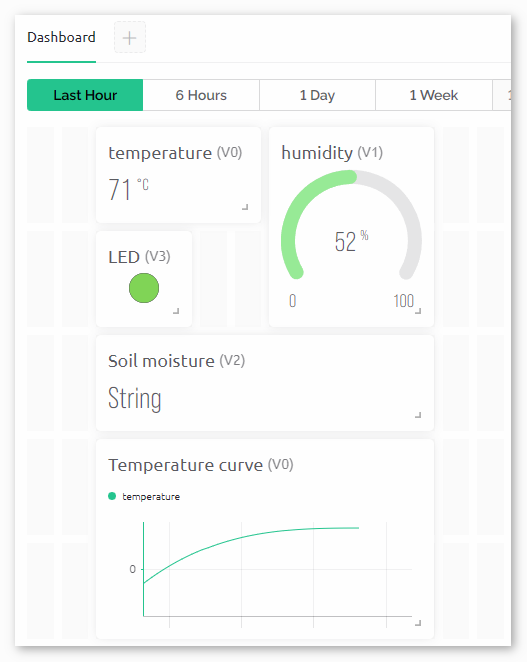

.. _iot_Plant_monitor:

Plant Monitor with Blynk
=============================

.. raw:: html

   <video loop autoplay muted style = "max-width:100%">
      <source src="../_static/video/iot/03-iot_Plant_monitor.mp4"  type="video/mp4">
      Your browser does not support the video tag.
   </video>

This project creates a plant monitoring demo system that detects the current temperature, humidity, light intensity, and soil moisture. The data is then displayed on Blynk along with suggestions based on the soil moisture levels.

1. Build the Cirduit
-----------------------------

.. note::

    The ESP8266 module requires a high current to provide a stable operating environment, so make sure the 9V battery is plugged in.

* :ref:`cpn_uno`
* :ref:`cpn_esp8266`
* :ref:`cpn_dht11`
* :ref:`cpn_soil`

2. Configure Blynk
-----------------------------

.. note::
    If you are not familiar with Blynk, it is strongly recommended that you read these two tutorials first. :ref:`iot_blynk_start` is a beginner's guide for Blynk, which includes how to configure ESP8266 and register with Blynk. And :ref:`iot_Flame` is a simple example, but the description of the steps will be more detailed.

**2.1 Create template**
^^^^^^^^^^^^^^^^^^^^^^^^^^^^^

Firstly, we need to establish a template on Blynk. Create a **"Plant Monitor"** template. 

**2.2 Datastream**
^^^^^^^^^^^^^^^^^^^^^^^^^^^^^

Create **Datastreams** of type **Virtual Pin** in the **Datastream** page receive data from esp8266 and uno r4 board. 

* Create Virtual Pin V0 according to the following diagram: 
   
  Set the name of the **Virtual Pin V0** to **temperature**. Set the **DATA TYPE** to **Double** and MIN and MAX to **-100** and **100**. Set the **UNITS** to **Celsius,℃**.

  .. image:: img/new/03-datastream_1_shadow.png
      :width: 90%

* Create Virtual Pin V1 according to the following diagram: 
   
  Set the name of the **Virtual Pin V1** to **humidity**. Set the **DATA TYPE** to **Double** and MIN and MAX to **0** and **100**. Set the **UNITS** to **Percentage,%**.

  .. image:: img/new/03-datastream_2_shadow.png
      :width: 90%

* Create Virtual Pin V2 according to the following diagram: 
   
  Set the name of the **Virtual Pin V2** to **soilMoisture**. Set the **DATA TYPE** to **String**.

  .. image:: img/new/03-datastream_3_shadow.png
      :width: 90%

* Create Virtual Pin V3 according to the following diagram: 
   
  Set the name of the **Virtual Pin V3** to **LED**. Set the **DATA TYPE** to **Integer** and MIN and MAX to **0** and **255**.
  
  .. image:: img/new/03-datastream_4_shadow.png
      :width: 90%

.. raw:: html
    
      

**2.3 Web Dashboard**
^^^^^^^^^^^^^^^^^^^^^^^^^^^^^

We also need to configure the **Web Dashboard** to interact with the Plant monitor.

Configure the Web Dashboard according to the following diagram. We used widgets such as label, gauge, LED, and chart. Be sure to bind each widget to its corresponding virtual pin.

.. raw:: html
    
       

**2.4 Save template**
^^^^^^^^^^^^^^^^^^^^^^^^^^^^^

At last, remember to save the template.

3. Run the Code
-----------------------------

#. Open the ``03-Plant_monitor.ino`` file under the path of ``iot-sensor-kit\iot_project\03-Plant_monitor``, or copy this code into **Arduino IDE**.

   .. raw:: html
       
       <iframe src=https://create.arduino.cc/editor/sunfounder01/72257734-f348-4227-af59-aa8422abc376/preview?embed style="height:510px;width:100%;margin:10px 0" frameborder=0></iframe>

#. Create a Blynk device using the "Plant Monitor" template. Then, replace the ``BLYNK_TEMPLATE_ID``, ``BLYNK_TEMPLATE_NAME``, and ``BLYNK_AUTH_TOKEN`` with your own. 

   .. code-block:: arduino
    
      #define BLYNK_TEMPLATE_ID "TMPxxxxxxx"
      #define BLYNK_TEMPLATE_NAME "Flame Detection Alert"
      #define BLYNK_AUTH_TOKEN "xxxxxxxxxxxxx"

#. You also need to enter the ``ssid`` and ``password`` of the WiFi you are using. 

   .. code-block:: arduino

    char ssid[] = "your_ssid";
    char pass[] = "your_password";

#. After selecting the correct board and port, click the **Upload** button.

#. Open the Serial monitor(set baudrate to 115200) and wait for a prompt such as a successful connection to appear.

   .. image:: img/new/02-ready_1_shadow.png
    :width: 80%
    :align: center

   .. note::

       If the message ``ESP is not responding`` appears when you connect, please follow these steps.

       * Make sure the 9V battery is plugged in.
       * Reset the ESP8266 module by connecting the pin RST to GND for 1 second, then unplug it.
       * Press the reset button on the R4 board.

       Sometimes, you may need to repeat the above operation 3-5 times, please be patient.

4. Code explanation
-----------------------------

#. **Initializing Libraries & Defining Constants**:
   
   This segment of code includes necessary libraries and defines certain constants like the Blynk template information and WiFi credentials. 
   
   .. code-block:: arduino
    
      #define BLYNK_TEMPLATE_ID "TMPLxxxxxxx"
      #define BLYNK_TEMPLATE_NAME "Plant monitoring"
      #define BLYNK_AUTH_TOKEN "xxxxxxxxxxx"
      #define BLYNK_PRINT Serial
      #include <ESP8266_Lib.h>
      #include <BlynkSimpleShieldEsp8266.h>
      char ssid[] = "your_ssid";
      char pass[] = "your_password";
      #include <SoftwareSerial.h>
      SoftwareSerial EspSerial(2, 3);
      #define ESP8266_BAUD 115200
      ESP8266 wifi(&EspSerial);

#. **Setting up the DHT Sensor**:

   The DHT sensor is initialized and relevant variables for storing temperature and humidity are defined.

   .. code-block:: arduino

      #include <DHT.h>
      #define DHTPIN 8
      #define DHTTYPE DHT11
      DHT dht(DHTPIN, DHTTYPE);
      float temperature;
      float humidity;

#. **Setting up the Soil Moisture Sensor**:

   Configuration for the soil moisture sensor. Thresholds for wet and dry conditions are defined.
   
   You need to measure your own ``wetSoil`` and ``drySoil`` according to the your actual situation. Record the reading of Soil Moisture Module as ``drySoil`` when the soil is dry, and record the reading of Soil Moisture Module within a suitable range that you consider to be the most moist (going beyond this range would be too wet) as ``wetSoil``.

   .. code-block:: arduino

      #define wetSoil 320
      #define drySoil 400
      const int moistureSensorPin = A0;
      int moisture;
      String soilStatus;

#. **Setting up the Timer**:

   A timer is configured which will dictate the frequency of data readings and updates.

   .. code-block:: arduino

      BlynkTimer timer;

#. **Initialization in Setup Function**:

   This section sets up the serial communication, configures the ESP8266 for WiFi, and begins the DHT sensor.

   - We use ``timer.setInterval(5000L, myTimerEvent)`` to set the timer interval in setup(), here we set to execute the ``myTimerEvent()`` function every **5000ms**. You can modify the first parameter of ``timer.setInterval(1000L, myTimerEvent)`` to change the interval between ``myTimerEvent`` executions.

   .. raw:: html
    
      

   .. code-block:: arduino

      void setup() {
         Serial.begin(115200);
         EspSerial.begin(ESP8266_BAUD);
         delay(10);
         Blynk.config(wifi, BLYNK_AUTH_TOKEN);
         Blynk.connectWiFi(ssid, pass);
         timer.setInterval(5000L, myTimerEvent);
         dht.begin();
      }

#. **loop() Function**:

   The main loop runs the Blynk process and timer.

   .. code-block:: arduino

      void loop() {
         Blynk.run();
         timer.run();
      }

#. **sendData() Function**:

   This function reads values from the DHT sensor and soil moisture sensor, determines the soil's status, and sends data to the Blynk app.

   - Use ``Blynk.virtualWrite(vPin, value)`` to send data to virtual pins on Blynk. Please refer to |link_blynk_virtualWrite|.
   - Use ``Blynk.setProperty(V3, "color", color)`` to set the color of LED on Blynk. More detail at |link_blynk_LED_color|.

   .. raw:: html
    
      

   .. code-block:: arduino

      void sendData() {
         // (code for reading and determining values)
         Blynk.virtualWrite(V0, temperature);
         Blynk.virtualWrite(V1, humidity);
         Blynk.virtualWrite(V2, soilStatus);
         Blynk.virtualWrite(V3, 255);            // set blynk LED brightness
         Blynk.setProperty(V3, "color", color);  // set blynk LED color
      }

#. **Printing Data to Serial Monitor**:

   This function is useful for debugging and verifying the readings locally on the Arduino IDE's serial monitor.

   .. code-block:: arduino

      void printData() {
         // (code for printing values to serial monitor)
      }

**Reference**

- |link_blynk_doc|
- |link_blynk_virtualWrite|
- |link_blynk_displays|
