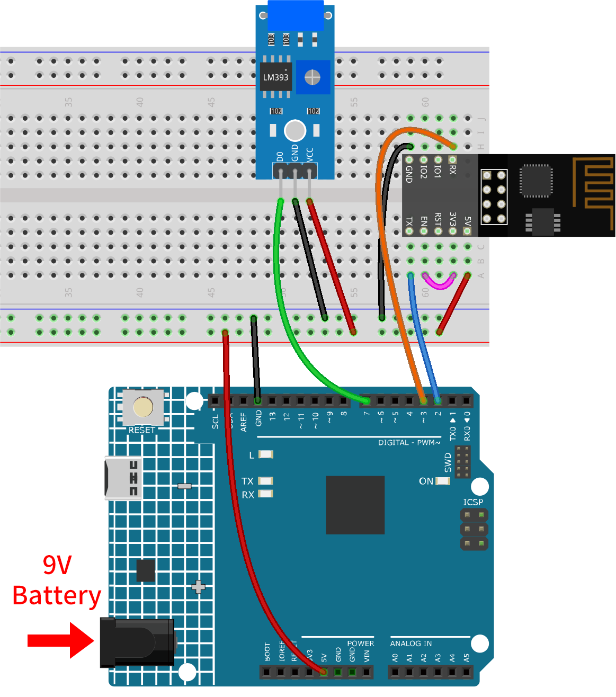

.. _iot_Einbruchwarnsystem:

Vibrationserkennungssystem mit IFTTT
=====================================

.. raw:: html

   <video loop autoplay muted style = "max-width:100%">
      <source src="../_static/video/iot/04-iot_Vibration_alert_system.mp4"  type="video/mp4">
      Ihr Browser unterstützt das Video-Tag nicht.
   </video>

Dieses Projekt implementiert ein Vibrationserkennungssystem mit Hilfe eines Arduino-Boards (Uno R4 oder R3), eines ESP8266-Moduls und eines Vibrationssensors (SW-420). Bei erkannter Vibration sendet das System eine HTTP-Anfrage an einen IFTTT-Server und kann dadurch diverse Aktionen auslösen, wie zum Beispiel das Versenden einer Benachrichtigung oder einer E-Mail.

Um übermäßige Warnmeldungen in kurzer Zeit zu vermeiden, ist das System so programmiert, dass diese HTTP-Anfragen nur im Mindestabstand von 2 Minuten (120.000 Millisekunden) gesendet werden. Dieses Intervall kann nach Bedarf angepasst werden.

1. Den Schaltkreis aufbauen
-----------------------------

.. note::

    Das ESP8266-Modul benötigt einen hohen Stromfluss, um stabil zu funktionieren. Stellen Sie daher sicher, dass die 9-V-Batterie angeschlossen ist.

* :ref:`cpn_uno`
* :ref:`cpn_esp8266`
* :ref:`cpn_vibration`

2. IFTTT konfigurieren
-----------------------------

|link_ifttt| ist ein privates Handelsunternehmen, das 2011 gegründet wurde und digitale Automatisierungsplattformen als Dienstleistung anbietet. Die Plattform ermöglicht es den Nutzern, mit einer visuellen Oberfläche plattformübergreifende „Wenn-Dann“-Bedingungen zu erstellen. Stand 2020 zählt die Plattform 18 Millionen Nutzer.

.. image:: img/04-ifttt_intro.png
    :width: 100%

IFTTT steht für "If This Then That". Einfach gesagt: Wenn bestimmte Bedingungen erfüllt sind, wird eine entsprechende Aktion ausgelöst. Der „If This“-Teil wird Trigger genannt und der „Then That“-Teil wird als Aktion bezeichnet. IFTTT verbindet Smart-Home-Geräte, soziale Medien, Liefer-Apps und vieles mehr, um automatisierte Aufgaben durchzuführen.

.. image:: https://images.contentful.com/mrsnpomeucef/78eXVQ2gXnWkCNCykr7Mdt/8b188790f1fda2ed84ab17afe06cf145/img-welcome-02_x2.jpg
    :width: 100%

**2.1 Bei IFTTT anmelden**
^^^^^^^^^^^^^^^^^^^^^^^^^^^^^

Geben Sie "https://ifttt.com" in Ihren Browser ein und klicken Sie auf den zentral platzierten Button "Get started". Füllen Sie das Formular mit Ihren Informationen aus, um ein Konto zu erstellen.

.. image:: img/04-ifttt_signup.png
    :width: 90%
    :align: center

Klicken Sie auf "Back", um den Schnellstart zu verlassen, kehren Sie zur IFTTT-Startseite zurück, aktualisieren Sie die Seite und melden Sie sich erneut an.

.. image:: img/04-ifttt_signup_2.png
    :width: 90%
    :align: center

**2.2 Das Applet erstellen**
^^^^^^^^^^^^^^^^^^^^^^^^^^^^^

Klicken Sie auf "Create", um mit der Erstellung des Applets zu beginnen.

.. image:: img/new/04-ifttt_create_applet_1_shadow.png
    :width: 80%
    :align: center

.. raw:: html
    
       

**Wenn dieser Auslöser**

Klicken Sie neben "If This" auf "Add", um einen Auslöser hinzuzufügen.

.. image:: img/new/04-ifttt_create_applet_2_shadow.png
    :width: 80%
    :align: center

Suchen Sie nach "Webhook" und klicken Sie darauf.

.. image:: img/new/04-ifttt_create_applet_3_shadow.png
    :width: 80%
    :align: center

Klicken Sie auf der folgenden Seite auf "Receive a web request".

.. image:: img/new/04-ifttt_create_applet_4_shadow.png
    :width: 80%
    :align: center

Setzen Sie den "Event Name" auf "vibration_detected".

.. image:: img/new/04-ifttt_create_applet_5_shadow.png
    :width: 80%
    :align: center

.. raw:: html
    
       

**Then That action**

Klicken Sie neben "Then That" auf "Add", um eine Aktion hinzuzufügen.

.. image:: img/new/04-ifttt_create_applet_6_shadow.png
    :width: 80%
    :align: center

Suchen Sie nach "email" und klicken Sie darauf.

.. image:: img/new/04-ifttt_create_applet_7_shadow.png
    :width: 80%
    :align: center

Klicken Sie auf der folgenden Seite auf "Send me a email".

.. image:: img/new/04-ifttt_create_applet_8_shadow.png
    :width: 80%
    :align: center

Legen Sie den Betreff und Inhalt der E-Mail fest, die bei erkannter Vibration versendet wird.

Als Referenz: Der Betreff ist auf "[ESP-01] Detected vibration!!!" gesetzt und der Inhalt lautet "Detected vibration, please confirm the situation promptly! {{OccurredAt}}". Beim Versand der E-Mail wird ``{{OccurredAt}}`` automatisch durch den Zeitpunkt des Ereignisses ersetzt.

.. image:: img/new/04-ifttt_create_applet_9_shadow.png
    :width: 80%
    :align: center

Befolgen Sie die folgenden Schritte, um die Erstellung des Applets abzuschließen.

.. image:: img/new/04-ifttt_create_applet_10_shadow.png
    :width: 80%
    :align: center

.. image:: img/new/04-ifttt_create_applet_11_shadow.png
    :width: 80%
    :align: center

.. image:: img/new/04-ifttt_create_applet_12_shadow.png
    :width: 50%
    :align: center

.. raw:: html
    
       

3. Code ausführen
--------------------------

#. Öffnen Sie die Datei ``04-Vibration_alert_system.ino`` im Verzeichnis ``ultimate-sensor-kit\iot_project\wifi\04-Vibration_alert_system``, oder kopieren Sie den folgenden Code in die **Arduino IDE**.

   .. raw:: html
       
       <iframe src=https://create.arduino.cc/editor/sunfounder01/dd3eb1dd-b516-4160-9be9-b9f09d6885ff/preview?embed style="height:510px;width:100%;margin:10px 0" frameborder=0></iframe>

#. Tragen Sie die ``mySSID`` und das ``myPWD`` des verwendeten WLANs ein.

   .. code-block:: arduino

    String mySSID = "Ihr_SSID";     // WLAN-SSID
    String myPWD = "Ihr_Passwort";  // WLAN-Passwort

#. Sie müssen auch die ``URL`` anpassen. Hierbei sollten Sie sowohl den von Ihnen festgelegten Ereignisnamen als auch Ihren API-Schlüssel eintragen.

   .. code-block:: arduino
    
      String URL = "/trigger/vibration_detected/with/key/xxxxxxxxxxxxxxxxxx";

   .. image:: img/new/04-ifttt_apikey_1_shadow.png
       :width: 80%
       :align: center

   .. image:: img/new/04-ifttt_apikey_2_shadow.png
       :width: 80%
       :align: center

   An dieser Stelle finden Sie **Ihren persönlichen API-Schlüssel, den Sie unbedingt geheim halten sollten**. Geben Sie den Ereignisnamen als ``vibration_erkannt`` ein. Die vollständige URL wird am unteren Ende der Webseite angezeigt. Kopieren Sie diese URL.

   .. image:: img/new/04-ifttt_apikey_3_shadow.png
       :width: 80%
       :align: center

   .. image:: img/new/04-ifttt_apikey_4_shadow.png
       :width: 80%
       :align: center

#. Wählen Sie das korrekte Board und den passenden Port aus und klicken Sie auf die Schaltfläche **Hochladen**.

#. Öffnen Sie den seriellen Monitor (Baudrate auf **9600** einstellen) und warten Sie auf eine entsprechende Meldung, die den erfolgreichen Verbindungsaufbau anzeigt.

   .. image:: img/new/04-ready_shadow.png
          :width: 95%

4. Code-Erklärung
-------------------------

Das ESP8266-Modul, das im Kit enthalten ist, ist bereits mit der AT-Firmware vorinstalliert. Daher kann das ESP8266-Modul über AT-Befehle gesteuert werden. In diesem Projekt verwenden wir die SoftwareSerial-Bibliothek, um die Kommunikation zwischen dem Arduino Uno Board und dem ESP8266-Modul zu ermöglichen. Das Arduino Uno Board sendet AT-Befehle an das ESP8266-Modul, um eine Netzwerkverbindung herzustellen und Anfragen zu senden. Weitere Informationen finden Sie unter |link_esp8266_at|.

Das Uno-Board liest Sensordaten und sendet AT-Befehle an das ESP8266-Modul, welches sich dann mit dem Netzwerk verbindet und Anfragen an die IFTTT-Server sendet.

#. Einbindung der SoftwareSerial-Bibliothek für die serielle Kommunikation zwischen Arduino und ESP8266

   .. code-block:: arduino
   
     #include <SoftwareSerial.h>      
     SoftwareSerial espSerial(2, 3);  

#. Konfiguration der WLAN-Zugangsdaten und IFTTT-Serverdetails

   .. code-block:: arduino
   
     String mySSID = "Ihre_SSID";     
     String myPWD = "Ihr_Passwort";  
     String myHOST = "maker.ifttt.com";
     String myPORT = "80";
     String URL = "/trigger/xxx/with/key/xxxx";  

#. Definition der Variablen für den Vibrationssensor und die Steuerung der Alarmfrequenz

   .. code-block:: arduino
   
     unsigned long lastAlertTime = 0;                
     const unsigned long postingInterval = 120000L;
     const int sensorPin = 7;

#. In der ``setup()``-Methode Initialisierung der seriellen Kommunikation, des ESP8266-Moduls und Verbindung zum WLAN herstellen

   .. code-block:: arduino
   
      void setup() {
        Serial.begin(9600);
        espSerial.begin(115200);
      
        // Initialize the ESP8266 module
        sendATCommand("AT+RST", 1000, DEBUG);   //Reset the ESP8266 module
        sendATCommand("AT+CWMODE=1", 1000, DEBUG);  //Set the ESP mode as station mode
        sendATCommand("AT+CWJAP=\"" + mySSID + "\",\"" + myPWD + "\"", 3000, DEBUG);  //Connect to WiFi network
      
        while (!espSerial.find("OK")) {
          //Wait for connection
        }
      }

#. In der ``loop()``-Methode Vibrationen erkennen und Alarm senden, falls das Zeitintervall überschritten wurde

   .. code-block:: arduino
   
      void loop() {
      
        if (digitalRead(sensorPin)) {
          if (lastAlertTime == 0 || millis() - lastAlertTime > postingInterval) {
            Serial.println("Detected vibration!!!");
            sendAlert();  //Send an HTTP request to IFTTT server
          } else {
            Serial.print("Detected vibration!!! ");
            Serial.println("Since an email has been sent recently, no warning email will be sent this time to avoid bombarding your inbox.");
          }
        } else {
          if (DEBUG) {
            Serial.println("Detecting...");
          }
        }
        delay(500);
      }

#. Die Funktion sendAlert() erstellt eine HTTP-Anfrage und sendet sie über das ESP8266-Modul

   .. code-block:: arduino
   
     void sendAlert() {
   
       String sendData = "GET " + URL + " HTTP/1.1" + "\r\n";
       sendData += "Host: maker.ifttt.com\r\n";
       
       sendATCommand("AT+CIPMUX=0",1000,DEBUG);                           
       sendATCommand("AT+CIPSTART=...",3000,DEBUG);  
       sendATCommand("AT+CIPSEND=" + String(sendData.length()),1000,DEBUG);   
       espSerial.println(sendData);
      
     }  

#. Behandlung der AT-Befehle mit der Methode sendATCommand()

   Diese Funktion sendet AT-Befehle an das ESP8266-Modul und sammelt die Antworten.
   
   .. code-block:: arduino
   
      void sendATCommand(String command, const int timeout, boolean debug) {
        // Print and send command
        Serial.print("AT Command ==> ");
        Serial.print(command);
        Serial.println();
        espSerial.println(command);  // Send the AT command
      
        // Get the response from the ESP8266 module
        String response = "";
        long int time = millis();
        while ((time + timeout) > millis()) {  // Wait for the response until the timeout
          while (espSerial.available()) {
            char c = espSerial.read();
            response += c;
          }
        }
      
        // Print response if debug mode is on
        if (debug) {
          Serial.println(response);
          Serial.println("--------------------------------------");
        }

**Referenzen**

* |link_esp8266_at|
* |link_ifttt_welcome|
* |link_ifttt_webhook_faq|
