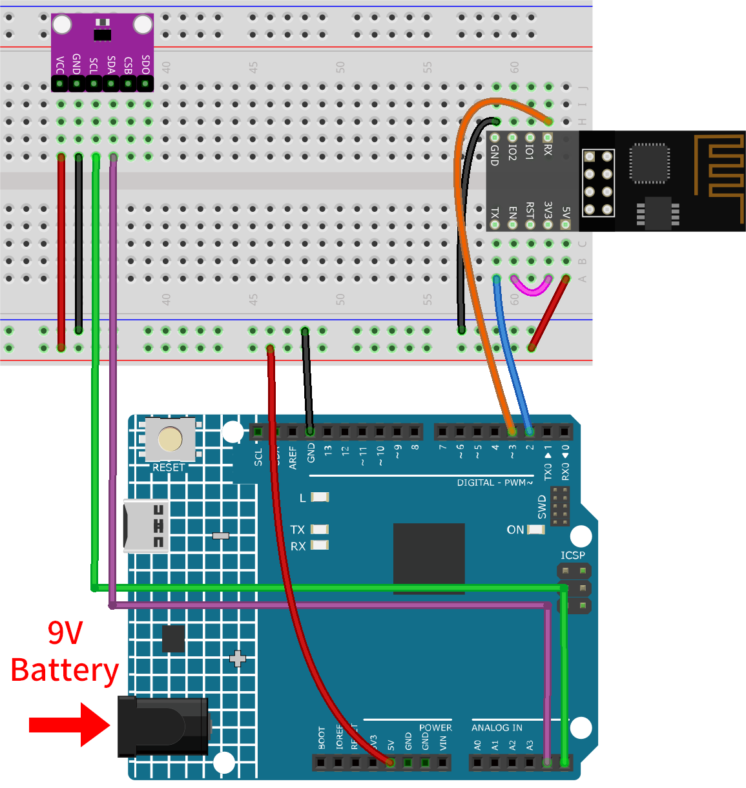

.. _iot_Weather_monitor:

Weather monitor with ThingSpeak
====================================

.. raw:: html

   <video loop autoplay muted style = "max-width:100%">
      <source src="/_static/video/iot/05-iot_Weather_monitor.mp4"  type="video/mp4">
      Your browser does not support the video tag.
   </video>

This project collects temperature and pressure data using an Atmospheric Pressure Sensor. The collected data is then transmitted to the ThingSpeak cloud platform via an ESP8266 module and Wi-Fi network at regular time intervals.

1. Build the Cirduit
-----------------------------

.. note::

    The ESP8266 module requires a high current to provide a stable operating environment, so make sure the 9V battery is plugged in.

* :ref:`cpn_uno`
* :ref:`cpn_esp8266`
* :ref:`cpn_bmp280`

2. Configure ThingSpeak
-----------------------------

|link_thingspeak| ™ is an IoT analytics platform service that allows you to aggregate, visualize and analyze live data streams in the cloud. ThingSpeak provides instant visualizations of data posted by your devices to ThingSpeak. With the ability to execute MATLAB® code in ThingSpeak you can perform online analysis and processing of the data as it comes in. ThingSpeak is often used for prototyping and proof of concept IoT systems that require analytics.

.. image:: https://thingspeak.com/assets/Signup_TSP_ML_image-3d581d644f5eb1ff9f4999fc55ad04e2530ee7f54be98323d7bb453032353750.svg
    :width: 80% 
    :align: center

.. raw:: html
    
       

**2.1 Creating ThingSpeak Account**
^^^^^^^^^^^^^^^^^^^^^^^^^^^^^^^^^^^^^^^^

The first thing you need to do is to create an account with ThingSpeak. Since the collaboration with MATLAB, you can use your MathWorks credentials to login to |link_thingspeak|.

If you do not have one, you need to create an account with MathWorks and login to ThingSpeak Application.

.. image:: img/new/05-thingspeak_signup_shadow.png
    :width: 50%
    :align: center

**2.2 Creating the channel**
^^^^^^^^^^^^^^^^^^^^^^^^^^^^^^^^^^^^^^^^

After logging in, create a new channel to store the data by going to "Channels" > "My Channels" and clicking on "New Channel".

.. image:: img/new/05-thingspeak_channel_1_shadow.png
    :width: 95%
    :align: center

For this project, we need to create a channel called "**Weather Monitor**" with two fields: **Field 1** for "**Temperature**" and **Field 2** for "**Atmospheric Pressure**".

.. image:: img/new/05-thingspeak_channel_2_shadow.png
    :width: 95%
    :align: center

.. raw:: html
    
       

3. Run the Code
-----------------------------

#. Open the ``05-Weather_monitor.ino`` file under the path of ``iot-sensor-kit\iot_project\05-Weather_monitor``, or copy this code into **Arduino IDE**.

   .. raw:: html
       
       <iframe src=https://create.arduino.cc/editor/sunfounder01/195c180e-72fa-4bea-9370-7c75920c7933/preview?embed style="height:510px;width:100%;margin:10px 0" frameborder=0></iframe>

#. You need to enter the ``mySSID`` and ``myPWD`` of the WiFi you are using. 

   .. code-block:: arduino

    String mySSID = "your_ssid";     // WiFi SSID
    String myPWD = "your_password";  // WiFi Password

#. You also need to modify the ``myAPI`` with your ThingSpeak Channel API key.

   .. code-block:: arduino
    
      String myAPI = "xxxxxxxxxxxx";  // API Key

   .. image:: img/new/05-thingspeak_api_shadow.png
       :width: 80%
       :align: center
   
   
   Here you can find **your unique API KEY that you must keep private**. 

#. After selecting the correct board and port, click the **Upload** button.

#. Open the Serial monitor(set baudrate to **9600**) and wait for a prompt such as a successful connection to appear.

   .. image:: img/new/05-ready_1_shadow.png
          :width: 95%

   .. image:: img/new/05-ready_2_shadow.png
          :width: 95%

4. Code explanation
-----------------------------

The ESP8266 module that comes with the kit is already pre-burned with AT firmware. Therefore, the ESP8266 module can be controlled through AT commands. In this project, we use software serial to enable communication between the Arduino Uno board and the ESP8266 module. The Arduino Uno board sends AT commands to the ESP8266 module for network connection and sending requests. You can refer to |link_esp8266_at|.

The Uno board reads sensor values and sends AT commands to the ESP8266 module. The ESP8266 module connects to a network and sends requests to ThingSpeak servers. 

1. **Setting Up & Global Variables**:

   This section establishes communication with the ESP8266 module and declares necessary global variables.

   .. code-block:: arduino

      #include <SoftwareSerial.h>
      SoftwareSerial espSerial(2, 3);
      #define DEBUG true
      String mySSID = "your_ssid";
      String myPWD = "your_password";
      String myAPI = "xxxxxxxxxxxx";
      String myHOST = "api.thingspeak.com";
      String myPORT = "80";
      unsigned long lastConnectionTime = 0;
      const unsigned long postingInterval = 20000L;

2. **BMP280 Sensor Setup**:

   This code segment sets up the BMP280 sensor for data reading.

   .. code-block:: arduino

      #include <Wire.h>
      #include <Adafruit_BMP280.h>
      #define BMP280_ADDRESS 0x76
      Adafruit_BMP280 bmp;
      unsigned bmpStatus;
      float pressure;
      float temperature;

3. **Initialization (Setup Function)**:

   The ``setup()`` function initializes serial communication, connects the ESP8266 module to Wi-Fi, and initializes the BMP280 sensor.

   .. code-block:: arduino

      void setup() {
        Serial.begin(9600);
        espSerial.begin(115200);
      
        // Initialize the ESP8266 module
        sendATCommand("AT+RST", 1000, DEBUG);                                         //Reset the ESP8266 module
        sendATCommand("AT+CWMODE=1", 1000, DEBUG);                                    //Set the ESP mode as station mode
        sendATCommand("AT+CWJAP=\"" + mySSID + "\",\"" + myPWD + "\"", 1000, DEBUG);  //Connect to WiFi network
      
        // Initialize the bmp280 sensor
        bmpStatus = bmp.begin(BMP280_ADDRESS);
        if (!bmpStatus) {
          Serial.println(F("Could not find a valid BMP280 sensor, check wiring or "
                           "try a different address!"));
          while (1) delay(10);  // Stop code execution if the sensor is not found.
        }
      
        /* Default settings from datasheet. */
        bmp.setSampling(Adafruit_BMP280::MODE_NORMAL,     /* Operating Mode. */
                        Adafruit_BMP280::SAMPLING_X2,     /* Temp. oversampling */
                        Adafruit_BMP280::SAMPLING_X16,    /* Pressure oversampling */
                        Adafruit_BMP280::FILTER_X16,      /* Filtering. */
                        Adafruit_BMP280::STANDBY_MS_500); /* Standby time. */
      }

4. **loop() function**:

   The main loop checks if 20 seconds have passed since the last data transmission. If so, it sends the data. You can modify the value of the ``postingInterval`` variable to adjust the interval at which data is sent.

   .. code-block:: arduino

      void loop() {
        //Send data according to the time interval you set.
        if (millis() - lastConnectionTime > postingInterval) {
          sendData();
        }
      }

5. **Data Transmission**:

   This function reads the temperature and pressure, constructs the GET request, and sends data to ThingSpeak.

   We constructed a GET request in the form of ``GET /update?api_key=xxxxxx&field1=xx&field2=xxxxxx`` and sent three parameters to the ThingSpeak server.

     - ``api_key``: API key for authentication and permission control
     - ``field1``: a parameter named "field1" used to record temperature
     - ``field2``: a parameter named "field2" used to record atmospheric pressure

   .. code-block:: arduino

      void sendData() {
        // Read the temperature and pressure from the BMP280 sensor
        pressure = bmp.readPressure();
        temperature = bmp.readTemperature();
      
        // If the data is invalid, print an error message and stop sending it
        if (isnan(pressure) || isnan(temperature)) {
          Serial.println("Failed to read from BMP sensor!");
          return;
        }
      
        // Construct the GET request for ThingSpeak
        String sendData = "GET /update?api_key=" + myAPI;
        sendData += "&field1=" + String(temperature);
        sendData += "&field2=" + String(pressure);
      
        // Send the GET request to ThingSpeak via the ESP8266
        sendATCommand("AT+CIPMUX=1", 1000, DEBUG);  //Allow multiple connections
        sendATCommand("AT+CIPSTART=0,\"TCP\",\"" + myHOST + "\"," + myPORT, 1000, DEBUG);  // Start a TCP connection to ThingSpeak
        sendATCommand("AT+CIPSEND=0," + String(sendData.length() + 4), 1000, DEBUG);       // Send the GET request
        espSerial.find(">");    // Wait for the ">" character from the ESP8266
        espSerial.println(sendData);    // Send the GET request
        Serial.println(sendData);
      
        // Print the values
        Serial.println("Value to be sent: ");
        printBMP();  // Call the printBMP function to print the temperature and pressure
      
        sendATCommand("AT+CIPCLOSE=0", 1000, DEBUG);  // Close the TCP connection
        lastConnectionTime = millis();          // Update the last connection time
      }

6. **Helper Functions**:

   These functions assist in sending AT commands to the ESP8266 and print the BMP280 sensor readings.

   .. code-block:: arduino

      void sendATCommand(String command, const int timeout, boolean debug) {
         ... // (refer to the provided code for the full sendATCommand function)
      }

      void printBMP() {
         ... // (refer to the provided code for the full printBMP function)
      }

**Reference**

* |link_esp8266_at|