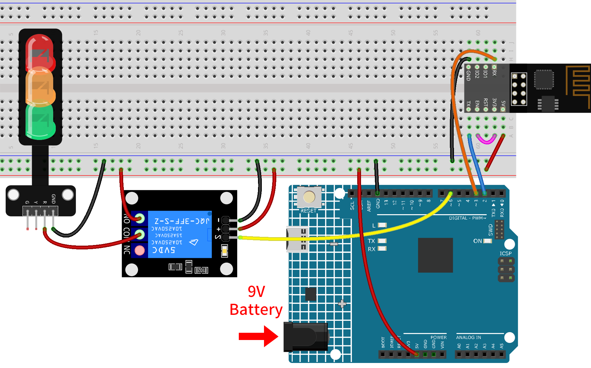
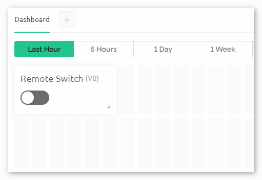

.. note::

    こんにちは、SunFounderのRaspberry Pi & Arduino & ESP32愛好家コミュニティへようこそ！Facebook上でRaspberry Pi、Arduino、ESP32についてもっと深く掘り下げ、他の愛好家と交流しましょう。

    **参加する理由は？**

    - **エキスパートサポート**：コミュニティやチームの助けを借りて、販売後の問題や技術的な課題を解決します。
    - **学び＆共有**：ヒントやチュートリアルを交換してスキルを向上させましょう。
    - **独占的なプレビュー**：新製品の発表や先行プレビューに早期アクセスしましょう。
    - **特別割引**：最新製品の独占割引をお楽しみください。
    - **祭りのプロモーションとギフト**：ギフトや祝日のプロモーションに参加しましょう。

    👉 私たちと一緒に探索し、創造する準備はできていますか？[|link_sf_facebook|]をクリックして今すぐ参加しましょう！

.. _iot_Remote_relay_controller:

Blynkを用いた遠隔リレーコントローラ
====================================

.. raw:: html

   <video loop autoplay muted style = "max-width:100%">
      <source src="../_static/video/iot/06-iot_Remote_relay_controller.mp4"  type="video/mp4">
      お使いのブラウザはビデオタグをサポートしていません。
   </video>

このプロジェクトは、Blynkアプリ内の仮想スイッチを通じて操作可能な遠隔リレーコントローラを作成することを目的としています。スイッチがオンになると、リレーに接続されたデジタルピンがHIGHになり、スイッチがオフになるとLOWになります。これにより、遠隔地からのリレー制御が容易になり、実質的に遠隔スイッチが作成されます。

1. 回路を作成する
-----------------------------

.. warning ::
    下記の例では、リレーを用いてLEDモジュールを制御します。
    **実際のアプリケーションで他の機器にリレーを接続する場合、高電圧ACに対する厳重な注意が必要です。不適切または誤った使用により、重大な傷害や死亡を招く可能性があります。したがって、高電圧ACに精通している人々向けです。常に安全を最優先してください。**

.. note::

    ESP8266モジュールは安定した動作環境を提供するために高電流が必要なので、9Vの電池が接続されていることを確認してください。

* :ref:`cpn_uno`
* :ref:`cpn_esp8266`
* :ref:`cpn_relay`
* :ref:`cpn_traffic`

2. Blynkを設定する
-----------------------------

.. note::
    Blynkに慣れていない場合は、最初に以下の二つのチュートリアルを読むことを強く推奨します。 :ref:`iot_blynk_start` はBlynkの初心者向けガイドで、ESP8266の設定とBlynkへの登録方法が含まれています。また、 :ref:`iot_Flame` は簡単な例ですが、手順の説明がより詳細になっています。

**2.1 テンプレートを作成**
^^^^^^^^^^^^^^^^^^^^^^^^^^^^^

まず、Blynkで **「Remote relay」** テンプレートを作成する必要があります。

**2.2 データストリーム**
^^^^^^^^^^^^^^^^^^^^^^^^^^^^^

**Datastreams** ページで、esp8266とuno r4ボードからデータを受信するための **Virtual Pin** タイプの **Datastreams** を作成します。

* 以下の図に従ってVirtual Pin V0を作成:
   
  **Virtual Pin V0** の名前を **Switch status** に設定します。**DATA TYPE** を **Integer** にし、MINとMAXを **0** と **1** に設定します。**UNITS** は **None** にします。

  .. image:: img/new/06-datastream_1_shadow.png
      :width: 90%

.. raw:: html
    
      

**2.3 Webダッシュボード**
^^^^^^^^^^^^^^^^^^^^^^^^^^^^^

遠隔リレーと対話するためにも、 **Web Dashboard** の設定が必要です。

以下の図に従ってWebダッシュボードを設定します。各ウィジェットを対応する仮想ピンにバインドすることを忘れないでください。

.. raw:: html
    
       

3. コードを実行する
-----------------------------

#. パス ``ultimate-sensor-kit\iot_project\wifi\06-Remote_relay_controller`` にある ``06-Remote_relay_controller.ino`` ファイルを開くか、このコードを **Arduino IDE** にコピペします。

   .. raw:: html
       
       <iframe src=https://create.arduino.cc/editor/sunfounder01/33324acd-40b6-470f-99f4-d86f4d0fb2f8/preview?embed style="height:510px;width:100%;margin:10px 0" frameborder=0></iframe>

#. "Remote relay"テンプレートを使用してBlynkデバイスを作成します。その後、 ``BLYNK_TEMPLATE_ID`` 、 ``BLYNK_TEMPLATE_NAME`` 、 ``BLYNK_AUTH_TOKEN`` を自分のものに置き換えます。

   .. code-block:: arduino
    
      #define BLYNK_TEMPLATE_ID "TMPxxxxxxx"
      #define BLYNK_TEMPLATE_NAME "Remote relay"
      #define BLYNK_AUTH_TOKEN "xxxxxxxxxxxxx"

#. 使用しているWiFiの ``ssid`` と ``password`` も入力する必要があります。

   .. code-block:: arduino

    char ssid[] = "your_ssid";
    char pass[] = "your_password";

#. 正しいボードとポートを選択したら、 **書き込み** ボタンをクリックします。

#. シリアルモニター（ボーレートを115200に設定）を開き、成功した接続などのプロンプトが表示されるまで待ちます。

   .. image:: img/new/02-ready_1_shadow.png
    :width: 90%
    :align: center

   .. note::

       接続時に ``ESP is not responding`` というメッセージが表示された場合は、以下の手順に従ってください。

       * 9Vバッテリーが接続されていることを確認してください。
       * RSTピンを1秒間GNDに接続して、ESP8266モジュールをリセットします。その後、それを外します。
       * R4ボードのリセットボタンを押します。

       以上の操作を3～5回繰り返すことが必要な場合がありますので、ご注意ください。

4. コードの説明
-----------------------------

1. Blynkの設定情報の入力:

   このセクションでは、Blynkアプリに特有の設定、例えばテンプレートID、デバイス名、認証トークンなどを指定します。

   .. code-block:: arduino

      #define BLYNK_TEMPLATE_ID "TMPLxxxxxxxx"
      #define BLYNK_TEMPLATE_NAME "Remote relay"
      #define BLYNK_AUTH_TOKEN "xxxxxxxxxxx"

2. 必要なライブラリのインクルード:

   このプロジェクトで必要なライブラリをインクルードします。これにより、ArduinoがWiFi経由で通信し、Blynkアプリと連携できます。

   .. code-block:: arduino

      #define BLYNK_PRINT Serial
      #include <ESP8266_Lib.h>
      #include <BlynkSimpleShieldEsp8266.h>
      #include <SoftwareSerial.h>

3. WiFiとシリアル設定の構成:

   WiFiのSSIDとパスワードを指定します。また、ESP01とのソフトウェアシリアル通信のピンも宣言します。 ``ESP8266_BAUD`` は、ESP8266モジュールのボーレートを定義します。

   .. code-block:: arduino

      char ssid[] = "your_ssid";
      char pass[] = "your_password";
      SoftwareSerial EspSerial(2, 3);  // RX, TX
      #define ESP8266_BAUD 115200
      ESP8266 wifi(&EspSerial);

4. リレーピンの定義:

   Arduinoのどのデジタルピンをリレー制御に使用するかを定義します。また、Blynkアプリ内の仮想スイッチの状態を格納する変数 ``switchStatus`` も初期化します。

   .. code-block:: arduino

      const int RelayPin = 6;
      int switchStatus = 0;

5. setup()関数:

   この関数では、リレーピンを出力として初期化し、デバッグ用のシリアル通信を開始し、指定されたWiFiの情報を用いてBlynkに接続します。

   .. code-block:: arduino

      void setup() {
        pinMode(RelayPin, OUTPUT);
        Serial.begin(115200);
        EspSerial.begin(ESP8266_BAUD);
        delay(10);
        Blynk.config(wifi, BLYNK_AUTH_TOKEN);
        Blynk.connectWiFi(ssid, pass);
      }

6. loop()関数:

   Blynkとの接続を維持し、イベント（仮想ピンの変更など）を処理するための2つの基本的な関数を繰り返し実行します。

   .. code-block:: arduino

      void loop() {
        Blynk.run();
        timer.run();
      }

7. Blynkの仮想ピンを処理する:

   Blynkアプリから仮想ピンV0の状態を読み取り、それに応じてリレーを制御します。アプリ内のスイッチがオン（すなわち、V0が1）であれば、リレーピンをHIGHに設定し、オフであればLOWに設定します。

   - BLYNKサーバー上の仮想ピンの値が変わるたびに、 ``BLYNK_WRITE()`` がトリガーされます。詳細は |link_blynk_write| にて。

   .. raw:: html
    
      
   
   .. code-block:: arduino

      // This function is called every time the Virtual Pin 0 state changes
      BLYNK_WRITE(V0) {
        switchStatus = param.asInt();  // Set incoming value from pin V0 to a variable
      
        if (switchStatus == 1) {
          Serial.println("The switch on Blynk has been turned on.");
          digitalWrite(RelayPin, HIGH);
        } else {
          Serial.println("The switch on Blynk has been turned off.");
          digitalWrite(RelayPin, LOW);
        }
      }

