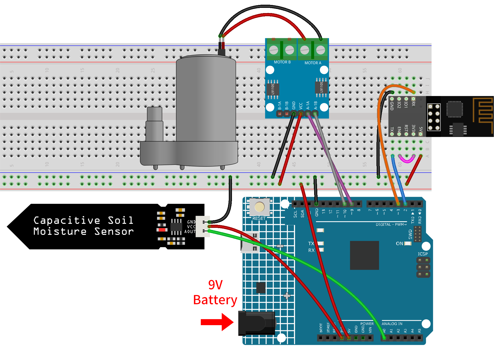
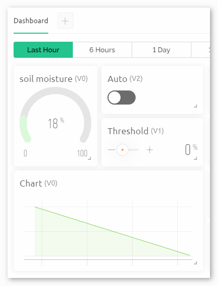

.. _iot_Auto_watering_system:

Auto Watering System with Blynk
===================================

.. raw:: html

   <video loop autoplay muted style = "max-width:100%">
      <source src="../_static/video/iot/07-iot_Auto_watering_system.mp4"  type="video/mp4">
      Your browser does not support the video tag.
   </video>

This project aims to demonstrate an automated irrigation system that utilizes soil moisture sensors and water pumps. The Blynk app is used for user interaction, where it receives the soil moisture data and sends watering threshold and automatic mode status to the system. When the soil moisture drops below the threshold while in automatic mode, the system activates the water pump.

1. Build the Cirduit
-----------------------------

.. note::

    The ESP8266 module requires a high current to provide a stable operating environment, so make sure the 9V battery is plugged in.

* :ref:`cpn_uno`
* :ref:`cpn_esp8266`
* :ref:`cpn_soil`
* :ref:`cpn_pump`

2. Configure Blynk
-----------------------------

.. note::
    If you are not familiar with Blynk, it is strongly recommended that you read these two tutorials first. :ref:`iot_blynk_start` is a beginner's guide for Blynk, which includes how to configure ESP8266 and register with Blynk. And :ref:`iot_Flame` is a simple example, but the description of the steps will be more detailed.

**2.1 Create template**
^^^^^^^^^^^^^^^^^^^^^^^^^^^^^

Firstly, we need to establish a template on Blynk. Create a **"Auto watering system"** template. 

**2.2 Datastream**
^^^^^^^^^^^^^^^^^^^^^^^^^^^^^

Create **Datastreams** of type **Virtual Pin** in the **Datastream** page receive data from esp8266 and uno r4 board. 

* Create Virtual Pin V0 according to the following diagram: 
   
  Set the name of the **Virtual Pin V0** to **Moisture Percentage**. Set the **DATA TYPE** to **Double** and MIN and MAX to **0** and **100**. Set the **UNITS** to **Percentage,%**.

  .. image:: img/new/07-datastream_1_shadow.png
      :width: 90%

* Create Virtual Pin V1 according to the following diagram: 
   
  Set the name of the **Virtual Pin V1** to **Water Threshold**. Set the **DATA TYPE** to **Double** and MIN and MAX to **0** and **100**. Set the **UNITS** to **Percentage,%**.

  .. image:: img/new/07-datastream_2_shadow.png
      :width: 90%

* Create Virtual Pin V2 according to the following diagram: 
   
  Set the name of the **Virtual Pin V2** to **Auto Mode**. Set the **DATA TYPE** to **Integer** and MIN and MAX to **0** and **1**.

  .. image:: img/new/07-datastream_3_shadow.png
      :width: 90%

**2.3 Web Dashboard**
^^^^^^^^^^^^^^^^^^^^^^^^^^^^^

We also need to configure the **Web Dashboard** to interact with the Auto watering system.

Configure the Web Dashboard according to the following diagram. We used widgets such as label, gauge, switch, slider and chart. Be sure to bind each widget to its corresponding virtual pin.

.. raw:: html
    
       

3. Run the Code
-----------------------------

#. Open the ``07-Auto_watering_system.ino`` file under the path of ``ultimate-sensor-kit\iot_project\wifi\07-Auto_watering_system``, or copy this code into **Arduino IDE**.

   .. raw:: html
       
       <iframe src=https://create.arduino.cc/editor/sunfounder01/5132407f-90f9-4a0d-8446-60af041d0d3c/preview?embed style="height:510px;width:100%;margin:10px 0" frameborder=0></iframe>

#. Create a Blynk device using the "Auto watering system" template. Then, replace the ``BLYNK_TEMPLATE_ID``, ``BLYNK_TEMPLATE_NAME``, and ``BLYNK_AUTH_TOKEN`` with your own. 

   .. code-block:: arduino
    
      #define BLYNK_TEMPLATE_ID "TMPxxxxxxx"
      #define BLYNK_TEMPLATE_NAME "Flame Detection Alert"
      #define BLYNK_AUTH_TOKEN "xxxxxxxxxxxxx"

#. You also need to enter the ``ssid`` and ``password`` of the WiFi you are using. 

   .. code-block:: arduino

    char ssid[] = "your_ssid";
    char pass[] = "your_password";

#. After selecting the correct board and port, click the **Upload** button.

#. Open the Serial monitor(set baudrate to 115200) and wait for a prompt such as a successful connection to appear.

   .. image:: img/new/02-ready_1_shadow.png
    :width: 80%
    :align: center

   .. note::

       If the message ``ESP is not responding`` appears when you connect, please follow these steps.

       * Make sure the 9V battery is plugged in.
       * Reset the ESP8266 module by connecting the pin RST to GND for 1 second, then unplug it.
       * Press the reset button on the R4 board.

       Sometimes, you may need to repeat the above operation 3-5 times, please be patient.

4. Code explanation
-----------------------------

#. **Blynk Cloud Setup and Library Imports**
   
   These lines define unique IDs and tokens required to identify and authenticate your Arduino device with the Blynk cloud. Additionally, essential libraries are imported for using the ESP8266 WiFi module, Blynk functionalities, and software serial communication.

   .. code-block:: arduino
         
      #define BLYNK_TEMPLATE_ID "TMPLxxxxxx"
      #define BLYNK_TEMPLATE_NAME "Auto water"
      #define BLYNK_AUTH_TOKEN "xxxxxxxxxxxxxxx"
      #define BLYNK_PRINT Serial
      #include <ESP8266_Lib.h>
      #include <BlynkSimpleShieldEsp8266.h>
      #include <SoftwareSerial.h>

#. **WiFi and Hardware Configuration**
   
   WiFi credentials (``ssid`` and ``pass``) are defined here. The pins ``2`` (RX) and ``3`` (TX) are set for software serial communication between the Arduino and the ESP8266. The baud rate for this communication is defined as ``115200``.

   .. code-block:: arduino

      char ssid[] = "your_ssid";
      char pass[] = "your_password";
      SoftwareSerial EspSerial(2, 3);
      #define ESP8266_BAUD 115200
      ESP8266 wifi(&EspSerial);

#. Define pins and global variables

   Pins for the water pump control and soil moisture sensor are defined along with global variables to store sensor values, thresholds, modes etc.

   You need to measure your own ``moistureInAir`` and ``moistureInWater`` according to the your actual situation. To avoid the calculated ``moisturePercentage`` exceeding the range of 0-100%, adjust the ``moistureInAir`` reading upwards to account for sensor fluctuations. Conversely, adjust the ``moistureInWater`` reading downwards when recording to compensate for these fluctuations.

   .. code-block:: arduino

     // Define pin configurations for the water pump
     const int pump1A = 9;
     const int pump1B = 10;
     bool pumpStatus = 0;  // 0 indicates OFF, 1 indicates ON
     
     // Define the soil moisture sensor
     const float moistureInAir = 535;    // Measure by placing the sensor in air
     const float moistureInWater = 280;  // Measure by immersing the sensor in water
     const int sensorPin = A0;
     int sensorValue = 0;  // Stores the raw sensor value
     
     int autoMode = 0;
     int waterThreshold = 0;        // The soil moisture percentage threshold to activate watering
     float moisturePercentage = 0;  // The calculated soil moisture percentage

#. **Initial Configurations in the setup() Function**
   
   We set two timers:

   - We use ``timer.setInterval(10000L, updateDataTimer)`` to set the timer interval, here we set to execute the ``updateDataTimer()`` function every **10000ms**. You can modify the first parameter to change the interval between ``updateDataTimer()`` executions.

   - We use ``timer.setInterval(35000L, autoWaterTimer)`` to set the timer interval, here we set to execute the ``autoWaterTimer()`` function every **35000ms**. You can modify the first parameter to change the interval between ``autoWaterTimer()`` executions.

   .. raw:: html
    
      

   .. code-block:: arduino
         
      void setup() {
        pinMode(pump1A, OUTPUT);    // set pump1A as output
        pinMode(pump1B, OUTPUT);    // set pump1B as output
        digitalWrite(pump1B, LOW);  // Keep pump1B low
      
        Serial.begin(115200);           // Start serial communication at 115200 baud rate for debugging
        EspSerial.begin(ESP8266_BAUD);  // Set ESP8266 baud rate
        delay(10);
      
        // Configure Blynk and connect to WiFi
        Blynk.config(wifi, BLYNK_AUTH_TOKEN);
        Blynk.connectWiFi(ssid, pass);
      
        // Configure timer events
        timer.setInterval(10000L, updateDataTimer);  // Update sensor data every 10 seconds
        timer.setInterval(35000L, autoWaterTimer);   // Check watering conditions every 35 seconds
      }

#. **loop() Function**
   
   This continuously running loop allows the Blynk library to check for updates and handles the defined timer events.

   .. code-block:: arduino

      void loop() {
         Blynk.run();
         timer.run();
      }

#. **Blynk App Interaction**
   
   These functions are triggered based on specific interactions with the Blynk app:

   - ``BLYNK_CONNECTED()``: Called when the device connects to Blynk. Syncs the initial states of the virtual pins.

   - ``BLYNK_WRITE(V1)``: Triggered when Virtual Pin 1 changes (water threshold).
   
   - ``BLYNK_WRITE(V2)``: Triggered when Virtual Pin 2 changes (auto mode status).

   .. raw:: html
    
        

   .. code-block:: arduino

      // This function is called every time the device is connected to the Blynk.Cloud
      BLYNK_CONNECTED() {
        Blynk.syncVirtual(V1);  // Sync water threshold
        Blynk.syncVirtual(V2);  // Sync auto mode status
      }
      
      // This function is called every time the Virtual Pin 1 state changes
      BLYNK_WRITE(V1) {
        waterThreshold = param.asInt();  // Update watering threshold
        Serial.print("Received threshold.   waterThreshold:");
        Serial.println(waterThreshold);
      }
      
      // This function is called every time the Virtual Pin 2 state changes
      BLYNK_WRITE(V2) {
        autoMode = param.asInt();  // Update auto mode status
      
        if (autoMode == 1) {
          Serial.println("The switch on Blynk has been turned on.");
        } else {
          Serial.println("The switch on Blynk has been turned off.");
        }
      }

#. **Timer Callbacks and Automatic Watering Logic**
   
   These functions handle the tasks that the timers run:

   - ``updateDataTimer()``: Calls ``sendData()`` to send current moisture data to Blynk. 
   - ``autoWaterTimer()``: Calls ``autoWater()`` to check if watering is required.
   - ``sendData()``: Calculates soil moisture percentage, logs it, and sends it to the Blynk app.
   - ``autoWater()``: Checks whether the soil needs watering based on the set threshold and if automatic mode is on.

   .. raw:: html
    
        

   .. code-block:: arduino

      void updateDataTimer() {
        sendData();
      }
      
      void autoWaterTimer() {
        autoWater();
      }
      
      // Function to send sensor data to Blynk app
      void sendData() {
        // Calculate soil moisture percentage
        sensorValue = analogRead(sensorPin);
        moisturePercentage = 1 - (sensorValue - moistureInWater) / (moistureInAir - moistureInWater);
      
        Serial.println("-----------------------------");
        Serial.println("Update soil moisture data ...");
        Serial.print("sensorValue:");
        Serial.print(sensorValue);
        Serial.print("  moisturePercentage:");
        Serial.println(moisturePercentage * 100);
      
        // Send moisture percentage to Blynk app
        Blynk.virtualWrite(V0, moisturePercentage * 100);
      }
      
      // Function to control automatic watering based on soil moisture and user settings
      void autoWater() {
        if (autoMode == 1 && moisturePercentage * 100 < waterThreshold) {
      
          if (!pumpStatus) {
            turnOnPump();
            Serial.println("-----------------------------");
            Serial.println("Watering...");
      
            // Turn off pump after 2 seconds
            timer.setTimeout(2000L, turnOffPump);
          }
        }
      }

#. **Pump Control Functions**
   
   These functions directly control the operation of the water pump:

   - ``turnOnPump()``: Activates the pump.
   - ``turnOffPump()``: Deactivates the pump.

   .. code-block:: arduino

      // Function to turn on the water pump
      void turnOnPump() {
        digitalWrite(pump1A, HIGH);
        pumpStatus = 1;
      }
      
      // Function to turn off the water pump
      void turnOffPump() {
        digitalWrite(pump1A, LOW);
        pumpStatus = 0;
      }

**Reference**

- |link_blynk_doc|
- |link_blynk_timer|
- |link_blynk_syncing| 
- |link_blynk_write|