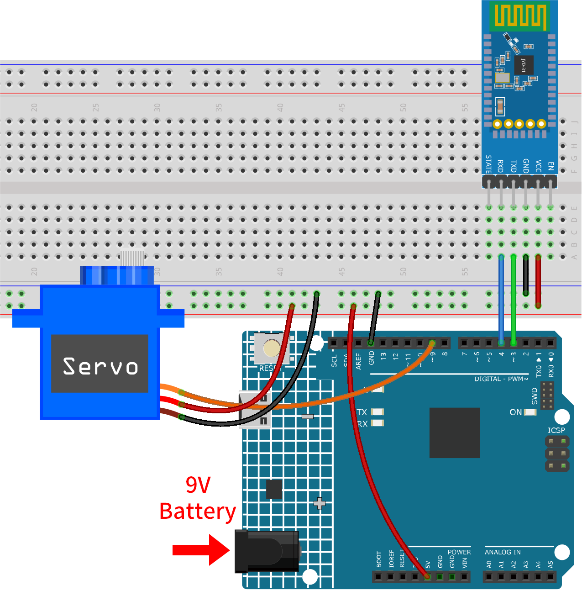

.. _iot_Bluetooth_lock_controller:

Bluetooth lock controller
=============================

This project uses an Android app created with MIT App Inventor to remotely control a servo motor via Bluetooth, simulating a locking mechanism. Users can command the servo to move to either the "locked" or "unlocked" position by sending specific messages through the app.

The system uses a JDY-31 Bluetooth module to receive these messages and instructs an Arduino Uno board to adjust the servo motor's angle accordingly. The servo transitions to a "locked" position upon receiving the '1' message and to an "unlocked" position upon receipt of the '0' message.

The Android application will be constructed utilizing a complimentary web-based platform known as MIT App Inventor. The project presents an excellent opportunity to gain familiarity with the interfacing of an Arduino with a smartphone.

1. Build the Cirduit
-----------------------------

* :ref:`cpn_uno`
* :ref:`cpn_jdy31`
* :ref:`cpn_servo`

2. Create the Android App
-----------------------------

The Android application will be fashioned using a free web application known as |link_appinventor|. 
MIT App Inventor serves as an excellent starting point for Android development, owing to its intuitive drag-and-drop 
features allowing for the creation of simplistic applications.

Now, let's begin.

#. Go to |link_appinventor_login|, and click "online tool" to login. You will require a Google account to register with MIT App Inventor.

   .. image:: img/new/09-ai_signup_shadow.png
       :width: 90%
       :align: center

#. After logging in, navigate to **Projects** -> **Import project (.aia) from my computer**. Subsequently, upload the ``Bluetooth_controlled_lock.aia`` file located in the path ``iot-sensor-kit\iot_project\08-Bluetooth_lock_controller``.

   You can also directly download here: :download:`Bluetooth_controlled_lock.aia</_static/other/Bluetooth_controlled_lock.aia>`

   .. image:: img/new/09-ai_import_shadow.png
        :align: center

#. Upon uploading the ``.aia`` file, you will see the application on the MIT App Inventor software. This is a pre-configured template. You can modify this template after you have familiarized yourself with MIT App Inventor through the following steps.

#. In MIT App Inventor, you have 2 primary sections: the **Designer** and the **Blocks**. You can switch between these two sections in the upper right corner of the page.

   .. image:: img/new/09-ai_intro_1_shadow.png

#. The **Designer** allows you to add buttons, text, screens, and modify the overall aesthetic of your application.

   .. image:: img/new/08-ai_intro_2_shadow.png
   
#. Next, there's the **Blocks** section. This section lets you craft custom functionalities for your app, allowing you to program each component on the app's GUI to achieve desired features.

   .. image:: img/new/08-ai_intro_3_shadow.png

#. To install the application on a smartphone, navigate to the **Build** tab.

   .. image:: img/new/08-ai_intro_4_shadow.png

   * You can generate a ``.apk`` file. After selecting this option, a page will appear allowing you to choose between downloading a ``.apk`` file or scanning a QR code for installation. Follow the installation guide to complete the application installation. 

     You can also directly download here: :download:`Bluetooth_controlled_lock.apk</_static/other/Bluetooth_controlled_lock.apk>`

   * If you wish to upload this app to Google Play or another app marketplace, you can generate a ``.aab`` file.

3. Upload the Code
-----------------------------

#. Open the ``08-Bluetooth_lock_controller.ino`` file under the path of ``iot-sensor-kit\iot_project\08-Bluetooth_lock_controller``, or copy this code into **Arduino IDE**.

   .. raw:: html
       
       <iframe src=https://create.arduino.cc/editor/sunfounder01/b7d14207-953c-479c-89a8-b4a6d8c64e61/preview?embed style="height:510px;width:100%;margin:10px 0" frameborder=0></iframe>

#. After selecting the correct board and port, click the **Upload** button.

#. Open the Serial monitor(set baudrate to **9600**) to view debug messages. 

4. App and Bluetooth moudule Connection
-----------------------------------------------

Ensure that the application created earlier is installed on your smartphone.

#. Initially, turn on **Bluetooth** on your smartphone.

   .. image:: img/new/09-app_1_shadow.png
      :width: 60%
      :align: center

#. Navigate to the **Bluetooth settings** on your smartphone and look for names like **JDY-31-SPP**.

   .. image:: img/new/09-app_2_shadow.png
      :width: 60%
      :align: center

#. After clicking it, agree to the **Pair** request in the pop-up window. If prompted for a pairing code, please enter "1234".

   .. image:: img/new/09-app_3_shadow.png
      :width: 60%
      :align: center

#. Now open the newly installed **Control_RGB_LED** APP.

   .. image:: img/new/08-app_4_shadow.png
      :width: 25%
      :align: center

#. In the APP, click on **Connect Bluetooth** to establish a connection between the APP and Bluetooth module.

   .. image:: img/new/08-app_5_shadow.png
      :width: 60%
      :align: center

#. This page displays a list of all paired Bluetooth devices. Choose the ``xx.xx.xx.xx.xx.xx JDY-31-SPP`` option from the list. The name of each device is listed next to its MAC address.

   .. image:: img/new/08-app_6_shadow.png
      :width: 60%
      :align: center

#. If you don't see any devices on the page shown above, it could be because this app is not authorized to scan for nearby devices. In such a case, you will need to adjust the settings manually.

   * To access the **APP Info** page, long-press the app icon and select it. Alternatively, if you have another method to reach this page, use that instead.

   .. image:: img/new/08-app_8_shadow.png
         :width: 60%
         :align: center

   * Navigate to the **Permissions** page.

   .. image:: img/new/08-app_9_shadow.png
         :width: 60%
         :align: center

   * To enable the APP to scan for nearby devices, go to **Nearby devices** and select **Always**.

   .. image:: img/new/08-app_10_shadow.png
         :width: 60%
         :align: center

   * Now, restart the APP and repeat steps 5 and 6 to successfully connect to Bluetooth.

#. After a successful connection, you will be redirected to the main page where it will display "connected". Then, you can click on either "Unlock" or "Lock" to control the locking mechanism.

   .. image:: img/new/08-app_7_shadow.png
      :width: 60%
      :align: center

5. Code explanation
-----------------------------------------------

#. Define the communication pins and initialize the SoftwareSerial library

   .. code-block:: arduino

      const int bluetoothTx = 3;  
      const int bluetoothRx = 4;   
      SoftwareSerial bleSerial(bluetoothTx, bluetoothRx);  
   
   The above code defines the transmit (Tx) and receive (Rx) pins used by the JDY-31 Bluetooth module for communication. It then initializes the SoftwareSerial library, which allows the Bluetooth module to communicate with the Arduino board.

#. Define servo-related constants and create a servo object

   .. code-block:: arduino

      const int servoPin = 9;
      const int lockAngle = 180;
      const int unlockAngle = 90;
      Servo myservo;

   Here, the pin attached to the servo is defined, along with the angles for "lock" and "unlock" positions. A Servo object ``myservo`` is also created for controlling the servo motor.

#. Initialize the servo and serial communications

   .. code-block:: arduino

      void setup() {
        myservo.attach(servoPin);
        Serial.begin(9600);
        bleSerial.begin(9600);
      }

#. Control servo based on Bluetooth module's input

   .. code-block:: arduino

      void loop() {
        if (bleSerial.available() > 0) {
          char message = bleSerial.read(); 
          if (message == '1') {  
            myservo.write(lockAngle);
            Serial.println("Locked");
          }
          else if (message == '0') {  
            myservo.write(unlockAngle);
            Serial.println("Unlocked");
          }
        }
      }

   The ``loop()`` function runs repeatedly. It reads incoming messages from the Bluetooth module. If the message is '1', the servo is moved to the "locked" position, and if the message is '0', the servo is moved to the "unlocked" position. The current status ("Locked" or "Unlocked") is printed to the Serial Monitor.