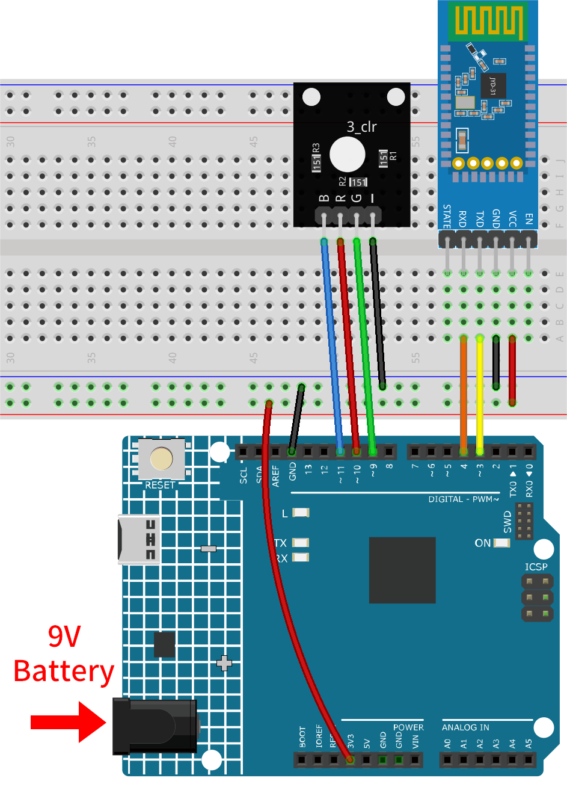

.. _iot_Bluetooth_RGB_controller:

Bluetooth RGB controller
=============================

.. raw:: html

   <video loop autoplay muted style = "max-width:100%">
      <source src="../_static/video/iot/09-iot_Bluetooth_RGB_controller.mp4"  type="video/mp4">
      Your browser does not support the video tag.
   </video>

This project uses an Android app to control the color of an RGB LED through Bluetooth technology using a smartphone.

This Android application will be constructed utilizing a complimentary web-based platform known as |link_appinventor|. The project presents an excellent opportunity to gain familiarity with the interfacing of an Arduino with a smartphone.

This project control an RGB LED connected to an Arduino Uno via a JDY-31 Bluetooth module. The Android application is used to send various color values to the Arduino Uno board via Bluetooth, based on user operations on the GUI. The program on Uno board receives RGB color values as characters from a serial port over Bluetooth and adjusts the LED's color accordingly.

1. Build the Cirduit
-----------------------------

* :ref:`cpn_uno`
* :ref:`cpn_jdy31`
* :ref:`cpn_rgb`

2. Create the Android App
-----------------------------

The Android application will be fashioned using a free web application known as |link_appinventor|. 
MIT App Inventor serves as an excellent starting point for Android development, owing to its intuitive drag-and-drop 
features allowing for the creation of simplistic applications.

Now, let's begin.

#. Go to |link_appinventor_login|, and click "online tool" to login. You will require a Google account to register with MIT App Inventor.

   .. image:: img/new/09-ai_signup_shadow.png
       :width: 90%
       :align: center

#. After logging in, navigate to **Projects** -> **Import project (.aia) from my computer**. Subsequently, upload the ``Control_RGB_LED.aia`` file located in the path ``ultimate-sensor-kit\iot_project\09-Bluetooth_RGB_controller``.

   You can also directly download here: :download:`Control_RGB_LED.aia</_static/other/Control_RGB_LED.aia>`

   .. image:: img/new/09-ai_import_shadow.png
        :align: center

#. Upon uploading the ``.aia`` file, you will see the application on the MIT App Inventor software. This is a pre-configured template. You can modify this template after you have familiarized yourself with MIT App Inventor through the following steps.

   .. image:: img/new/09-ai_import_2_shadow.png

#. In MIT App Inventor, you have 2 primary sections: the **Designer** and the **Blocks**. You can switch between these two sections in the upper right corner of the page.

   .. image:: img/new/09-ai_intro_1_shadow.png

#. The **Designer** allows you to add buttons, text, screens, and modify the overall aesthetic of your application.

   .. image:: img/new/09-ai_intro_2_shadow.png
   
#. Next, there's the **Blocks** section. This section lets you craft custom functionalities for your app, allowing you to program each component on the app's GUI to achieve desired features.

   .. image:: img/new/09-ai_intro_3_shadow.png

#. To install the application on a smartphone, navigate to the **Build** tab.

   .. image:: img/new/09-ai_intro_4_shadow.png

   * You can generate a ``.apk`` file. After selecting this option, a page will appear allowing you to choose between downloading a ``.apk`` file or scanning a QR code for installation. Follow the installation guide to complete the application installation. 

     You can also directly download here: :download:`Control_RGB_LED.apk</_static/other/Control_RGB_LED.apk>`

   * If you wish to upload this app to Google Play or another app marketplace, you can generate a ``.aab`` file.

3. Upload the Code
-----------------------------

#. Open the ``09-Bluetooth_RGB_controller.ino`` file under the path of ``ultimate-sensor-kit\iot_project\09-Bluetooth_RGB_controller``, or copy this code into **Arduino IDE**.

   .. raw:: html
       
       <iframe src=https://create.arduino.cc/editor/sunfounder01/dc140b60-64ed-4ec0-8e50-53c5340c267e/preview?embed style="height:510px;width:100%;margin:10px 0" frameborder=0></iframe>

#. After selecting the correct board and port, click the **Upload** button.

#. Open the Serial monitor(set baudrate to **9600**) to view debug messages. 

4. App and Bluetooth moudule Connection
-----------------------------------------------

Ensure that the application created earlier is installed on your smartphone.

#. Initially, turn on **Bluetooth** on your smartphone.

   .. image:: img/new/09-app_1_shadow.png
      :width: 60%
      :align: center

#. Navigate to the **Bluetooth settings** on your smartphone and look for names like **JDY-31-SPP**.

   .. image:: img/new/09-app_2_shadow.png
      :width: 60%
      :align: center

#. After clicking it, agree to the **Pair** request in the pop-up window. If prompted for a pairing code, please enter "1234".

   .. image:: img/new/09-app_3_shadow.png
      :width: 60%
      :align: center

#. Now open the newly installed **Control_RGB_LED** APP.

   .. image:: img/new/09-app_4_shadow.png
      :width: 25%
      :align: center

#. In the APP, click on **Connect Bluetooth** to establish a connection between the APP and Bluetooth module.

   .. image:: img/new/09-app_5_shadow.png
      :width: 60%
      :align: center

#. This page displays a list of all paired Bluetooth devices. Choose the ``xx.xx.xx.xx.xx.xx JDY-31-SPP`` option from the list. The name of each device is listed next to its MAC address.

   .. image:: img/new/09-app_6_shadow.png
      :width: 60%
      :align: center

#. If you don't see any devices on the page shown above, it could be because this app is not authorized to scan for nearby devices. In such a case, you will need to adjust the settings manually.

   * To access the **APP Info** page, long-press the app icon and select it. Alternatively, if you have another method to reach this page, use that instead.

   .. image:: img/new/09-app_8_shadow.png
         :width: 60%
         :align: center

   * Navigate to the **Permissions** page.

   .. image:: img/new/09-app_9_shadow.png
         :width: 60%
         :align: center

   * To enable the APP to scan for nearby devices, go to **Nearby devices** and select **Always**.

   .. image:: img/new/09-app_10_shadow.png
         :width: 60%
         :align: center

   * Now, restart the APP and repeat steps 5 and 6 to successfully connect to Bluetooth.

#. After successfully connecting, you will be redirected to the main page where it will show "connected". From there, you can easily modify the RGB values and alter the color of the display by clicking on the **Change Color** button.

   .. image:: img/new/09-app_7_shadow.png
      :width: 60%
      :align: center

5. Code explanation
-----------------------------------------------

#. Setting up the Bluetooth module and initializing variables:

   The code begins by including the ``SoftwareSerial`` library and initializing the necessary variables. 
   
   .. code-block:: arduino

      #include <SoftwareSerial.h>
      SoftwareSerial bleSerial(3, 4);  //Rx,Tx

      #define max_char 12
      char message[max_char];  
      char r_char;             
      byte currentIndex = 0;

      const int redPin = 10;
      const int greenPin = 9;
      const int bluePin = 11;

      int redValue = 0;
      int greenValue = 255;
      int blueValue = 0;

      String redTempValue;
      String greenTempValue;
      String blueTempValue;

      int flag = 0;      
      char currentColor;  

#. setup() function:

   Here, the RGB LED pins are set as output pins, and the serial communication is initialized with a baud rate of 9600 for both the Arduino's main serial and the Bluetooth module.
   
   .. code-block:: arduino

      void setup() {
        pinMode(redPin, OUTPUT);
        pinMode(bluePin, OUTPUT);
        pinMode(greenPin, OUTPUT);
        Serial.begin(9600);
        bleSerial.begin(9600);
      }

#. Reading and processing the data:

   In the main loop, the code continuously checks for incoming data from the Bluetooth module. Upon receiving any data, it processes the characters to identify RGB values and sets the color of the RGB LED accordingly.
   
   .. code-block:: arduino

      void loop() {
        while (bleSerial.available() > 0) {
          ... [data reading and processing]
        }

        if (flag == 0) {
          Serial.println(message); 
          analogWrite(redPin, redTempValue.toInt());
          analogWrite(greenPin, greenTempValue.toInt());
          analogWrite(bluePin, blueTempValue.toInt());

          flag = 1;  

          for (int i = 0; i < 12; i++) {
            message[i] = '\0';
          }
          currentIndex = 0;
        }
      }