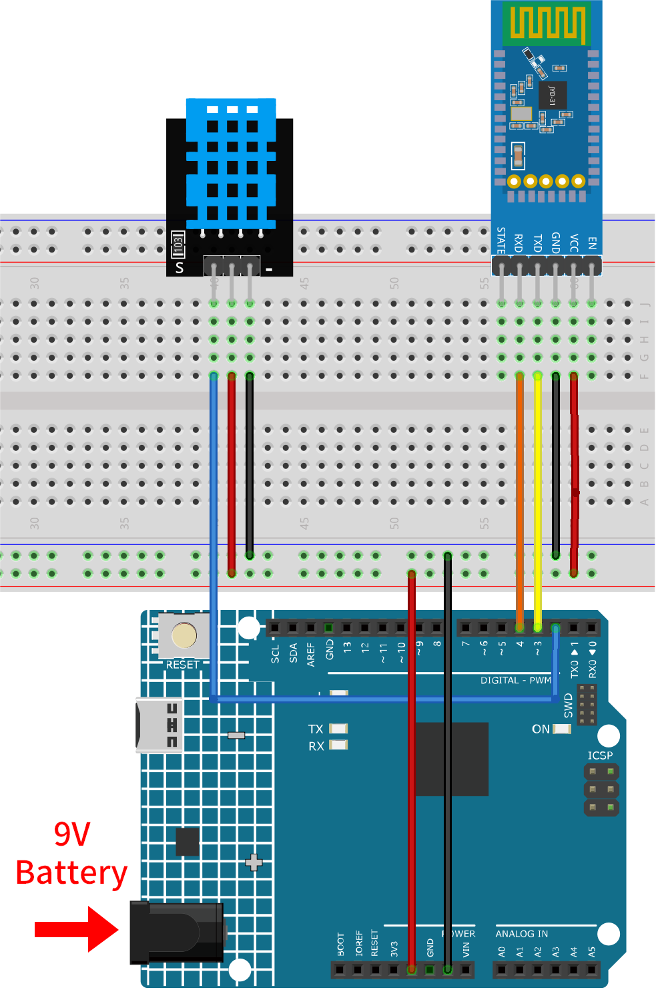

.. _iot_Bluetooth_environmental_monitor:

Bluetooth環境モニター
=================================

.. raw:: html

   <video loop autoplay muted style = "max-width:100%">
      <source src="../_static/video/iot/10-iot_Bluetooth_environmental_monitor.mp4"  type="video/mp4">
      ご利用のブラウザはビデオタグをサポートしていません。
   </video>

このプロジェクトでは、MIT App Inventorで作成されたAndroidアプリを使用して、Arduinoボードから環境データを受信・表示します。Arduinoボードは、DHT11センサーから温度と湿度のデータを取得します。データ収集後、JDY-31モジュールを用いてBluetooth経由で送信され、アプリがそれを画面上で表示します。

Androidアプリは、|link_appinventor| という無料のWebベースプラットフォームを利用して構築されます。このプロジェクトは、Arduinoとスマートフォンのインターフェースに慣れる絶好の機会です。

1. 回路の作成
-----------------------------

* :ref:`cpn_uno`
* :ref:`cpn_jdy31`
* :ref:`cpn_dht11`

2. Androidアプリの作成
-----------------------------

Androidアプリは、|link_appinventor| という無料のWebアプリケーションを使用して開発されます。MIT App Inventorは、直感的なドラッグアンドドロップ機能で簡単なアプリケーションを作成できるため、Android開発の優れたスタート地点となります。

それでは始めましょう。

#. |link_appinventor_login| に移動し、「online tool」というボタンをクリックしてログインします。MIT App Inventorに登録するにはGoogleアカウントが必要です。

   .. image:: img/new/09-ai_signup_shadow.png
       :width: 90%
       :align: center

#. ログイン後、 **Projects** -> **Import project (.aia) from my computer** へ移動して、 ``ultimate-sensor-kit\iot_project\bluetooth\05-Bluetooth_environmental_monitor`` 内の ``Bluetooth_controlled_lock.aia`` ファイルをアップロードします。

   こちらからもダウンロードできます: :download:`Bluetooth_Environmental_Monitor.aia</_static/other/Bluetooth_Environmental_Monitor.aia>`

   .. image:: img/new/09-ai_import_shadow.png
        :align: center

#. ``.aia`` ファイルをアップロードした後、MIT App Inventorソフトウェアでアプリが表示されます。これは事前に設定されたテンプレートであり、次のステップでMIT App Inventorに慣れた後に、このテンプレートを変更できます。

#. MIT App Inventorには2つの主要なセクションがあります： **Designer** と **Blocks** です。ページの右上隅でこれらのセクション間を切り替えることができます。

   .. image:: img/new/09-ai_intro_1_shadow.png

#. **Designer** では、ボタン、テキスト、画面を追加し、アプリの全体的な見た目を変更できます。

   .. image:: img/new/10-ai_intro_2_shadow.png

#. 次に、 **Blocks** セクションがあります。このセクションでは、アプリにカスタム機能を追加でき、アプリのGUI上の各コンポーネントをプログラムして、目的の機能を実現できます。

   .. image:: img/new/10-ai_intro_3_shadow.png

#. スマートフォンにアプリをインストールするには、 **Build** タブに移動します。

   .. image:: img/new/08-ai_intro_4_shadow.png

   * ``.apk`` ファイルを生成できます。このオプションを選択すると、 ``.apk`` ファイルをダウンロードするか、QRコードをスキャンしてインストールするかを選ぶページが表示されます。インストールガイドに従ってアプリのインストールを完了してください。

     また、事前にコンパイルされたAPKはこちらからダウンロードできます: :download:`Bluetooth_Environmental_Monitor.apk</_static/other/Bluetooth_Environmental_Monitor.apk>`

   * Google Playや他のアプリマーケットにこのアプリをアップロードする場合、 ``.aab`` ファイルを生成できます。

3. コードのアップロード
-----------------------------

#. ``ultimate-sensor-kit\iot_project\bluetooth\05-Bluetooth_environmental_monitor`` のパス下で ``10-Bluetooth_environmental_monitor.ino`` ファイルを開く、またはこのコードを **Arduino IDE** にコピーしてください。

   .. note:: 
      ライブラリをインストールするには、Arduinoライブラリマネージャーで **"DHT sensor library"** を検索してインストールしてください。

   .. raw:: html
       
       <iframe src=https://create.arduino.cc/editor/sunfounder01/97605897-2fae-4e4e-97f3-d254796636a1/preview?embed style="height:510px;width:100%;margin:10px 0" frameborder=0></iframe>

#. ボードとポートを選択した後、 **書き込み** ボタンをクリックしてください。

#. シリアルモニターを開き（ボーレートは **9600** に設定）、デバッグメッセージを確認してください。

4. アプリとBluetoothモジュールの接続
-----------------------------------------------

スマートフォンに先ほど作成したアプリがインストールされていることを確認してください。

#. まず、スマートフォンの **Bluetooth** をオンにします。

   .. image:: img/new/09-app_1_shadow.png
      :width: 60%
      :align: center

#. スマートフォンの **Bluetooth設定** に移動し、 **JDY-31-SPP** といった名前を探してください。

   .. image:: img/new/09-app_2_shadow.png
      :width: 60%
      :align: center

#. クリックした後、ポップアップウィンドウで **ペアリング** のリクエストに同意してください。ペアリングコードが必要な場合は「1234」を入力してください。

   .. image:: img/new/09-app_3_shadow.png
      :width: 60%
      :align: center

#. 新しくインストールされた **Environmental Monitor** アプリを開きます。

   .. image:: img/new/10-app_4_shadow.png
      :width: 25%
      :align: center

#. アプリ内で **Connect** ボタンをクリックして、アプリとBluetoothモジュールの間に接続を確立します。

   .. image:: img/new/10-app_5_shadow.png
      :width: 60%
      :align: center

#. このページには、すべてのペアリング済みBluetoothデバイスのリストが表示されます。リストから ``xx.xx.xx.xx.xx.xx JDY-31-SPP`` オプションを選択してください。各デバイスの名前は、そのMACアドレスの隣に表示されます。

   .. image:: img/new/10-app_6_shadow.png
      :width: 60%
      :align: center

#. 上記のページにデバイスが表示されない場合、このアプリは近くのデバイスをスキャンする権限がない可能性があります。その場合は、設定を手動で調整する必要があります。

   * **アプリ情報** ページにアクセスするには、アプリのアイコンを長押しして選択します。別の方法でこのページにアクセスできる場合は、それを使用してください。

   .. image:: img/new/10-app_8_shadow.png
         :width: 60%
         :align: center

   * **権限** ページに移動します。

   .. image:: img/new/08-app_9_shadow.png
         :width: 60%
         :align: center

   * アプリが近くのデバイスをスキャンできるようにするために、 **近くのデバイス** に移動し、 **常に許可** を選択します。

   .. image:: img/new/08-app_10_shadow.png
         :width: 60%
         :align: center

   * その後、アプリを再起動し、ステップ5と6を繰り返して、Bluetoothに正常に接続します。

#. 接続が成功した後、主なページにリダイレクトされ、温度と湿度が表示されます。

   .. image:: img/new/10-app_7_shadow.png
      :width: 60%
      :align: center

5. コードの説明
-----------------------------------------------

1. Bluetooth通信とDHT11センサーの設定。

   .. code-block:: arduino

      #include <SoftwareSerial.h>
      const int bluetoothTx = 3;
      const int bluetoothRx = 4;
      SoftwareSerial bleSerial(bluetoothTx, bluetoothRx);

      #include <DHT.h>
      #define DHTPIN 2
      #define DHTTYPE DHT11
      DHT dht(DHTPIN, DHTTYPE);

   このコードは、必要なライブラリを含め、BluetoothモジュールとDHT11センサーのピンを定義します。また、Bluetooth通信とDHT11用のオブジェクトを宣言しています。

2. setup()関数での初期化。

   .. code-block:: arduino

      void setup() {
        Serial.begin(9600);
        bleSerial.begin(9600);
        dht.begin();
      }

   この部分は、デバッグ用のシリアル通信、Bluetoothモジュール、およびDHTセンサーを初期化します。

3. データの読み取りとBluetooth経由での送信。

   .. code-block:: arduino

      void loop() {

        delay(2000);
        float humidity = dht.readHumidity();
        float temperature = dht.readTemperature();

        // Check if any reads failed and exit early (to try again).
        if (isnan(humidity) || isnan(temperature)) {
          Serial.println(F("Failed to read from DHT sensor!"));
          return;
        }

        // For debug
        // Print the humidity and temperature to the serial monitor
        Serial.print(F("Humidity: "));
        Serial.print(humidity);
        Serial.print(F("%  Temperature: "));
        Serial.print(temperature);
        Serial.println(F("°C "));

        sensorData = String(temperature) + "," + String(humidity);  // Concatenate temperature and humidity values
        Serial.print("Data to send: ");
        Serial.println(sensorData);

        bleSerial.println(sensorData);  // Send temperature and humidity values to the Bluetooth module
      }

   この部分では、DHT11センサーから2秒ごとに温度と湿度を読み取ります。読み取りに失敗した場合は、エラーメッセージを出力します。それ以外の場合、シリアルモニターに読み取り値を出力し、カンマ区切りの形式でBluetoothモジュール経由で送信します。アプリは「温度,湿度」という形式のデータを受信したら、その情報を解析し、ユーザーインターフェースに表示します。
