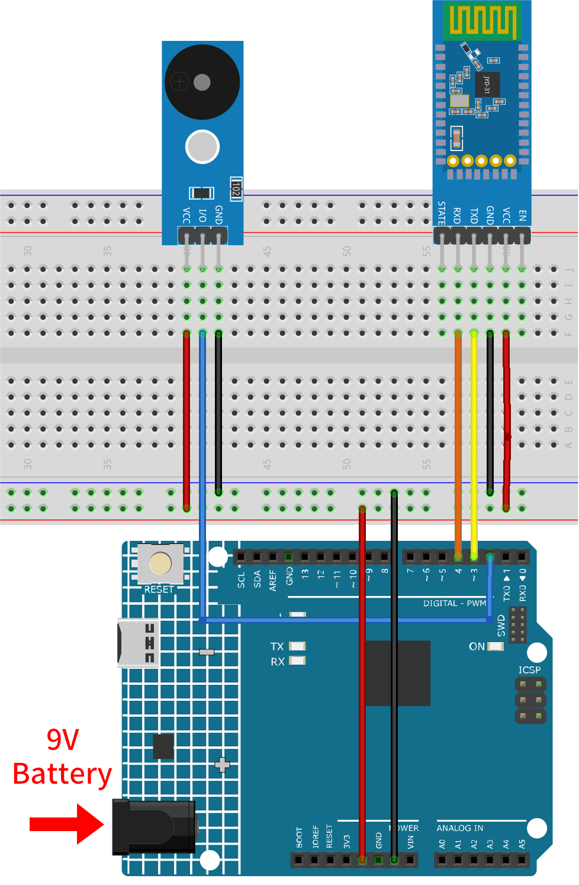

.. _iot_Bluetooth_piano:

Bluetoothピアノ
=============================

.. raw:: html

   <video controls style = "max-width:100%">
      <source src="../_static/video/iot/11-iot_Bluetooth_piano.mp4"  type="video/mp4">
      ご使用のブラウザはビデオタグをサポートしていません。
   </video>
     

このプロジェクトは、MIT App Inventorで作成されたAndroidアプリを使用して、JDY-31 Bluetoothモジュールとパッシブブザーモジュールを活用したシンプルな「ピアノ」機能を提供します。Bluetoothピアノプロジェクトでは、JDY-31 Bluetoothモジュールを使用してパッシブブザーモジュールで様々な音階を演奏することができます。ArduinoにBluetooth経由で特定の音符指令を送信することで、ブザー上で対応する音を生成できます。

Androidアプリケーションは、 |link_appinventor| という無料のWebベースのプラットフォームを用いて構築されます。このプロジェクトは、スマートフォンとArduinoの連携についての知識を深める絶好の機会となります。

1. 回路を組む
-----------------------------

* :ref:`cpn_uno`
* :ref:`cpn_jdy31`
* :ref:`cpn_buzzer`

2. Androidアプリを作成する
-----------------------------

Androidアプリは、 |link_appinventor| という無料のWebアプリケーションを使用して開発されます。
MIT App Inventorは、直感的なドラッグアンドドロップ機能によってシンプルなアプリケーションを作成するのに適した素晴らしいスタートポイントです。

それでは始めましょう。

#. |link_appinventor_login| にアクセスし、「online tool」をクリックしてログインします。MIT App Inventorに登録するためにはGoogleアカウントが必要です。

   .. image:: img/new/09-ai_signup_shadow.png
       :width: 90%
       :align: center

#. ログイン後、 **Projects** -> **Import project (.aia) from my computer** に移動します。その後、 ``ultimate-sensor-kit\iot_project\bluetooth\06-Bluetooth_piano`` にある ``piano.aia`` ファイルをアップロードします。

   または、直接こちらからダウンロードできます: :download:`piano.aia</_static/other/piano.aia>`

   .. image:: img/new/09-ai_import_shadow.png
        :align: center

#. ``.aia`` ファイルをアップロードした後、MIT App Inventorソフトウェアでアプリケーションが表示されます。これは事前に設定されたテンプレートです。MIT App Inventorに慣れた後、このテンプレートを自由に編集できます。

#. MIT App Inventorには、 **Designer** と **Blocks** という2つの主要なセクションがあります。これらのセクションは、ページの右上隅で切り替えることができます。

   .. image:: img/new/09-ai_intro_1_shadow.png

#. **Designer** では、ボタン、テキスト、画面を追加したり、アプリの全体的な見た目を編集できます。

   .. image:: img/new/11-ai_intro_2_shadow.png

#. 次に、 **Blocks** セクションです。このセクションでは、アプリのGUI上の各コンポーネントをプログラムして、所望の機能を実装できます。

   .. image:: img/new/11-ai_intro_3_shadow.png

#. スマートフォンにアプリをインストールするためには、 **Build** タブに移動します。

   .. image:: img/new/08-ai_intro_4_shadow.png

   * ``.apk`` ファイルを生成することができます。このオプションを選択すると、 ``.apk`` ファイルをダウンロードするかQRコードをスキャンしてインストールするかを選べるページが表示されます。インストールガイドに従ってアプリケーションのインストールを完了させてください。

     事前にコンパイルされたAPKもこちらでダウンロードできます: :download:`piano.apk</_static/other/piano.apk>`

   * Google Playや他のアプリマーケットにこのアプリをアップロードしたい場合は、 ``.aab`` ファイルを生成できます。

3. コードをアップロードする
-----------------------------

#. ``ultimate-sensor-kit\iot_project\bluetooth\06-Bluetooth_piano`` パス内の ``11-Bluetooth_piano.ino`` ファイルを開くか、このコードを **Arduino IDE** にコピーしてください。

   .. raw:: html
       
       <iframe src=https://create.arduino.cc/editor/sunfounder01/a9d0b7bf-0927-4a10-88b9-bbc4a9abc5c8/preview?embed style="height:510px;width:100%;margin:10px 0" frameborder=0></iframe>

#. 適切なボードとポートを選択したら、 **書き込み** ボタンをクリックします。

#. デバッグメッセージを見るために、シリアルモニタを開き（ボーレートを **9600** に設定してください）。

4. アプリとBluetoothモジュールの接続
-----------------------------------------------

既にスマートフォンに作成したアプリがインストールされていることを確認してください。

#. 最初に、スマートフォンの **Bluetooth** をオンにします。

   .. image:: img/new/09-app_1_shadow.png
      :width: 60%
      :align: center

#. スマートフォンの **Bluetooth設定** に移動し、 **JDY-31-SPP** のような名前を探します。

   .. image:: img/new/09-app_2_shadow.png
      :width: 60%
      :align: center

#. クリック後、ポップアップウィンドウで **ペアリング** リクエストに同意します。ペアリングコードが求められた場合は「1234」と入力してください。

   .. image:: img/new/09-app_3_shadow.png
      :width: 60%
      :align: center

#. それでは、新しくインストールした **Piano** アプリを開きます。

   .. image:: img/new/11-app_4_shadow.png
      :width: 25%
      :align: center

#. アプリ内で **Connect** ボタンをクリックして、アプリとBluetoothモジュールとの接続を確立します。

   .. image:: img/new/11-app_5_shadow.png
      :width: 85%
      :align: center

#. この画面には、すべてのペアリング済みBluetoothデバイスが一覧表示されます。 ``xx.xx.xx.xx.xx.xx JDY-31-SPP`` というオプションをリストから選びます。各デバイスの名前は、MACアドレスの隣に表示されています。

   .. image:: img/new/11-app_6_shadow.png
      :width: 60%
      :align: center

#. 上記のページにデバイスが表示されない場合、アプリが周辺のデバイスをスキャンする権限を持っていない可能性があります。その場合は、設定を手動で調整する必要があります。

   * **APP情報** ページにアクセスするには、アプリのアイコンを長押しして選択します。別の方法でこのページにアクセスできる場合は、その方法を使用してください。

   .. image:: img/new/11-app_8_shadow.png
         :width: 60%
         :align: center

   * **権限** ページに移動します。

   .. image:: img/new/08-app_9_shadow.png
         :width: 60%
         :align: center

   * アプリに周辺のデバイスをスキャンする機能を有効にするには、 **周辺のデバイス** に移動して **常に** を選択します。

   .. image:: img/new/08-app_10_shadow.png
         :width: 60%
         :align: center

   * それでは、アプリを再起動して手順5と6を繰り返し、Bluetoothに成功裏に接続してください。

#. 接続に成功したら、アプリ内のボタンをクリックして異なる音符を演奏できます。簡単な曲も演奏可能です。

   .. image:: img/new/11-app_7_shadow.png
      :width: 85%
      :align: center

5. コードの解説
-----------------------------------------------

1. **ライブラリとピンの設定**

   .. code-block:: arduino
   
      #include "pitches.h"
      #include <SoftwareSerial.h>
      const int bluetoothTx = 3;
      const int bluetoothRx = 4;
      SoftwareSerial bleSerial(bluetoothTx, bluetoothRx);
      const int buzzerPin = 2;

   - ``pitches.h`` : このファイルには、音楽の音符に対応する周波数値が格納されています。

   .. raw:: html

       

2. **Bluetoothデータを保存するための変数宣言**

   .. code-block:: arduino
   
      char character;
      String noteType;

   - ``character`` : Bluetoothから受信した個々の文字を保存します。
   - ``noteType`` : 受信した文字を集約して完全な音符指示を形成します。

   .. raw:: html

       

3. **セットアップ関数 - シリアル通信の初期化**

   .. code-block:: arduino
   
      void setup() {
        Serial.begin(9600);
        bleSerial.begin(9600);
      }
   
   - ボーレート9600でシリアル通信を初期化します。
   - 標準の ``Serial`` はデバッグ用で、 ``bleSerial`` はBluetooth通信専用です。

   .. raw:: html

       

4. **メインループ - Bluetoothデータの読み取りと対応する音符の演奏**

   .. code-block:: arduino
   
      void loop() {
        while (bleSerial.available() > 0) {
          character = bleSerial.read();
          noteType = noteType + character;
          if (character == '*') {
            noteType = noteType.substring(0, noteType.length() - 1);
            Serial.println(noteType);
            if (noteType == "NOTE_C4") {
              tone(buzzerPin, NOTE_C4);
            } // ...他の音符も同様にチェック...
            noteType = "";
            delay(200);
            noTone(buzzerPin);
          }
        }
      }
   
   - Bluetoothからの文字を読み取り、 ``noteType`` を組み立てます。
   - アスタリスク（'*'）が検出されると、それは音符指示の終わりを示します。その後、短い遅延が続いて音符が停止します。
