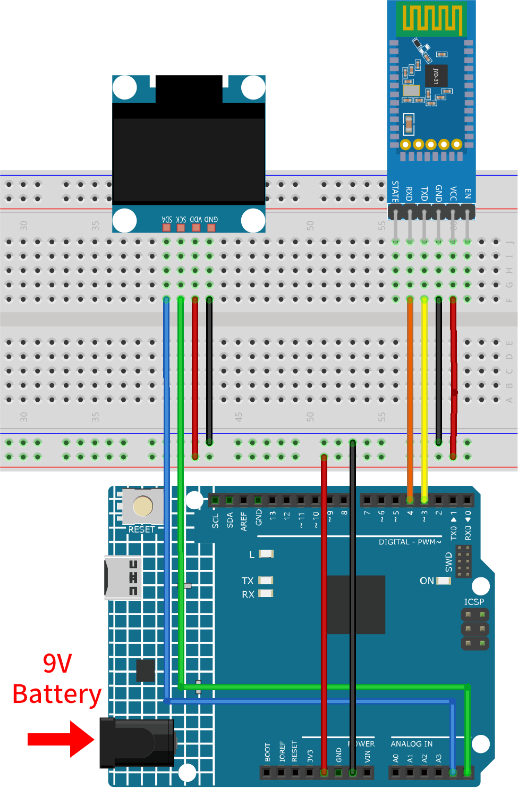

.. _iot_Bluetooth_oled:

Bluetooth OLED
=================================

.. raw:: html

   <video loop autoplay muted style = "max-width:100%">
      <source src="../_static/video/iot/12-iot_Bluetooth_oled.mp4"  type="video/mp4">
      お使いのブラウザはビデオタグをサポートしていません。
   </video>

このプロジェクトでは、MIT App Inventorで作成されたAndroidアプリを用いて、Bluetoothを介してArduinoデバイスにメッセージを送信します。Arduinoは受信したメッセージをOLEDスクリーンに表示します。Androidアプリは、ユーザーフレンドリーなインターフェースで設計されており、ユーザーはボタンを押すだけでメッセージを送信できます。

Androidアプリケーションは、|link_appinventor| という無料のウェブベースのプラットフォームを用いて構築されます。このプロジェクトは、Arduinoとスマートフォンとのインターフェイスを熟練する絶好の機会です。

1. 回路を作成する
-----------------------------

* :ref:`cpn_uno`
* :ref:`cpn_jdy31`
* :ref:`cpn_olde`

2. Androidアプリを作成する
-----------------------------

Androidアプリケーションは、|link_appinventor| という無料のウェブアプリケーションを使用して開発されます。
MIT App Inventorは、直感的なドラッグ＆ドロップ機能で簡単なアプリケーションを作成できるため、Android開発の優れたスタート地点となります。

さて、始めましょう。

#. |link_appinventor_login| に移動し、「online tool」としてログインをクリックします。MIT App Inventorに登録するためにはGoogleアカウントが必要です。

   .. image:: img/new/09-ai_signup_shadow.png
       :width: 90%
       :align: center

#. ログイン後、 **Projects** -> **Import project (.aia) from my computer** に進み、 ``ultimate-sensor-kit\iot_project\bluetooth\07-Bluetooth_oled`` にある ``oled.aia`` ファイルをアップロードします。

   直接ダウンロードはこちら: :download:`oled.aia</_static/other/oled.aia>`

   .. image:: img/new/09-ai_import_shadow.png
        :align: center

#. ``.aia`` ファイルをアップロードすると、MIT App Inventorソフトウェア上でアプリケーションが表示されます。これは事前に設定されたテンプレートです。次のステップでMIT App Inventorに慣れた後にこのテンプレートを修正できます。

#. MIT App Inventorには、 **Designer** と **Blocks** という2つの主要なセクションがあります。ページの右上隅でこれらのセクションを切り替えることができます。

   .. image:: img/new/09-ai_intro_1_shadow.png

#. **Designer** は、ボタン、テキスト、画面を追加したり、アプリケーションの全体的な見た目を修正することができます。

   .. image:: img/new/12-ai_intro_2_shadow.png

#. 次に、 **Blocks** セクションがあります。このセクションで、アプリのGUIの各コンポーネントをプログラムして、希望する機能を実現できます。

   .. image:: img/new/12-ai_intro_3_shadow.png

#. スマートフォンにアプリケーションをインストールするには、 **Build** タブに移動します。

   .. image:: img/new/08-ai_intro_4_shadow.png

   * ``.apk`` ファイルを生成することができます。このオプションを選択すると、 ``.apk`` ファイルをダウンロードするか、QRコードをスキャンしてインストールするかを選べるページが表示されます。インストールガイドに従って、アプリケーションのインストールを完了します。

     また、事前にコンパイルされたAPKはこちらからダウンロードできます: :download:`piano.apk</_static/other/piano.apk>`

   * Google Playや他のアプリマーケットにこのアプリをアップロードする場合、``.aab`` ファイルを生成できます。

3. コードをアップロードする
-----------------------------

#. ``ultimate-sensor-kit\iot_project\bluetooth\07-Bluetooth_oled`` のパスにある ``07-Bluetooth_oled.ino`` ファイルを開くか、このコードを **Arduino IDE** にコピーします。

   .. note:: 
      ライブラリをインストールするには、Arduino Library Managerを使用して **"Adafruit SSD1306"** および **"Adafruit GFX"** を検索し、それをインストールします。

   .. raw:: html
       
       <iframe src=https://create.arduino.cc/editor/sunfounder01/aafe675c-be6c-49a0-8c73-596d8b85e3cc/preview?embed style="height:510px;width:100%;margin:10px 0" frameborder=0></iframe>

#. 適切なボードとポートを選択したら、 **書き込み** ボタンをクリックします。

#. シリアルモニターを開き（ボーレートを **9600** に設定）、デバッグメッセージを表示します。

4. アプリとBluetoothモジュールの接続
-----------------------------------------------

事前にスマートフォンに作成したアプリがインストールされていることを確認してください。

#. まず、スマートフォンの **Bluetooth** を有効にします。

   .. image:: img/new/09-app_1_shadow.png
      :width: 60%
      :align: center

#. スマートフォンの **Bluetooth設定** に移動し、 **JDY-31-SPP** といった名前を探します。

   .. image:: img/new/09-app_2_shadow.png
      :width: 60%
      :align: center

#. 見つけたらクリックし、ポップアップウィンドウの **ペアリング** リクエストに同意します。ペアリングコードが要求された場合は、「1234」と入力してください。

   .. image:: img/new/09-app_3_shadow.png
      :width: 60%
      :align: center

#. その後、新しくインストールされた **OLED** アプリを開きます。

   .. image:: img/new/12-app_4_shadow.png
      :width: 25%
      :align: center

#. アプリ内で **Connect** ボタンをクリックし、アプリとBluetoothモジュール間の接続を確立します。

   .. image:: img/new/12-app_5_shadow.png
      :width: 60%
      :align: center

#. この画面では、すべてのペアリング済みBluetoothデバイスが一覧表示されます。 ``xx.xx.xx.xx.xx.xx JDY-31-SPP`` といったオプションを選択してください。各デバイスの名前は、そのMACアドレスの隣に表示されます。

   .. image:: img/new/12-app_6_shadow.png
      :width: 60%
      :align: center

   接続が成功すると、OLEDディスプレイは「Waiting for connection」から接続済みデバイスのMACアドレスが表示されるように変わります。

   .. image:: img/12-app_6-1.png
      :width: 70%
      :align: center

   .. raw:: html

       

#. 上記の画面でデバイスが表示されない場合、アプリに近隣のデバイスをスキャンする権限がない可能性があります。その場合、設定を手動で調整する必要があります。

   * **アプリ情報** ページにアクセスするには、アプリのアイコンを長押しして選択します。または、このページに別の方法でアクセスできる場合は、それを使用してください。

   .. image:: img/new/12-app_8_shadow.png
         :width: 60%
         :align: center

   * **権限** ページに移動します。

   .. image:: img/new/08-app_9_shadow.png
         :width: 60%
         :align: center

   * アプリが近隣のデバイスをスキャンできるようにするには、 **近隣のデバイス** を選択し、 **常に** を選びます。

   .. image:: img/new/08-app_10_shadow.png
         :width: 60%
         :align: center

   * 次に、アプリを再起動し、手順5と6を繰り返して、Bluetoothに成功裏に接続します。

#. 接続が成功すると、メインページにリダイレクトされます。提供されたテキストボックスに希望するメッセージを入力し、送信ボタンをクリックしてOLEDスクリーンに表示します。

   .. image:: img/new/12-app_7_shadow.png
      :width: 60%
      :align: center

5. コードの解説
-----------------------------------------------

1. **Bluetooth通信の設定**:
   
   このセクションでは、 ``SoftwareSerial`` ライブラリをインクルードし、Bluetooth通信用のデジタルピンを設定します。標準的な ``Serial`` はデバッグ用で、 ``bleSerial`` はBluetooth通信専用です。

   .. code-block:: arduino

      #include <SoftwareSerial.h>
      const int bluetoothTx = 3;
      const int bluetoothRx = 4;
      SoftwareSerial bleSerial(bluetoothTx, bluetoothRx);

2. **OLEDディスプレイの設定**:

   OLEDディスプレイを初期化・管理するために必要なライブラリと定数がここで宣言されます。

   .. code-block:: arduino

      #include <SPI.h>
      #include <Wire.h>
      #include <Adafruit_GFX.h>
      #include <Adafruit_SSD1306.h>
      #define SCREEN_WIDTH 128
      #define SCREEN_HEIGHT 64
      #define OLED_RESET -1
      #define SCREEN_ADDRESS 0x3C
      Adafruit_SSD1306 display(SCREEN_WIDTH, SCREEN_HEIGHT, &Wire, OLED_RESET);

3. **初期化**:
   
   ``setup()`` 関数内で、シリアル通信が初期化されます。OLEDディスプレイが起動し、最初のメッセージ「接続待ち」と表示されます。

   .. code-block:: arduino

      void setup() {
         Serial.begin(9600);
         bleSerial.begin(9600);
         if (!display.begin(SSD1306_SWITCHCAPVCC, SCREEN_ADDRESS)) {
            Serial.println(F("SSD1306 allocation failed"));
            for (;;)
               ;
         }
         display.clearDisplay();
         display.setTextColor(WHITE);
         display.setTextSize(1);
         display.setCursor(32, 20);
         display.println("Waiting for");
         display.setCursor(32, 30);
         display.println("connection");
         display.display();
      }

4. **メインループ**:
   
   ``loop()`` 内で、Bluetoothモジュールからの受信データを常に監視します。フルメッセージ（'#'で終わる、ユーザーが送信するメッセージの末尾にAPPは自動的に'#'を追加します）が受信されると、それがOLEDに表示されます。また、受信したメッセージはデバッグ目的でシリアルモニタに出力されます。

   .. code-block:: arduino

      void loop() {
         while (bleSerial.available() > 0) {
            character = bleSerial.read();
            message = message + character;
            if (character == '#') {
               message = message.substring(0, message.length() - 1);
               Serial.println();
               Serial.print("DEBUG:");
               Serial.println(message);
               display.clearDisplay();
               display.setTextColor(WHITE);
               display.setTextSize(1);
               display.setCursor(0, 20);
               display.println(message);
               display.display();
               message = "";
               delay(200);
            }
         }
      }
